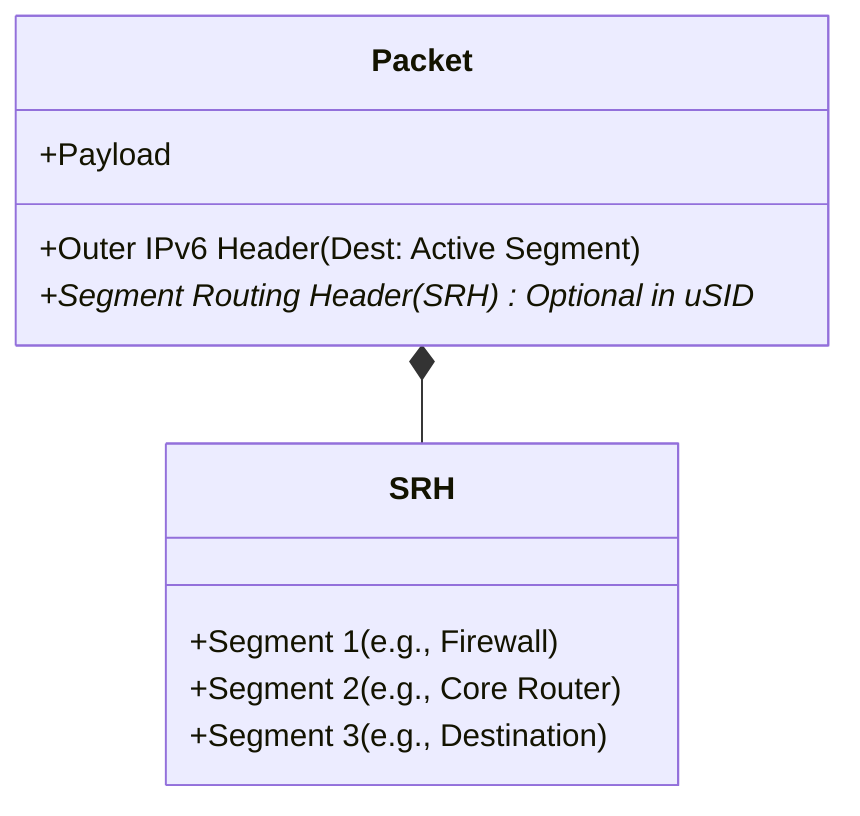
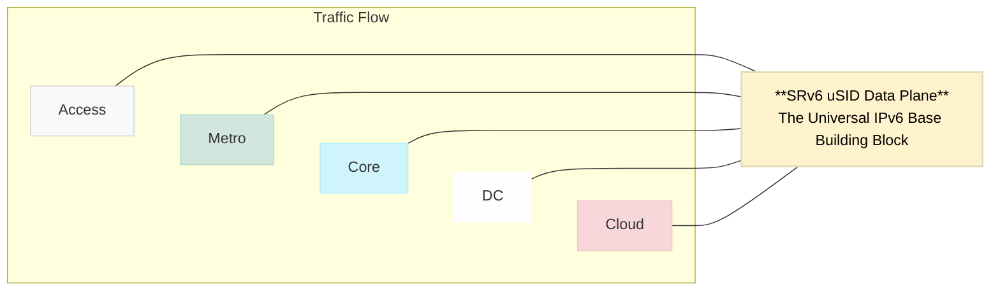
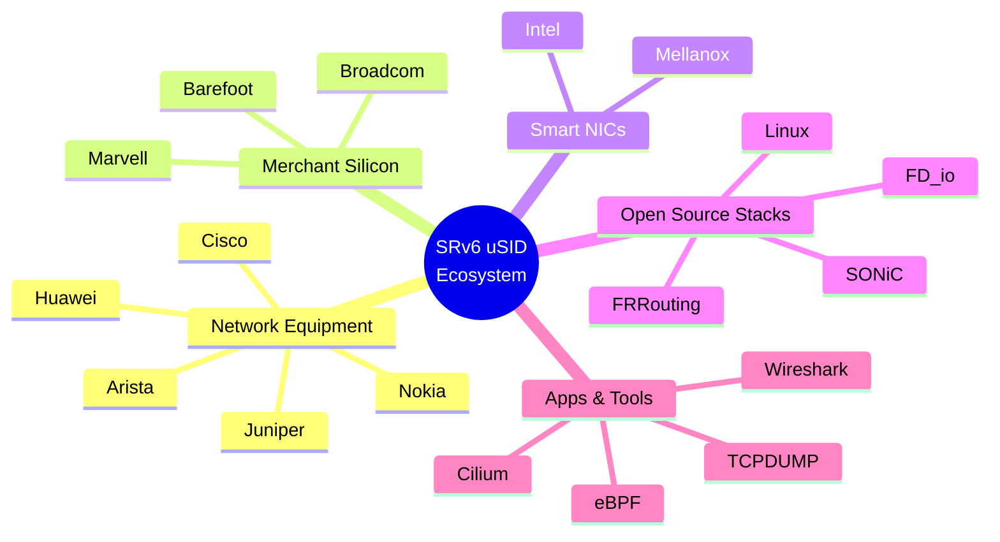
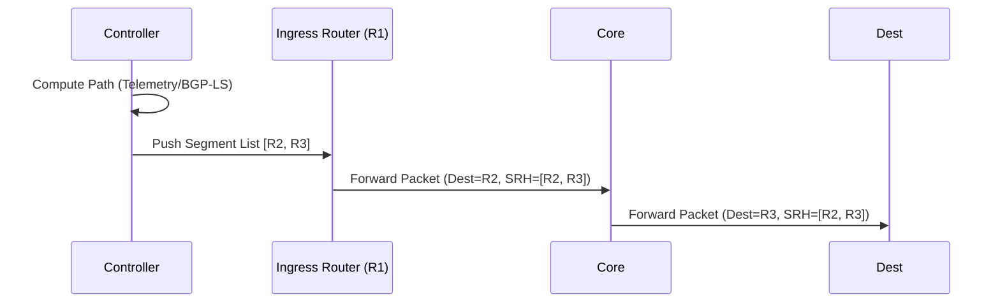
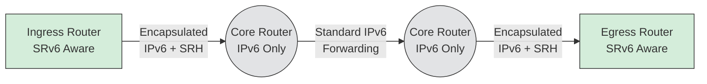

# Cloud-Native SASE / SD-WAN ISV Architecture

## Repository Overview
This repository serves as a technical knowledge base and architecture playground for building a **carrier-grade SASE (Secure Access Service Edge) and SD-WAN product** hosted natively in Microsoft Azure. 

As an Independent Software Vendor (ISV), the goal is to build a highly flexible, high-performance network overlay product **without relying on managed cloud provider abstractions** like Azure Virtual WAN (vWAN) or Azure Route Server (ARS). By doing so, we retain complete 100% control over routing protocols, traffic engineering, tunneling, and advanced architectures like SRv6, treating the public cloud simply as a high-speed IP transport underlay.

This documentation explores the challenges, workarounds, and architectural patterns required to run telco-grade routing natively on top of hyperscaler Software Defined Networks (SDNs).

---

## Azure Underlay Limitations & ISV SASE Workarounds

When building our own SASE platform on top of public cloud networks, we need to understand the behaviors and limitations of the cloud provider’s underlying Software Defined Network (SDN). Because Azure's SDN is heavily protected, an ISV must build an **overlay architecture** to achieve the following carrier-grade capabilities.

Here are the core concepts and how we adapt them for Azure:

### 1. Native SRv6
**Concept:** Native support for Segment Routing over IPv6 in the cloud network fabric. Allows encoding the forwarding path inside the packet using SRv6 segments. Enables service chaining, traffic engineering, and programmable routing without MPLS.
**The Azure Challenge:** Azure's native SDN does not expose or support Native SRv6 routing capabilities for tenant payloads.
**The Workaround:** All SRv6 logic must be handled in our proprietary software layer (inside the NVAs), independent of the Azure underlay.

### 2. IPv6 SRH Pass-Through
**Concept:** Ability for the cloud network to forward IPv6 packets that contain the Segment Routing Header (SRH) without dropping or stripping it. Required if SRv6 packets traverse the provider network unchanged.
**The Azure Challenge:** Azure's hypervisor (vSwitch) drops IPv6 packets that contain an SRH header to prevent potential security vectors or parsing bugs in hardware load balancers.
**The Workaround:** To route SRv6 packets between our SASE NVAs in Azure, we must wrap the SRv6 packets inside a UDP tunnel (e.g., `SRv6 over UDP` or `VXLAN`), or encrypt them inside IPsec ESP, effectively hiding the SRH header from the Azure SDN.

### 3. Router Appliance as WAN Hub
**Concept:** Capability to deploy a third-party virtual router appliance that acts as the central WAN hub for branch connectivity. The router participates in routing and controls traffic between branches, cloud workloads, and other networks.
**The Azure Challenge:** Azure does not inherently allow a third-party VM to dynamically dictate routing to the entire VNet fabric *unless* you integrate with Azure Route Server (ARS) or use Azure vWAN—both of which this architecture completely avoids to maintain 100% ISV control.
**The Workaround:** We treat Azure strictly as an underlay. Our edge clients, branch routers, and other cloud proxies build **Overlay Tunnels (IPsec, WireGuard, or UDP)** directly to our SASE NVA. All routing logic occurs within our proprietary overlay boundaries.

### 4. Customer-controlled L3 Transit
**Concept:** The customer fully controls Layer-3 routing across the cloud network. Includes custom route tables, BGP policy, route filtering, and traffic engineering. The cloud provider does not abstract routing decisions.
**The Azure Challenge:** By default, Azure VNets are stub networks, not transit networks. Natively routing traffic across VNets through a custom NVA requires managing static User Defined Routes (UDRs) everywhere.
**The Workaround:** To achieve true transit, the SASE control plane must orchestrate an end-to-end overlay. Traffic is pulled into the NVA via client agents or branch IPsec tunnels, allowing the NVA to bridge and route traffic transparently.

### 5. BGP-driven WAN Fabric
**Concept:** The WAN architecture uses BGP as the primary control plane for routing. Routes dynamically propagate between branches, SD-WAN devices, cloud workloads, and hubs. Enables scalable and dynamic WAN connectivity.
**The Azure Challenge:** Azure heavily limits direct BGP interactions with the VNet fabric natively (without using a managed service).
**The Workaround:** The SASE product must run its own internal BGP daemon (like FRRouting/BIRD/VPP). BGP peering sessions are established *between our NVAs exclusively over our overlay tunnels*. The Azure VNet structure remains completely oblivious to this BGP chatter.

### 6. SD-WAN Underlay Flexibility
**Concept:** Ability to deploy multiple networking appliances (SD-WAN, firewall, router, load balancer) and control how traffic flows between them. Important for service chaining, custom routing paths, and multi-vendor networking stacks.
**The Azure Challenge:** Azure restricts complex L2/L3 manipulations natively in the VNet. 
**The Workaround:** Traffic steering between chains must be handled at the NVA level using our SRv6 policies rather than attempting to chain via Azure UDRs or Native Load Balancers.

### 7. vWAN-like Managed Simplicity
**Concept:** A managed WAN service that abstracts routing complexity. Provides automatic route propagation, centralized management, and simplified branch connectivity (Example: cloud-managed WAN hub architecture).
**The Azure Challenge:** Azure offers Virtual WAN (vWAN), providing high "managed simplicity," but it limits capabilities to what Azure supports.
**The Workaround:** As a SASE ISV, our value proposition is our unique routing capabilities (dynamic SRv6 slice steering, deep packet inspection, custom QoS) which vWAN cannot do. We explicitly trade Azure's managed simplicity for extreme flexibility by building our own custom, centralized management plane to control our NVAs.

### 8. Carrier-grade WAN Patterns
**Concept:** Ability to build large-scale global WAN architectures with deterministic routing, high availability, multi-region connectivity, and scalable branch onboarding. Often used by telcos and large enterprises.
**The Azure Challenge:** Azure's cloud fabric natively struggles with complex asymmetric routing (due to stateful load balancers) and deterministic traffic engineering based on latency.
**The Workaround:** Building an overlay mesh of DPDK/VPP-accelerated NVAs allows us to reinstate these carrier-grade features entirely in software, bypassing the cloud provider's limitations.

### 9. SRv6 Experimentation Feasible
**Concept:** The cloud environment allows testing SRv6-based networking features. Includes the ability to generate SRv6 packets, run SRv6-capable routers, experiment with segment routing service chains, and test programmable data planes.
**The Azure Challenge:** Because the Azure hypervisor drops SRH headers, you cannot experiment with "native" SRv6 frames traversing the VNet easily.
**The Workaround:** All testing, local development, and service chaining validation requires setting up `SRv6 over UDP` or `SRv6 over IPsec` encapsulation first to allow cross-VM experimentation.

---

# Native SRv6 (Segment Routing over IPv6)

## Complete Technical Overview

Welcome to the IPv6 Educational Series. This document focuses on **Native SRv6 (Segment Routing over IPv6)**.

---

### Table of Contents
1. [What is SRv6?](#1-what-is-srv6)
2. [What Problem Does SRv6 Solve?](#2-what-problem-does-srv6-solve)
3. [How Does the Source Know the Entire Path?](#3-how-does-the-source-know-the-entire-path)
4. [Does the Source Need to Encode Every Physical Hop?](#4-does-the-source-need-to-encode-every-physical-hop)
5. [Do All Nodes Need to Be SRv6-Aware?](#5-do-all-nodes-need-to-be-srv6-aware)
6. [What Happens if One Node is Not SRv6-Aware?](#6-what-happens-if-one-node-is-not-srv6-aware)
7. [How SRv6 Forwarding Works (Packet Walk)](#7-how-srv6-forwarding-works-packet-walk)
8. [How is SRv6 Different from MPLS-SR?](#8-how-is-srv6-different-from-mpls-sr)
9. [What Breaks SRv6 in Real Deployments?](#9-what-breaks-srv6-in-real-deployments)
10. [How SRv6 is Deployed in Real Telco Networks](#10-how-srv6-is-deployed-in-real-telco-networks)
11. [SRv6 in Public Cloud Context](#11-srv6-in-public-cloud-context)
12. [Final Direct Answers](#12-final-direct-answers)

---

## 1) What is SRv6?

SRv6 (Segment Routing over IPv6) is a routing architecture where:
- The entire forwarding path is encoded inside the packet.
- The path is stored in an IPv6 extension header called the **Segment Routing Header (SRH)**.
- Each segment is represented by an IPv6 address.
- A segment can represent:
  - A node
  - A service
  - A function
  - A policy
  - A behavior

Instead of routers making independent hop-by-hop routing decisions, the ingress node defines the full path. This is sometimes called "source routing", but implemented in a scalable, carrier-grade way.

### SRv6 Base Concepts
- **SID (Segment Identifier)**: A 128-bit instruction placed in the IPv6 destination address field – analogous to an MPLS Label.
- **Locator**: The portion of the 128-bit SID that identifies a Node (analogous to SR Node SID).
- **Function**: The portion of the 128-bit SID that identifies a local behavior on the receiving Node (analogous to SR VPN label, Adj-SID).



### Full SID vs. Micro-SID (uSID)
There are two primary flavors of SRv6:
1. **Full SID with SRH**: Uses the 128-bit SRH header structure. Better for strict traffic engineering but carries high header overhead.
2. **uSID (Micro-SID)**: Encodes multiple 16-bit instructions (micro-segments) into a single 128-bit IPv6 destination address (up to 6 micro-SIDs per block). This provides massive reduction in header overhead and is much simpler for ASIC processing. *The vast majority of modern SRv6 deployments use uSID.*

## 2) What Problem Does SRv6 Solve?

SRv6 was designed to simplify and modernize:
- Traffic engineering
- Service chaining
- Network programmability
- Fast reroute
- 5G slicing
- MPLS replacement

**Traditional MPLS requires:**
- Label distribution protocols (LDP)
- Stateful core
- Complex control plane

**SRv6 removes:**
- MPLS label distribution
- Per-flow state in the core

The intelligence is pushed to the **ingress node** and the **controller**. The core becomes stateless IPv6 forwarding.

### SRv6: Unified Forwarding Architecture
SRv6 fundamentally acts as the unified base building block across all network domains. Since it relies on native IPv6 forwarding, a single uSID architecture can span across the Host, Data Center, Access, Metro, Core, and public Cloud seamlessly.



### Rich SRv6 Ecosystem
SRv6 is strongly supported across a diverse industry ecosystem, from hardware to open-source software applications.



---

## 3) How Does the Source Know the Entire Path?

The source does NOT guess the path. It gets the segment list from the control plane. There are three common models:

### A) Controller-Based Model (Most Common)
A centralized controller:
- Knows the topology and collects network state (BGP-LS, IGP, telemetry).
- Computes the optimal path.
- Pushes a segment list to the ingress router.

Instead of `R1 -> R2 -> R3 -> R4`, the controller gives `R1` the Segment List `[R2, R3, R4]`. `R1` inserts this list into the SRH.



### B) Distributed Control Plane
- Routers advertise Segment IDs (SIDs).
- IGP distributes topology.
- Ingress computes path locally (Common in ISP backbones).

### C) Service Chaining Model
Application or orchestrator defines the path. 
*Example: Firewall -> DPI -> NAT -> Destination*

Ingress router encodes the Segments: `[FW, DPI, NAT, DEST]` into the packet.

---

## 4) Does the Source Need to Encode Every Physical Hop?

**No.** Segments do NOT have to represent every physical hop.
They can represent:
- Logical nodes
- Regions
- Services
- Functions

*Example:* Instead of encoding `R1 -> R2 -> R3 -> R4`, you might encode `[Region-A, Firewall, Destination]`. Intermediate routing can happen normally inside those segments.

---

## 5) Do All Nodes Need to Be SRv6-Aware?

**No.** This is a critical concept. There are three scenarios:

1. **Fully SRv6-Aware Domain**: All routers understand SRH. Each hop processes the segment list. Ideal deployment.
2. **Encapsulation Model (Common in Practice)**: Ingress router encapsulates packet in outer IPv6 header with SRH. Core routers just forward IPv6 normally and do NOT need to understand SR logic. Only nodes that execute segments must understand SRv6.
3. **Node Drops IPv6 Extension Headers**: If a device filters or drops unknown extension headers, the SRv6 chain breaks. This is a massive real-world challenge.



---

## 6) What Happens if One Node is Not SRv6-Aware?

There are two interpretations depending on the node's behavior:

1. **Not SR-aware but forwards IPv6 normally**: No problem. SRH is just an IPv6 extension header. Packet continues forwarding.
2. **Device drops extension headers**: Chain breaks and the packet is dropped. Common in firewalls, some load balancers, legacy routers, and cloud fabrics.

---

## 7) How SRv6 Forwarding Works (Packet Walk)

**Packet structure:**
```text
[Outer IPv6 Header]
[Segment Routing Header]
    Segment 1
    Segment 2
    Segment 3
[Payload]
```

**Process (SRH vs uSID Shift-and-Forward):**

Unlike MPLS, SRH SID-Lists are processed last-to-first.
1. Active segment is copied into the IPv6 Destination Address.
2. Router forwards packet toward that segment.
3. When the segment endpoint is reached:
   - In **Classic SRH**: The node executes a function, the "Segments Left" counter is decremented, and the pointer moves to the next segment.
   - In **uSID**: It uses a "Shift-and-Forward" instruction where the node looks up the updated Destination Address, shifts the bits left, and forwards it to the next micro-segment.

**Result:** No per-flow state is stored in the core. All state is in the packet.

---

## 8) How is SRv6 Different from MPLS-SR?

| Feature | MPLS-SR | SRv6 |
| :--- | :--- | :--- |
| **Data Plane** | Uses label stack | Uses IPv6 addresses |
| **Dependencies** | Requires MPLS support & label distribution | No MPLS required |
| **Addressing** | Local significance typically | Global addressing model |
| **Capabilities** | Forwarding primarily | Programmable behaviors (not just forwarding) |
| **Overhead** | Smaller headers | Heavier (larger headers) |

---

## 9) What Breaks SRv6 in Real Deployments?

Common issues encountered in real-world scenarios:
- **MTU problems:** SRH increases packet size.
- **Extension header filtering:** Blocked by middleboxes.
- **Hardware constraints:** ASIC limitations on parsing deep headers.
- **Security policies:** Firewall and cloud fabric filtering.
- **Control Plane limitations:** Lack of IPv6 support.
- **Load Balancers:** May strip unknown headers.

---

## 10) How SRv6 is Deployed in Real Telco Networks

**Typical model:**
- **Ingress PE**: SR aware
- **Core routers**: IPv6 forwarding only (No full SR logic required)
- **Egress PE**: SR aware

Only the ingress node and the specific segment endpoints must understand SRv6 behaviors.

---

## 11) SRv6 in Public Cloud Context

Important distinctions:
- **The Cloud does NOT expose its backbone SR capabilities.**
- To experiment with SRv6 in cloud you need:
  - IPv6 support
  - No extension header filtering
  - Ability to deploy router VMs
  - MP-BGP IPv6 if doing dynamic routing

You are *not* using cloud backbone SR; you are building your own SR domain inside VMs. The cloud underlay may filter headers, limit MTU, or restrict BGP IPv6. This is why experimentation varies wildly by provider.

---

## 12) Final Direct Answers

* **Q: How does the source know the path?**
  * **A:** Through a controller or distributed control plane that computes and provides the segment list.
* **Q: Does the source need full topology knowledge?**
  * **A:** No. It needs segment identifiers and policy input.
* **Q: Do all nodes need to be SRv6-aware?**
  * **A:** No. They only need to forward IPv6 and not drop extension headers.
* **Q: If one node is not SRv6-aware, does it break?**
  * **A:** Only if it drops extension headers or cannot forward IPv6 correctly.

---
*End of SRv6 Technical Brief*
