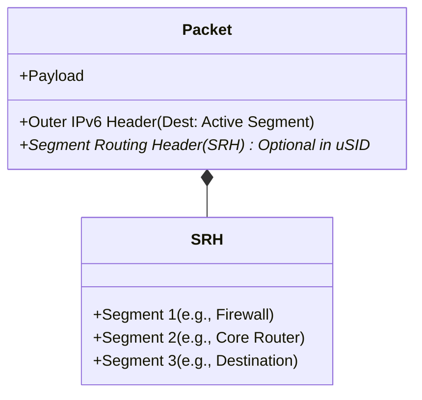
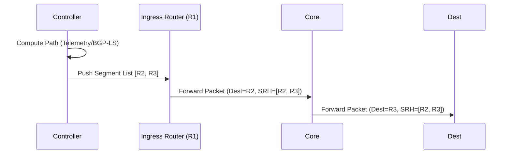
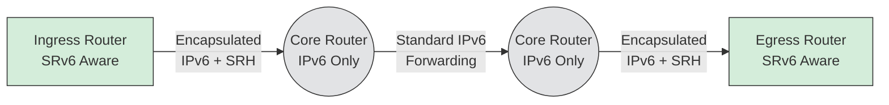

# Native SRv6 (Segment Routing over IPv6)

## Complete Technical Overview

Welcome to the IPv6 Educational Series. This document focuses on **Native SRv6 (Segment Routing over IPv6)**.

---

### Table of Contents
1. [What is SRv6?](#1-what-is-srv6)
2. [What Problem Does SRv6 Solve?](#2-what-problem-does-srv6-solve)
3. [How Does the Source Know the Entire Path?](#3-how-does-the-source-know-the-entire-path)
4. [Does the Source Need to Encode Every Physical Hop?](#4-does-the-source-need-to-encode-every-physical-hop)
5. [Do All Nodes Need to Be SRv6-Aware?](#5-do-all-nodes-need-to-be-srv6-aware)
6. [What Happens if One Node is Not SRv6-Aware?](#6-what-happens-if-one-node-is-not-srv6-aware)
7. [How SRv6 Forwarding Works (Packet Walk)](#7-how-srv6-forwarding-works-packet-walk)
8. [How is SRv6 Different from MPLS-SR?](#8-how-is-srv6-different-from-mpls-sr)
9. [What Breaks SRv6 in Real Deployments?](#9-what-breaks-srv6-in-real-deployments)
10. [How SRv6 is Deployed in Real Telco Networks](#10-how-srv6-is-deployed-in-real-telco-networks)
11. [SRv6 in Public Cloud Context](#11-srv6-in-public-cloud-context)
12. [Final Direct Answers](#12-final-direct-answers)

---

## 1) What is SRv6?

SRv6 (Segment Routing over IPv6) is a routing architecture where:
- The entire forwarding path is encoded inside the packet.
- The path is stored in an IPv6 extension header called the **Segment Routing Header (SRH)**.
- Each segment is represented by an IPv6 address.
- A segment can represent:
  - A node
  - A service
  - A function
  - A policy
  - A behavior

Instead of routers making independent hop-by-hop routing decisions, the ingress node defines the full path. This is sometimes called "source routing", but implemented in a scalable, carrier-grade way.

### SRv6 Base Concepts
- **SID (Segment Identifier)**: A 128-bit instruction placed in the IPv6 destination address field – analogous to an MPLS Label.
- **Locator**: The portion of the 128-bit SID that identifies a Node (analogous to SR Node SID).
- **Function**: The portion of the 128-bit SID that identifies a local behavior on the receiving Node (analogous to SR VPN label, Adj-SID).



### Full SID vs. Micro-SID (uSID)
There are two primary flavors of SRv6:
1. **Full SID with SRH**: Uses the 128-bit SRH header structure. Better for strict traffic engineering but carries high header overhead.
2. **uSID (Micro-SID)**: Encodes multiple 16-bit instructions (micro-segments) into a single 128-bit IPv6 destination address (up to 6 micro-SIDs per block). This provides massive reduction in header overhead and is much simpler for ASIC processing. *The vast majority of modern SRv6 deployments use uSID.*

## 2) What Problem Does SRv6 Solve?

SRv6 was designed to simplify and modernize:
- Traffic engineering
- Service chaining
- Network programmability
- Fast reroute
- 5G slicing
- MPLS replacement

**Traditional MPLS requires:**
- Label distribution protocols (LDP)
- Stateful core
- Complex control plane

**SRv6 removes:**
- MPLS label distribution
- Per-flow state in the core

The intelligence is pushed to the **ingress node** and the **controller**. The core becomes stateless IPv6 forwarding.

---

## 3) How Does the Source Know the Entire Path?

The source does NOT guess the path. It gets the segment list from the control plane. There are three common models:

### A) Controller-Based Model (Most Common)
A centralized controller:
- Knows the topology and collects network state (BGP-LS, IGP, telemetry).
- Computes the optimal path.
- Pushes a segment list to the ingress router.

Instead of `R1 -> R2 -> R3 -> R4`, the controller gives `R1` the Segment List `[R2, R3, R4]`. `R1` inserts this list into the SRH.



### B) Distributed Control Plane
- Routers advertise Segment IDs (SIDs).
- IGP distributes topology.
- Ingress computes path locally (Common in ISP backbones).

### C) Service Chaining Model
Application or orchestrator defines the path. 
*Example: Firewall -> DPI -> NAT -> Destination*

Ingress router encodes the Segments: `[FW, DPI, NAT, DEST]` into the packet.

---

## 4) Does the Source Need to Encode Every Physical Hop?

**No.** Segments do NOT have to represent every physical hop.
They can represent:
- Logical nodes
- Regions
- Services
- Functions

*Example:* Instead of encoding `R1 -> R2 -> R3 -> R4`, you might encode `[Region-A, Firewall, Destination]`. Intermediate routing can happen normally inside those segments.

---

## 5) Do All Nodes Need to Be SRv6-Aware?

**No.** This is a critical concept. There are three scenarios:

1. **Fully SRv6-Aware Domain**: All routers understand SRH. Each hop processes the segment list. Ideal deployment.
2. **Encapsulation Model (Common in Practice)**: Ingress router encapsulates packet in outer IPv6 header with SRH. Core routers just forward IPv6 normally and do NOT need to understand SR logic. Only nodes that execute segments must understand SRv6.
3. **Node Drops IPv6 Extension Headers**: If a device filters or drops unknown extension headers, the SRv6 chain breaks. This is a massive real-world challenge.



---

## 6) What Happens if One Node is Not SRv6-Aware?

There are two interpretations depending on the node's behavior:

1. **Not SR-aware but forwards IPv6 normally**: No problem. SRH is just an IPv6 extension header. Packet continues forwarding.
2. **Device drops extension headers**: Chain breaks and the packet is dropped. Common in firewalls, some load balancers, legacy routers, and cloud fabrics.

---

## 7) How SRv6 Forwarding Works (Packet Walk)

**Packet structure:**
```text
[Outer IPv6 Header]
[Segment Routing Header]
    Segment 1
    Segment 2
    Segment 3
[Payload]
```

**Process (SRH vs uSID Shift-and-Forward):**

Unlike MPLS, SRH SID-Lists are processed last-to-first.
1. Active segment is copied into the IPv6 Destination Address.
2. Router forwards packet toward that segment.
3. When the segment endpoint is reached:
   - In **Classic SRH**: The node executes a function, the "Segments Left" counter is decremented, and the pointer moves to the next segment.
   - In **uSID**: It uses a "Shift-and-Forward" instruction where the node looks up the updated Destination Address, shifts the bits left, and forwards it to the next micro-segment.

**Result:** No per-flow state is stored in the core. All state is in the packet.

---

## 8) How is SRv6 Different from MPLS-SR?

| Feature | MPLS-SR | SRv6 |
| :--- | :--- | :--- |
| **Data Plane** | Uses label stack | Uses IPv6 addresses |
| **Dependencies** | Requires MPLS support & label distribution | No MPLS required |
| **Addressing** | Local significance typically | Global addressing model |
| **Capabilities** | Forwarding primarily | Programmable behaviors (not just forwarding) |
| **Overhead** | Smaller headers | Heavier (larger headers) |

---

## 9) What Breaks SRv6 in Real Deployments?

Common issues encountered in real-world scenarios:
- **MTU problems:** SRH increases packet size.
- **Extension header filtering:** Blocked by middleboxes.
- **Hardware constraints:** ASIC limitations on parsing deep headers.
- **Security policies:** Firewall and cloud fabric filtering.
- **Control Plane limitations:** Lack of IPv6 support.
- **Load Balancers:** May strip unknown headers.

---

## 10) How SRv6 is Deployed in Real Telco Networks

**Typical model:**
- **Ingress PE**: SR aware
- **Core routers**: IPv6 forwarding only (No full SR logic required)
- **Egress PE**: SR aware

Only the ingress node and the specific segment endpoints must understand SRv6 behaviors.

---

## 11) SRv6 in Public Cloud Context

Important distinctions:
- **The Cloud does NOT expose its backbone SR capabilities.**
- To experiment with SRv6 in cloud you need:
  - IPv6 support
  - No extension header filtering
  - Ability to deploy router VMs
  - MP-BGP IPv6 if doing dynamic routing

You are *not* using cloud backbone SR; you are building your own SR domain inside VMs. The cloud underlay may filter headers, limit MTU, or restrict BGP IPv6. This is why experimentation varies wildly by provider.

---

## 12) Final Direct Answers

* **Q: How does the source know the path?**
  * **A:** Through a controller or distributed control plane that computes and provides the segment list.
* **Q: Does the source need full topology knowledge?**
  * **A:** No. It needs segment identifiers and policy input.
* **Q: Do all nodes need to be SRv6-aware?**
  * **A:** No. They only need to forward IPv6 and not drop extension headers.
* **Q: If one node is not SRv6-aware, does it break?**
  * **A:** Only if it drops extension headers or cannot forward IPv6 correctly.

---
*End of SRv6 Technical Brief*
