# Cloud-Native SASE / SD-WAN ISV Architecture

### 📚 Companion Deep-Dive Guides
* **[Check Point AKS Cloud-Native SASE Architecture (VPP, SRv6, SR-IOV)](./checkpoint_aks_sase.md)**
* **[Azure vWAN Global Scale & Limits Breakdown (MTU, Connections, BGP)](./azure_vwan_scale.md)**

---

### Master Table of Contents
1. [Education: Understanding SASE](#education-understanding-sase)
2. [Check Point SASE (Harmony) Architecture](#check-point-sase-harmony-architecture)
3. [Repository Overview](#repository-overview)
4. [The "Explain It Like I'm 5" (ELI5) Guide](#the-explain-it-like-im-5-eli5-guide-to-our-sase)
5. [SASE Reference Architecture in Azure](#sase-reference-architecture-in-azure)
6. [Azure Underlay Limitations & ISV SASE Workarounds](#azure-underlay-limitations--isv-sase-workarounds)
7. [Deep Dive: Native SRv6 Architecture](#deep-dive-native-srv6-architecture)
8. [Deep Dive: IPv6 SRH Pass-Through in Cloud](#deep-dive-ipv6-srh-pass-through-in-cloud)
9. [Deep Dive: Router Appliance as WAN Hub](#deep-dive-router-appliance-as-wan-hub)
10. [Deep Dive: Customer-Controlled L3 Transit](#deep-dive-customer-controlled-l3-transit)
11. [Deep Dive: BGP-Driven WAN Fabric](#deep-dive-bgp-driven-wan-fabric)
12. [Deep Dive: SD-WAN Underlay Flexibility vs Managed Simplicity](#deep-dive-sd-wan-underlay-flexibility-vs-managed-simplicity)
13. [Deep Dive: Carrier-Grade WAN Patterns](#deep-dive-carrier-grade-wan-patterns)
14. [Deep Dive: SRv6 Experimentation Feasible](#deep-dive-srv6-experimentation-feasible)

---

## Education: Understanding SASE

### What is SASE?
Secure Access Service Edge (SASE) is an enterprise networking and security architecture standard. It converges comprehensive Wide Area Networking (WAN) capabilities with comprehensive network security functions to support the dynamic secure access needs of diverse digital enterprises. 

In simple terms, instead of backhauling traffic from remote workers or branch offices to a central corporate data center just to apply security policies (the traditional model), SASE brings the network and security controls directly to the edge—closer to the users, devices, and applications, regardless of where they are located.

### The Challenges SASE Solves
Traditional network architectures rely on a perimeter-based security model. As organizations move to the cloud and embrace remote work, this model breaks down. SASE addresses several critical challenges:
* **Tromboning / Hairpinning:** Routing cloud-bound traffic through on-premises data centers for security inspection adds severe latency. SASE inspects and secures traffic locally at the cloud edge.
* **Complex Appliance Sprawl:** Managing separate point solutions (firewalls, proxies, VPNs, SD-WAN controllers) from different vendors is expensive and complex. SASE consolidates these into a single, unified cloud service.
* **Inconsistent Security Policies:** Remote users often bypass corporate VPNs to access cloud apps directly, leading to security blind spots. SASE enforces a consistent security posture regardless of user location or device.
* **Network Performance and Scalability:** Legacy VPNs struggle to handle the bandwidth demands of modern cloud applications. SASE leverages cloud-native scale and distributed Points of Presence (PoPs) for optimal routing.

### Core Components of SASE
SASE is a framework composed of two primary pillars: **Network as a Service (NaaS)** and **Network Security as a Service (NSaaS)** (often referred to as Security Service Edge, or SSE). While specific implementations vary by vendor, a true SASE architecture fundamentally includes:

#### 1. The Networking Pillar (SD-WAN)
* **Software-Defined WAN (SD-WAN):** Intelligently routes traffic over multiple transports (MPLS, broadband, LTE/5G) based on application performance, prioritizing critical traffic and ensuring high availability.

#### 2. The Security Pillar (Security Service Edge - SSE)
* **Zero Trust Network Access (ZTNA):** Replaces traditional VPNs by providing identity- and context-based access to specific applications, rather than granting broad network access. "Never trust, always verify."
* **Secure Web Gateway (SWG):** Protects users from web-based threats by filtering malicious traffic, enforcing acceptable use policies, and providing SSL/TLS inspection for internet-bound traffic.
* **Cloud Access Security Broker (CASB):** Secures data in transit and at rest within SaaS applications. It provides visibility, compliance, data loss prevention (DLP), and threat protection for cloud services.
* **Firewall as a Service (FWaaS):** Delivers Next-Generation Firewall (NGFW) capabilities (like IDS/IPS, URL filtering, and deep packet inspection) from the cloud, scaling elastically without the limits of physical hardware.

### Visualizing SASE Architecture

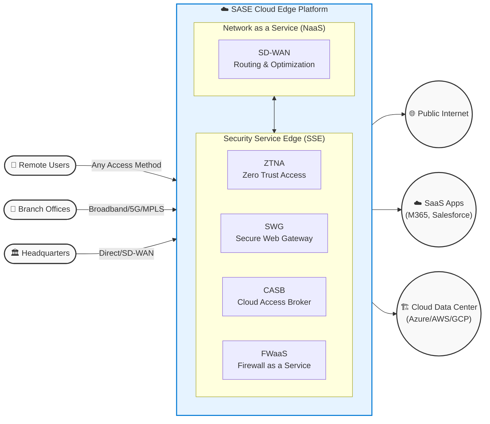

By merging these components into a single cloud-delivered platform, SASE allows organizations to drastically simplify their IT infrastructure while improving both security and user experience.

---

## Check Point SASE (Harmony) Architecture

Check Point provides a comprehensive SASE solution primarily known as **Harmony SASE** (incorporating technologies from Perimeter 81) alongside **Quantum SD-WAN**. The solution uniquely converges networking and cloud-delivered security, powered by their centralized threat intelligence network.

### Key Components of Check Point SASE

The architecture operates across three main layers: the network endpoints, the cloud security edge, and the centralized management/intelligence plane.

#### 1. The Cloud Security Edge (Harmony SASE Global PoPs / SSE)
Check Point operates a high-speed global backbone of network Points of Presence (PoPs). All traffic to the Internet, SaaS, or private data centers routes through this edge, where it is thoroughly inspected dynamically in the cloud.
* **ZTNA (Zero Trust Network Access - Harmony Connect):** Grants user and device-specific least-privilege access to corporate applications. It evaluates identity (integrating with Okta, Entra ID, Ping, etc.), verifies endpoint device posture (checking for active AV, patched OS, encryption), and creates a secure, application-level micro-tunnel directly to Azure VNets, AWS VPCs, or On-Prem servers. This modernizes remote access by eliminating implicit trust, replacing legacy VPNs, and keeping private applications completely hidden from the public internet.
* **SWG (Secure Web Gateway - Harmony Browse):** Protects the workforce from web-borne threats by utilizing rapid cloud proxies and on-device "nano-agents." It performs SSL/TLS decryption to inspect encrypted traffic, neutralizing zero-day phishing, credential theft, and drive-by malware downloads before they hit the browser. administrators can enforce granular granular URL filtering, Safe Search protocols, and usage policies to reduce risk and manage bandwidth.
* **CASB (Cloud Access Security Broker - Harmony Email & Collaboration):** Operates inline or via deep API integrations with major SaaS providers (Microsoft 365, Google Workspace, Salesforce, Slack, Teams). It automatically discovers "Shadow IT" apps being used by employees, prevents sensitive data leaks via enterprise-grade Data Loss Prevention (DLP), detects Account Takeovers (ATO), and utilizes AI to intercept highly complex Business Email Compromise (BEC) and targeted phishing campaigns.
* **FWaaS (Firewall as a Service - CloudGuard Network Security):** Shifts the compute demands of heavy perimeter screening into the cloud. It applies Check Point's complete Advanced Threat Prevention (ATP) suite to traffic flowing between branches, clouds, and the internet. Native capabilities include the Intrusion Prevention System (IPS), Application Control, Anti-Bot analysis, and deep packet inspection—providing Next-Generation Firewall (NGFW) performance delivered instantly without the need to rack, stack, or maintain expensive physical security appliances at every branch location.

#### 2. The Network Edge (Quantum SD-WAN)
* **Quantum SD-WAN & Quantum Gateways:** Next-Generation smart edge devices that bring immense agility and resilience to Wide Area Networks. They provide **Sub-second Link Failover**, allowing live VoIP streams or video calls to shift seamlessly across different transport methods (Broadband, 5G, or MPLS) without dropping the user's session. It features intelligent, **Application-Based Routing**, ensuring high priority and low latency for mission-critical apps (like Zoom/Teams) while orchestrating automated, Zero-Touch Provisioning (ZTP) secure Auto-VPN IPsec tunnels that forward standard traffic upward to the Harmony SASE PoPs.

#### 3. Management and Threat Intelligence (The Brain)
* **Infinity Portal (The SASE Controller):** A massively scalable, unified cloud management platform. It completely collapses network tracking, threat remediation, and policy creation into a true "single pane of glass." Security teams no longer jump between disconnected dashboards; a single unified SD-WAN routing and ZTNA security policy can orchestrate workloads ranging from an Azure native VPC down to a physical on-prem datacenter, all accompanied by comprehensive real-time logging and compliance analytics.
* **ThreatCloud AI:** The invisible powerhouse underlying the entire Check Point ecosystem. It acts as the global intelligence engine, analyzing threat telemetry from millions of worldwide Check Point gateways, endpoints, and mobile devices natively in real-time. Driven by advanced machine learning models, ThreatCloud AI instantly identifies newly birthed zero-day exploits, malicious C2 (Command & Control) URLs, and emerging malware—proactively distributing blocklists to all your SASE enforcement points globally within seconds, completely without human intervention.

### Visualizing Check Point SASE

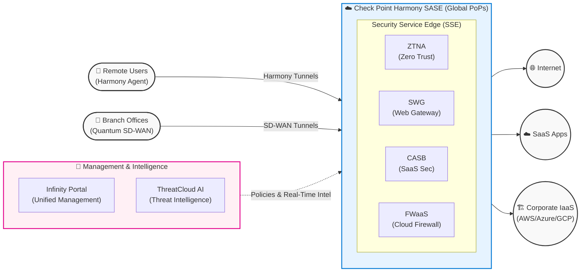

---

## Repository Overview
This repository serves as a technical knowledge base and architecture playground for building a **managed, carrier-grade SASE (Secure Access Service Edge) and SD-WAN product** hosted natively in Microsoft Azure. 

As an Independent Software Vendor (ISV) offering a managed service, the deployment model is **"SASE Per Customer"**. Rather than mixing multiple clients in a massive multi-tenant network, we automatically deploy and manage an isolated, dedicated SASE environment (both Control Plane and Data Plane) in Azure for *each end customer*. 

The goal is to build a highly flexible, high-performance network overlay product **without relying on managed cloud provider abstractions** like Azure Virtual WAN (vWAN) or Azure Route Server (ARS). By doing so, the ISV retains complete 100% control over the customer's routing protocols, traffic engineering, tunneling, and advanced service chaining architectures like SRv6, treating the customer's dedicated public cloud VNet simply as a high-speed IP transport underlay.

This documentation explores the challenges, workarounds, and architectural patterns required to run telco-grade routing natively on top of hyperscaler Software Defined Networks (SDNs) for an isolated customer instance.

---

## 📖 The "Explain It Like I'm 5" (ELI5) Guide to Our SASE
*If you are not a network engineer, terms like "SRv6", "BGP", and "UDP Encapsulation" can sound like a foreign language. Here is a simple analogy to understand what we are building and **why** we are building it this way.*

### The Analogy: The "Smart Postal System"

Imagine you need to send a highly secure package through the regular public mail. The public mail system represents **Azure's Native Network (The Underlay)**.

#### 1. The Problem with the Public Mail (Azure):
The regular mail system is "dumb". It only looks at the "To" and "From" addresses on the outside of a box. It doesn't care what is inside, and it definitely does not support complex instructions like: *"Take this to the X-Ray facility first, then to the bomb-sniffer, completely wipe the fingerprints, and only THEN deliver it."* 

If you use Azure's default tools (like Azure virtual WAN), you are completely at the mercy of their basic rules.

#### 2. Our Solution: The VIP Smart Box (The SASE Overlay):
Instead of relying on Azure's limitatons, we build our own logistics system. We take the user's secure data, attach a highly detailed **"Smart Routing Instruction Card" (This is SRv6)**, and then shove the whole thing into a plain, boring cardboard box **(This is UDP Encapsulation)**. 

#### 3. The Azure Transport (The Blind Courier):
We hand this boring box to Azure. Azure just sees a standard cardboard box and drives it to our destination (Our **SASE Virtual Router / NVA**). Azure has *no idea* what is inside the box, which means Azure cannot accidentally drop our traffic or interfere with our detailed routing. We have effectively "blinded" the cloud provider so establishing our own rules is possible.

#### 4. Service Chaining (The Assembly Line):
When the plain box arrives at our secure facility (The SASE NVA), here is what happens:
1. We open the plain cardboard box (Strip the **UDP wrapper**).
2. We read the internal VIP Instruction Card (Read the **SRv6 header**): *"Ah, this needs to go to the Malware Scanner next."*
3. We set the card aside temporarily, and hand the raw contents to the scanner (The **IPS Engine**). 
4. When the scanner returns the clean contents to us, we tape the VIP Instruction Card back on, put it in a *new* plain box, and hand it back to the Azure courier for the next hop.

#### 5. The Dispatch HQ (The Customer's SASE Controller):
If the factories are busy opening boxes and scanning items, who coordinates the big picture? That is the **Dedicated SASE Orchestrator & SD-WAN Controller**. It acts as "Air Traffic Control" for *that specific customer*, logically mapping out the global topology, and pushing new VIP Instruction rules down to the factories—doing so without the Azure Fabric ever knowing.

### Visualizing the Difference:

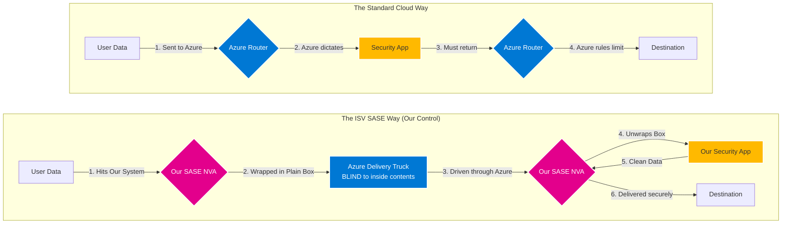

---

## SASE Reference Architecture in Azure

To understand how an ISV builds a custom SASE fabric in Azure (deployed dedicated-per-customer) without using managed Network services (like Virtual WAN), we must visualize the separation between the **Azure Underlay** and the **ISV Overlay**. High-performance NVAs (like Check Point CloudGuard Gateway) hosted in VMs act as the core routing fabric.

### Cloud Hub & Spoke Connectivity Model (Multi-Cloud SASE)

This diagram illustrates a real-world multi-cloud deployment of Check Point's SASE solution. The **🧠 Management & Intelligence plane** (Infinity Portal and ThreatCloud AI) acts as the overarching global control plane hosted in the **AWS Cloud**, while the heavy lifting of the **Data Plane** (SSE elements, CloudGuard, Harmony, and Quantum SD-WAN transit) is implemented entirely within the customer's dedicated **Azure Cloud** infrastructure.

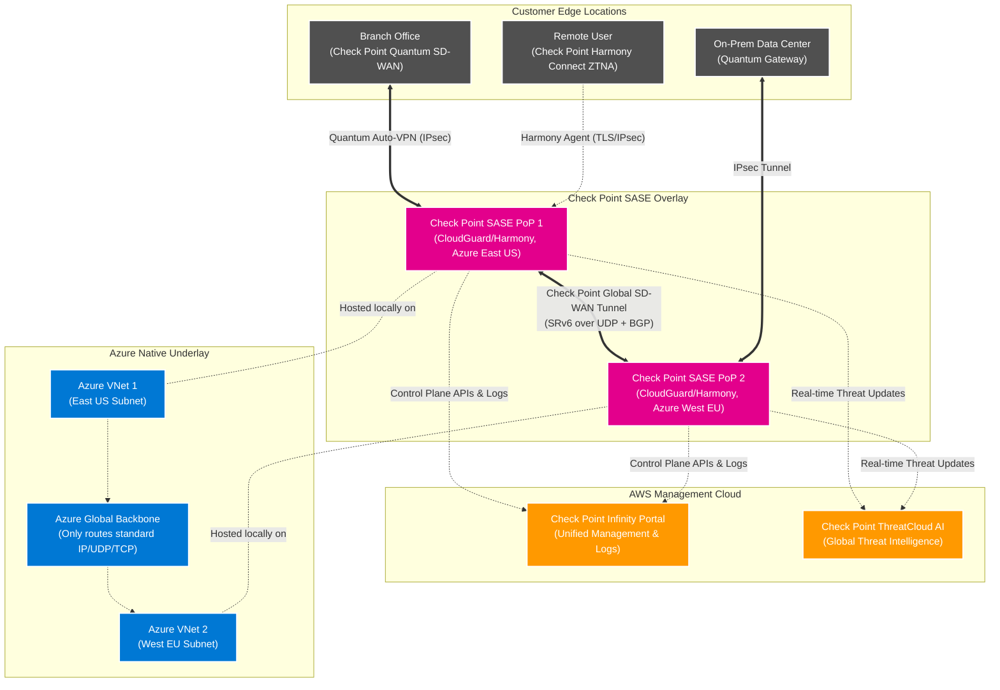

### Understanding the Overlay vs. Underlay

To build this architecture successfully, an ISV must strictly separate the network into two distinct planes:

#### 1. The Azure Native Underlay (The Transport Layer)
Represented by the **blue** boxes in the diagram.
*   **What it is:** The physical Microsoft-owned network, meaning the dedicated Virtual Networks (VNets), subnets, and the global Azure backbone provisioned specifically for that customer.
*   **Its purpose:** To provide highly reliable, high-speed *basic* IP connectivity between the ISV's Virtual Machines (the SASE Hub components). 
*   **The constraint:** As an ISV, we do not control this layer's advanced routing. If we try to inject complex BGP topologies, SRv6 paths, or custom L2 transit natively into these blue boxes, Azure's SDN will block or drop the traffic to protect its fabric. It only sees and routes standard TCP/UDP packets.

#### 2. The Customer's SASE Overlay Fabric (The Intelligence Layer)
Represented by the **pink** boxes in the diagram.
*   **What it is:** The proprietary software network created by the ISV running high-performance routing software (like FD.io VPP or DPDK) inside the Azure VMs provisioned in the customer's tenant environment. 
*   **Its purpose:** To provide the carrier-grade routing features that Azure lacks. The NVAs establish "tunnels" (like UDP, VXLAN, or IPsec) between each other over the Azure underlay. 
*   **The magic:** All of the advanced edge features—such as BGP peering with branch routers, **service chaining between SASE products (routing natively from SD-WAN Gateway to FWaaS to SWG to CASB)**, SRv6 traffic engineering, deep packet inspection (DPI), and zero-trust policies—happen strictly *inside* these pink overlay boxes (or across local container interfaces) and tunnels.

#### 3. The Engineering Motivation: Why use IPv6 (SRv6) at the core?
Looking at Check Point's architecture, you might wonder: *why bother using IPv6 for the underlying infrastructure instead of standard IPv4?* Utilizing **SRv6 (Segment Routing over IPv6)** is actually a massive engineering "cheat code" for SASE providers:

*   **Programmable Packets (Service Chaining):** Unlike IPv4 which has a rigid header, IPv6 was built with Extension Headers. SRv6 allows the SASE Gateway to program the exact service chain *directly into the packet itself*. Instead of configuring complex stateful routing (PBR) hop-by-hop, the packet carries instructions: *"Take me to the CloudGuard Firewall (SID 1), then Harmony Browse (SID 2), then out to the Internet (SID 3)."*
*   **Solving the Multi-Tenant Overlapping IP Nightmare:** 99% of enterprise customers use the exact same private IPv4 ranges (`10.0.0.0/8`). If Check Point had to route hundreds of customers over an IPv4 core, it would require CPU-heavy and highly complex Network Address Translation (NAT) / VRF isolation. By wrapping customer payloads inside a massive IPv6 overlay, every tenant, branch, and user gets a globally unique, collision-free routing space while keeping their internal `10.x` addresses undisturbed.
*   **Stateless, Highly Scalable Core:** Because the SRv6 header dictates the path, intermediate core routers don't need to learn massive tracking tables for every single session flow limit. They simply read the outer destination IPv6 address and forward it blindly. This makes scaling the global PoPs incredibly fast and resilient.

#### 4. The Azure "UDP Smuggling" Trick
While the benefits of IPv6/SRv6 are immense, we hit a massive wall in the cloud: **Azure's native SDN hates custom headers and will instantly drop SRv6 packets.**

To execute this architecture in Azure, SASE architectures rely on **UDP Encapsulation (Smuggling)**:
1.  **The Wrapper:** When the SASE Gateway needs to route the advanced IPv6 packet to the Firewall engine, it takes the entire SRv6 packet and wraps it inside a standard `UDP` packet.
2.  **The Delivery:** It hands that payload to the Azure Virtual Network. Azure acts completely blind—it just thinks, *"Oh, a standard UDP packet heading to VM #2,"* and happily forwards it across the backbone.
3.  **The Unwrapping:** When it hits the destination Check Point VM, the software strips the outer UDP wrapper, exposes the magical SRH (Segment Routing Header), and natively executes the zero-trust security checks.

By treating Azure purely as "dumb plumbing", Check Point successfully bridges all the carrier-grade benefits of IPv6 without fighting Microsoft's hypervisor limitations.
### 2. IPv6 SRH Pass-Through
**Concept:** Ability for the cloud network to forward IPv6 packets that contain the Segment Routing Header (SRH) without dropping or stripping it. Required if SRv6 packets traverse the provider network unchanged.
**The Azure Challenge:** Azure's hypervisor (vSwitch) drops IPv6 packets that contain an SRH header to prevent potential security vectors or parsing bugs in hardware load balancers.
**The Workaround:** To route SRv6 packets between our SASE NVAs in Azure, we must wrap the SRv6 packets inside a UDP tunnel (e.g., `SRv6 over UDP` or `VXLAN`), or encrypt them inside IPsec ESP, effectively hiding the SRH header from the Azure SDN.

### 3. Router Appliance as WAN Hub
**Concept:** Capability to deploy a third-party virtual router appliance that acts as the central WAN hub for branch connectivity. The router participates in routing and controls traffic between branches, cloud workloads, and other networks.
**The Azure Challenge:** Azure does not inherently allow a third-party VM to dynamically dictate routing to the entire VNet fabric *unless* you integrate with Azure Route Server (ARS) or use Azure vWAN—both of which this architecture completely avoids to maintain 100% ISV control.
**The Workaround:** We treat Azure strictly as an underlay. Our edge clients, branch routers, and other cloud proxies build **Overlay Tunnels (IPsec, WireGuard, or UDP)** directly to our SASE NVA. All routing logic occurs within our proprietary overlay boundaries.

### 4. Customer-controlled L3 Transit
**Concept:** The customer fully controls Layer-3 routing across the cloud network. Includes custom route tables, BGP policy, route filtering, and traffic engineering. The cloud provider does not abstract routing decisions.
**The Azure Challenge:** By default, Azure VNets are stub networks, not transit networks. Natively routing traffic across VNets through a custom NVA requires managing static User Defined Routes (UDRs) everywhere.
**The Workaround:** To achieve true transit, the SASE control plane must orchestrate an end-to-end overlay. Traffic is pulled into the NVA via client agents or branch IPsec tunnels, allowing the NVA to bridge and route traffic transparently.

### 5. BGP-driven WAN Fabric
**Concept:** The WAN architecture uses BGP as the primary control plane for routing. Routes dynamically propagate between branches, SD-WAN devices, cloud workloads, and hubs. Enables scalable and dynamic WAN connectivity.
**The Azure Challenge:** Azure heavily limits direct BGP interactions with the VNet fabric natively (without using a managed service).
**The Workaround:** The SASE product must run its own internal BGP daemon (like FRRouting/BIRD/VPP). BGP peering sessions are established *between our NVAs exclusively over our overlay tunnels*. The Azure VNet structure remains completely oblivious to this BGP chatter.

### 6. SD-WAN Underlay Flexibility
**Concept:** Ability to deploy multiple networking appliances (SD-WAN, firewall, router, load balancer) and control how traffic flows between them. Important for service chaining, custom routing paths, and multi-vendor networking stacks.
**The Azure Challenge:** Azure restricts complex L2/L3 manipulations natively in the VNet. 
**The Workaround:** Traffic steering between chains must be handled at the NVA level using our SRv6 policies rather than attempting to chain via Azure UDRs or Native Load Balancers.

### 7. vWAN-like Managed Simplicity
**Concept:** A managed WAN service that abstracts routing complexity. Provides automatic route propagation, centralized management, and simplified branch connectivity (Example: cloud-managed WAN hub architecture).
**The Azure Challenge:** Azure offers Virtual WAN (vWAN), providing high "managed simplicity," but it limits capabilities to what Azure supports.
**The Workaround:** As a SASE ISV, our value proposition is our unique routing capabilities (dynamic SRv6 slice steering, deep packet inspection, custom QoS) which vWAN cannot do. We explicitly trade Azure's managed simplicity for extreme flexibility by building our own custom, centralized management plane to control our NVAs.

### 8. Carrier-grade WAN Patterns
**Concept:** Ability to build large-scale global WAN architectures with deterministic routing, high availability, multi-region connectivity, and scalable branch onboarding. Often used by telcos and large enterprises.
**The Azure Challenge:** Azure's cloud fabric natively struggles with complex asymmetric routing (due to stateful load balancers) and deterministic traffic engineering based on latency.
**The Workaround:** Building an overlay mesh of DPDK/VPP-accelerated NVAs allows us to reinstate these carrier-grade features entirely in software, bypassing the cloud provider's limitations.

### 9. SRv6 Experimentation Feasible
**Concept:** The cloud environment allows testing SRv6-based networking features. Includes the ability to generate SRv6 packets, run SRv6-capable routers, experiment with segment routing service chains, and test programmable data planes.
**The Azure Challenge:** Because the Azure hypervisor drops SRH headers, you cannot experiment with "native" SRv6 frames traversing the VNet easily.
**The Workaround:** All testing, local development, and service chaining validation requires setting up `SRv6 over UDP` or `SRv6 over IPsec` encapsulation first to allow cross-VM experimentation.

---

## Deep Dive: Native SRv6 Architecture

### Complete Technical Overview

Welcome to the IPv6 Educational Series. This section focuses on **Native SRv6 (Segment Routing over IPv6)**.

---

#### SRv6 Table of Contents
1. [What is SRv6?](#1-what-is-srv6)
2. [What Problem Does SRv6 Solve?](#2-what-problem-does-srv6-solve)
3. [How Does the Source Know the Entire Path?](#3-how-does-the-source-know-the-entire-path)
4. [Does the Source Need to Encode Every Physical Hop?](#4-does-the-source-need-to-encode-every-physical-hop)
5. [Do All Nodes Need to Be SRv6-Aware?](#5-do-all-nodes-need-to-be-srv6-aware)
6. [What Happens if One Node is Not SRv6-Aware?](#6-what-happens-if-one-node-is-not-srv6-aware)
7. [How SRv6 Forwarding Works (Packet Walk)](#7-how-srv6-forwarding-works-packet-walk)
8. [How is SRv6 Different from MPLS-SR?](#8-how-is-srv6-different-from-mpls-sr)
9. [What Breaks SRv6 in Real Deployments?](#9-what-breaks-srv6-in-real-deployments)
10. [How SRv6 is Deployed in Real Telco Networks](#10-how-srv6-is-deployed-in-real-telco-networks)
11. [SRv6 in Public Cloud Context](#11-srv6-in-public-cloud-context)
12. [Final Direct Answers](#12-final-direct-answers)

---

## 1) What is SRv6?

SRv6 (Segment Routing over IPv6) is a routing architecture where:
- The entire forwarding path is encoded inside the packet.
- The path is stored in an IPv6 extension header called the **Segment Routing Header (SRH)**.
- Each segment is represented by an IPv6 address.
- A segment can represent:
  - A node
  - A service
  - A function
  - A policy
  - A behavior

Instead of routers making independent hop-by-hop routing decisions, the ingress node defines the full path. This is sometimes called "source routing", but implemented in a scalable, carrier-grade way.

### SRv6 Base Concepts
- **SID (Segment Identifier)**: A 128-bit instruction placed in the IPv6 destination address field – analogous to an MPLS Label.
- **Locator**: The portion of the 128-bit SID that identifies a Node (analogous to SR Node SID).
- **Function**: The portion of the 128-bit SID that identifies a local behavior on the receiving Node (analogous to SR VPN label, Adj-SID).

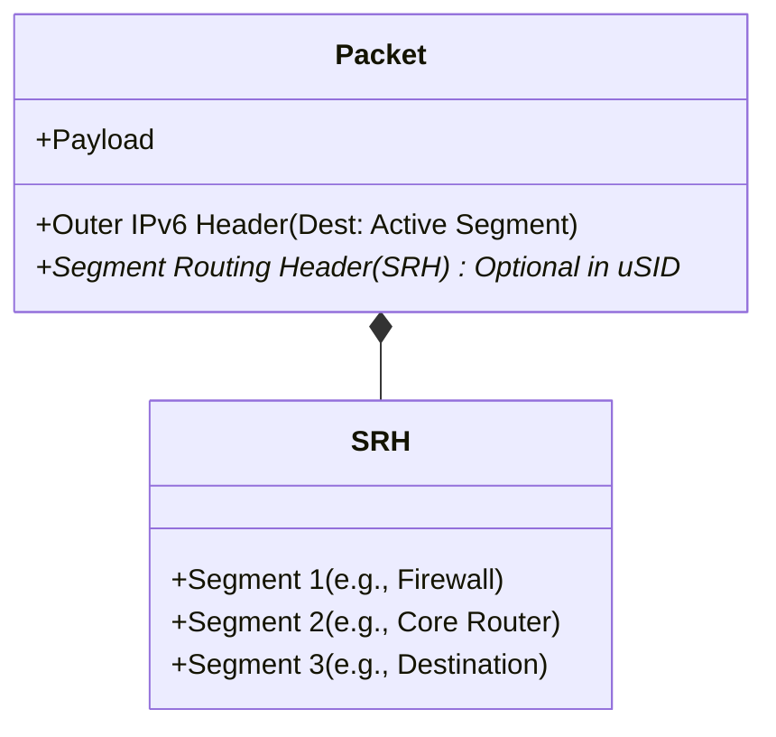

### Full SID vs. Micro-SID (uSID)
There are two primary flavors of SRv6:
1. **Full SID with SRH**: Uses the 128-bit SRH header structure. Better for strict traffic engineering but carries high header overhead.
2. **uSID (Micro-SID)**: Encodes multiple 16-bit instructions (micro-segments) into a single 128-bit IPv6 destination address (up to 6 micro-SIDs per block). This provides massive reduction in header overhead and is much simpler for ASIC processing. *The vast majority of modern SRv6 deployments use uSID.*

## 2) What Problem Does SRv6 Solve?

SRv6 was designed to simplify and modernize:
- Traffic engineering
- Service chaining
- Network programmability
- Fast reroute
- 5G slicing
- MPLS replacement

**Traditional MPLS requires:**
- Label distribution protocols (LDP)
- Stateful core
- Complex control plane

**SRv6 removes:**
- MPLS label distribution
- Per-flow state in the core

The intelligence is pushed to the **ingress node** and the **controller**. The core becomes stateless IPv6 forwarding.

### SRv6: Unified Forwarding Architecture
SRv6 fundamentally acts as the unified base building block across all network domains. Since it relies on native IPv6 forwarding, a single uSID architecture can span across the Host, Data Center, Access, Metro, Core, and public Cloud seamlessly.

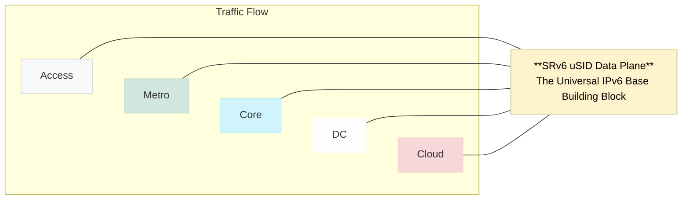

### Rich SRv6 Ecosystem
SRv6 is strongly supported across a diverse industry ecosystem, from hardware to open-source software applications.

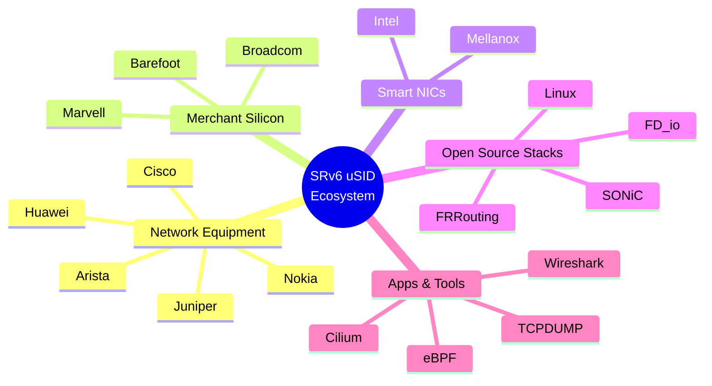

---

## 3) How Does the Source Know the Entire Path?

The source does NOT guess the path. It gets the segment list from the control plane. There are three common models:

### A) Controller-Based Model (Most Common)
A centralized controller:
- Knows the topology and collects network state (BGP-LS, IGP, telemetry).
- Computes the optimal path.
- Pushes a segment list to the ingress router.

Instead of `R1 -> R2 -> R3 -> R4`, the controller gives `R1` the Segment List `[R2, R3, R4]`. `R1` inserts this list into the SRH.

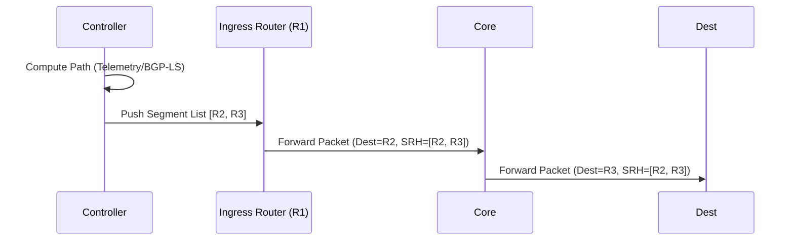

### B) Distributed Control Plane
- Routers advertise Segment IDs (SIDs).
- IGP distributes topology.
- Ingress computes path locally (Common in ISP backbones).

### C) Service Chaining Model
Application or orchestrator defines the path. 
*Example: Firewall -> DPI -> NAT -> Destination*

Ingress router encodes the Segments: `[FW, DPI, NAT, DEST]` into the packet.

---

## 4) Does the Source Need to Encode Every Physical Hop?

**No.** Segments do NOT have to represent every physical hop.
They can represent:
- Logical nodes
- Regions
- Services
- Functions

*Example:* Instead of encoding `R1 -> R2 -> R3 -> R4`, you might encode `[Region-A, Firewall, Destination]`. Intermediate routing can happen normally inside those segments.

---

## 5) Do All Nodes Need to Be SRv6-Aware?

**No.** This is a critical concept. There are three scenarios:

1. **Fully SRv6-Aware Domain**: All routers understand SRH. Each hop processes the segment list. Ideal deployment.
2. **Encapsulation Model (Common in Practice)**: Ingress router encapsulates packet in outer IPv6 header with SRH. Core routers just forward IPv6 normally and do NOT need to understand SR logic. Only nodes that execute segments must understand SRv6.
3. **Node Drops IPv6 Extension Headers**: If a device filters or drops unknown extension headers, the SRv6 chain breaks. This is a massive real-world challenge.

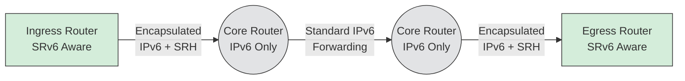

---

## 6) What Happens if One Node is Not SRv6-Aware?

There are two interpretations depending on the node's behavior:

1. **Not SR-aware but forwards IPv6 normally**: No problem. SRH is just an IPv6 extension header. Packet continues forwarding.
2. **Device drops extension headers**: Chain breaks and the packet is dropped. Common in firewalls, some load balancers, legacy routers, and cloud fabrics.

---

## 7) How SRv6 Forwarding Works (Packet Walk)

**Packet structure:**
```text
[Outer IPv6 Header]
[Segment Routing Header]
    Segment 1
    Segment 2
    Segment 3
[Payload]
```

**Process (SRH vs uSID Shift-and-Forward):**

Unlike MPLS, SRH SID-Lists are processed last-to-first.
1. Active segment is copied into the IPv6 Destination Address.
2. Router forwards packet toward that segment.
3. When the segment endpoint is reached:
   - In **Classic SRH**: The node executes a function, the "Segments Left" counter is decremented, and the pointer moves to the next segment.
   - In **uSID**: It uses a "Shift-and-Forward" instruction where the node looks up the updated Destination Address, shifts the bits left, and forwards it to the next micro-segment.

**Result:** No per-flow state is stored in the core. All state is in the packet.

---

## 8) How is SRv6 Different from MPLS-SR?

| Feature | MPLS-SR | SRv6 |
| :--- | :--- | :--- |
| **Data Plane** | Uses label stack | Uses IPv6 addresses |
| **Dependencies** | Requires MPLS support & label distribution | No MPLS required |
| **Addressing** | Local significance typically | Global addressing model |
| **Capabilities** | Forwarding primarily | Programmable behaviors (not just forwarding) |
| **Overhead** | Smaller headers | Heavier (larger headers) |

---

## 9) What Breaks SRv6 in Real Deployments?

Common issues encountered in real-world scenarios:
- **MTU problems:** SRH increases packet size.
- **Extension header filtering:** Blocked by middleboxes.
- **Hardware constraints:** ASIC limitations on parsing deep headers.
- **Security policies:** Firewall and cloud fabric filtering.
- **Control Plane limitations:** Lack of IPv6 support.
- **Load Balancers:** May strip unknown headers.

---

## 10) How SRv6 is Deployed in Real Telco Networks

**Typical model:**
- **Ingress PE**: SR aware
- **Core routers**: IPv6 forwarding only (No full SR logic required)
- **Egress PE**: SR aware

Only the ingress node and the specific segment endpoints must understand SRv6 behaviors.

---

## 11) SRv6 in Public Cloud Context

Important distinctions:
- **The Cloud does NOT expose its backbone SR capabilities.**
- To experiment with SRv6 in cloud you need:
  - IPv6 support
  - No extension header filtering
  - Ability to deploy router VMs
  - MP-BGP IPv6 if doing dynamic routing

You are *not* using cloud backbone SR; you are building your own SR domain inside VMs. The cloud underlay may filter headers, limit MTU, or restrict BGP IPv6. This is why experimentation varies wildly by provider.

---

## 12) Final Direct Answers

* **Q: How does the source know the path?**
  * **A:** Through a controller or distributed control plane that computes and provides the segment list.
* **Q: Does the source need full topology knowledge?**
  * **A:** No. It needs segment identifiers and policy input.
* **Q: Do all nodes need to be SRv6-aware?**
  * **A:** No. They only need to forward IPv6 and not drop extension headers.
* **Q: If one node is not SRv6-aware, does it break?**
  * **A:** Only if it drops extension headers or cannot forward IPv6 correctly.

---
*End of SRv6 Technical Brief*

---

## Deep Dive: IPv6 SRH Pass-Through in Cloud

**What is it?**
SRH (Segment Routing Header) is a type of IPv6 Extension Header. IPv6 was designed to be extensible, allowing intermediate routers to process additional headers before the actual packet payload (TCP/UDP). "Pass-through" means the cloud network fabric allows these packets to traverse the network without dropping them.

**Why it matters for SASE:**
To build a true SRv6 fabric without tunneling, every router/switch in the path must at least ignore the SRH and forward the packet based on the outer IPv6 destination address. If the cloud provider's underlying hardware load balancers or hypervisor vSwitches are configured to drop unknown extension headers (often done for DDoS protection or legacy hardware limitations), native SRv6 is impossible.

---

## Deep Dive: Router Appliance as WAN Hub

**What is it?**
Instead of using cloud-native hub constructs (like AWS Transit Gateway or Azure Virtual WAN), an ISV deploys their own Virtual Machine running a software router (e.g., VPP, DPDK, FRR) to act as the massive central aggregator for thousands of branch offices.

**Why it matters for SASE:**
ISVs need ultimate control. A custom NVA (Network Virtual Appliance) allows the ISV to run proprietary Deep Packet Inspection (DPI), custom highly-scaled IPsec termination, zero-trust network access (ZTNA) proxies, and segment routing. 
**The challenge:** In cloud networks, dynamically telling the cloud's native subnets to use this new 3rd-party appliance as the absolute center of the universe usually requires complicated and constantly updating API calls (managing UDRs).

---

## Deep Dive: Customer-Controlled L3 Transit

**What is it?**
In classical networking, a router receives a packet on Interface A from Network X, and forwards it out Interface B to Network Y. This is transit.
Cloud networks like Azure VNets or AWS VPCs are purposefully built as **stub networks**, meaning they are destinations, not transit hubs.

**Why it matters for SASE:**
If you want Branch A to talk to Branch B, and they are both connected via IPsec to your cloud-hosted SASE Hub, that cloud Hub must act as a transit router. Cloud providers actively try to prevent tenant VMs from blindly routing traffic they do not own (to prevent spoofing loops). SASE platforms must engineer around these anti-spoofing and non-transit behaviors by utilizing overlays (like VXLAN or encapsulating IPsec traffic tightly from end to end).

---

## Deep Dive: BGP-Driven WAN Fabric

**What is it?**
BGP (Border Gateway Protocol) is the protocol of the internet. A "BGP-driven fabric" means that instead of static routes, every edge device (branch SD-WAN box, remote user gateway, cloud hub) uses BGP to dynamically advertise what IP subnets they own.

**Why it matters for SASE:**
At the enterprise scale (thousands of sites), static routes are impossible. When a new subnet comes online at a branch, it must be instantly known globally. 
**The Cloud friction:** Public clouds usually limit the number of BGP peers or routes you can advertise to their native gateways. By running our *own* BGP daemon strictly within our own encrypted overlay tunnels, we bypass cloud limits entirely and scale to millions of routes.

---

## Deep Dive: SD-WAN Underlay Flexibility vs Managed Simplicity

**What is it?**
This is the classic engineering tradeoff between "easy to use" and "limitless flexibility."
- **Managed Simplicity (e.g., Azure vWAN):** You click a button, and Azure spins up hubs, configures BGP automatically, and attaches VPNs. You are locked into Azure's way of thinking.
- **Underlay Flexibility (e.g., Custom SASE NVA):** You build the Linux VM, install DPDK, compile the dataplane, build the routing daemons, and manage the orchestration. It requires a massive software engineering effort.

**Why it matters for SASE:**
An ISV's entire business model is selling features that the basic cloud provider doesn't have (like granular path steering, advanced payload inspection, WAN optimization). You cannot build a competitive SASE product using vanilla cloud managed services. You must adopt high flexibility.

---

## Deep Dive: Carrier-Grade WAN Patterns

**What is it?**
"Carrier-grade" implies massive scale, 99.999% uptime, determinism, and advanced topologies:
- **Asymmetric Routing:** Traffic leaves via ISP A but returns via ISP B. Cloud firewalls/LBs typically drop this because they are stateful. Carrier networks must support it.
- **Anycast:** Multiple hubs share the same IP address; branch offices automatically connect to the physically closest hub.
- **Traffic Engineering (TE):** Selecting a slower path deliberately because the fast path is dropping VOIP packets.

**Why it matters for SASE:**
To provide a telco-like experience, the SASE ISV's software must reimplement these carrier-grade behaviors inside their software layer, because the underlying cloud SDN is too restrictive to support them natively.

---

## Deep Dive: SRv6 Experimentation Feasible

**What is it?**
The ability for DevOps and Network Engineers to spin up two VMs in the cloud, construct a raw SRv6 IPv6 packet using a Python script or packet generator, and observe it arriving perfectly intact on the other VM using `tcpdump`.

**Why it matters for SASE:**
If a cloud provider drops extension headers, developers cannot test native SRv6 locally. They are forced to build massive encapsulation layers (UDP/VXLAN tunnels) *before* they can run their first "Hello World" SRv6 test. This severely slows down RnD and experimentation for ISVs building next-generation network stacks in the cloud.

---

## Deep Dive: SRv6 Overlay Service Chaining for ISVs in Azure

For Independent Software Vendors (ISVs) deploying Secure Access Service Edge (SASE), SD-WAN, or security platforms in Azure, efficiently routing traffic through a sequence of security or optimization services (firewalls, IDS/IPS, proxies, WAFs) is a critical requirement. This process is known as **Service Chaining**.

### Native Service Chaining vs. SRv6 Overlays

In a native Azure architecture, chaining relies on the SDN (UDRs, Route Servers, and Load Balancers). This lacks granular per-flow control and is often impossible to scale cleanly across multiple virtual appliances without complex NATing.

In an **SRv6 Overlay model**, the ISV abstracts the chain from the Azure network entirely:
1.  **The Underlay (Azure VNet):** Simply acts as a dumb transport layer, forwarding UDP packets.
2.  **The Overlay (SRv6/ISV):** The service chain path is encoded directly into the inner packet header using a Segment Routing Header (SRH).

### How it looks in Architecture: Underlay vs. Overlay

This diagram shows how a packet from a client is encapsulated at the edge, routed across the "dumb" Azure UDP underlay, and proxy-chained through SR-unaware security engines (like Check Point CloudGuard or Harmony engines) using SRv6 `End.AD` behaviors.

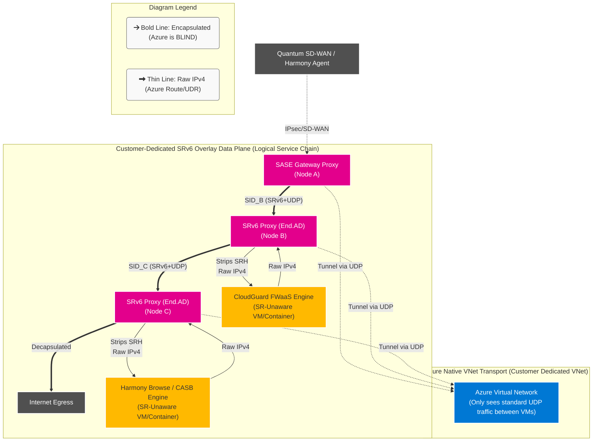

### The SRv6 Proxy Mechanisms

Because most security appliances (Firewalls, IDS/IPS) are "SR-unaware" (they don't understand IPv6 SRH headers and drop them), the ISVs deploy the SRv6 logic alongside them using proxy functions:

*   **End.AD (Dynamic Proxy):** The SRv6 endpoint removes the IPv6 and SRH headers, forwarding the pure original inner packet (e.g., IPv4) to the security appliance. When the appliance finishes inspecting it and routes it back, the endpoint retrieves the cached SRH, updates the active Segment to the next hop, and fires it down the chain.
*   **End.AM (Masquerading Proxy):** Used when the appliance can handle IPv6 but not SR-headers. The endpoint "hides" the SRH, modifying the IPv6 destination address to point to the appliance.

By wrapping this entire sequence inside UDP tunnels across the Azure VNets, the cloud provider remains entirely oblivious to the complex, distributed service chaining occurring above it.
### How to Service Chain SASE Products in Azure (The "Peeling the Onion" Flow)

If the traffic is wrapped in an outer UDP tunnel (to hide the SRv6 headers from Azure), **the Azure VNet and any native Azure Load Balancers are completely blind to the actual payload.** They cannot read the inner IP addresses, so they cannot natively sequence traffic through different SASE products (like SD-WAN to FWaaS to SWG to CASB).

Because Azure cannot do it, **your SD-WAN / SASE NVA must act as the "Service Router" and do the decapsulation locally before handing the traffic sequentially to the separate security containers/VMs that make up the customer's SASE environment.**

Here is exactly how this is engineered inside the customer's dedicated Azure VNet, utilizing the SRv6 `End.AD` (Endpoint to Dynamic Proxy) function.

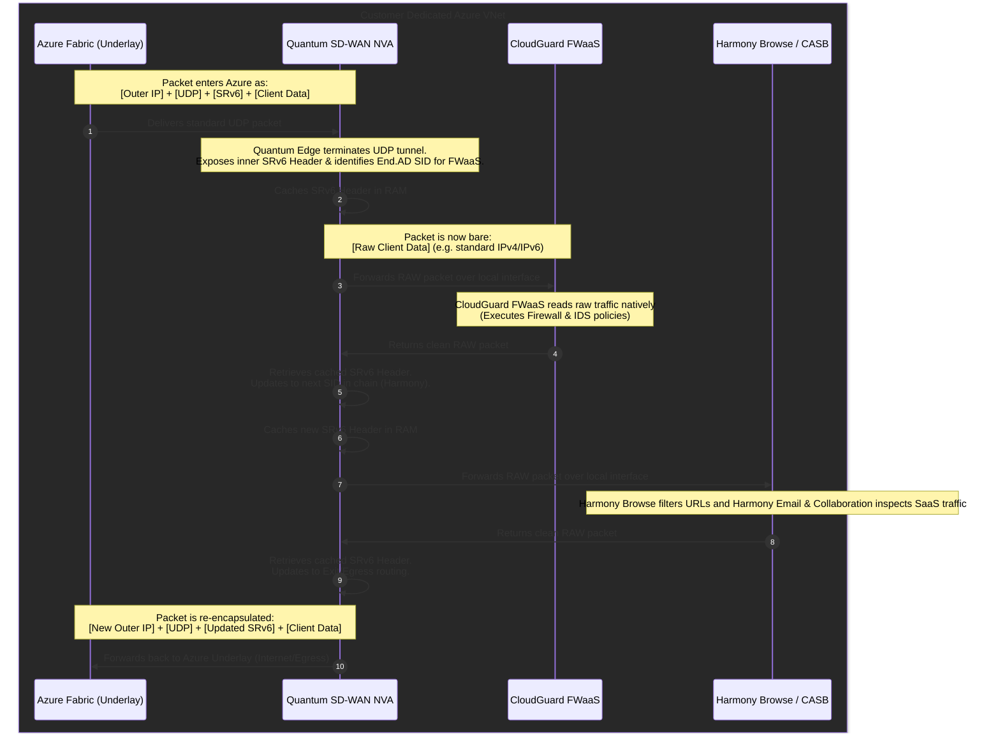

#### The Step-by-Step Mechanism:

1. **The Encapsulated Packet Arrives (from the Branch):** A UDP packet arrives at the customer's Azure VNet from their branch SD-WAN router. Azure simply looks at the Outer IP, routes it to the SD-WAN NVA VM's NIC, and considers its job done.
2. **The SD-WAN NVA "Peels the Onion" (Decapsulation):** The high-performance data plane (like VPP or DPDK) receives the UDP packet, strips off the UDP and Outer IP headers, and exposes the inner `[SRv6 Header]`.
3. **Caching the Route (End.AD for FWaaS):** The NVA reads the SID (Segment Identifier). Recognizing the packet needs to go to the FWaaS product first, it executes the `End.AD` proxy function. It strips the SRv6 header entirely and saves it to a local cache table.
4. **FWaaS Inspection:** The SD-WAN NVA takes the completely bare `[Raw Client Data]` (standard IPv4/IPv6 traffic) and sends it out a dedicated local network interface to the neighboring FWaaS process (a separate VM or container in the customer's deployment). Because the packet is bare, the FWaaS can successfully read, inspect, and filter the traffic based on standard IPs and ports.
5. **The Return to Router:** The FWaaS finishes inspecting the packet. Seeing that it is safe, it routes the raw packet back to the SD-WAN NVA's interface.
6. **Continuing the Chain (SWG/CASB):** The NVA looks up the active flow, retrieves the cached `[SRv6 Header]`, and updates the pointer to the *next* segment in the chain (the SWG/CASB). It repeats the proxy process, sending the raw packet to the SWG container for web filtering.
7. **Re-Encapsulation & Egress:** Once the packet clears all local SASE products in the chain and returns to the SDWAN NVA, the NVA wraps the packet back in a new UDP tunnel or performs NAT, and fires it back into the Azure underlay to reach its final destination (e.g. the public Internet).

*(Architecture Note: To maximize performance and reduce Azure bandwidth costs, modern ISV managed services bundle the SD-WAN gateway, the FWaaS, and the SWG all on the **same large Virtual Machine** or dedicated Kubernetes Node for that customer. They run the NVA router in VPP, and the security apps in Docker containers, using zero-copy memory interfaces like `memif` to pass the raw packets instantly between SASE products without the traffic ever touching the Azure network during the chain!)*

### The Dedicated SASE Controller (The "Brain")

If the Data Plane (the NVAs) are busy wrapping, unwrapping, and steering UDP packets to build the overlay, **how do they know which SIDs to use and which policies to enforce?**

This is achieved via the **SASE Orchestrator and SD-WAN Controller**, which is deployed or logically isolated **per customer**.

* **The Control Plane (The Brain):** A centralized, single-tenant orchestrator maintains the customer's network configurations, global topology map, and all zero-trust unified security policies. It knows exactly where the customer's branches are and what order their SASE products should be chained in.
* **The Data Plane (The Muscle):** The SASE Hub NVAs running inside the Customer's dedicated Azure VNets (VPP/DPDK dataplanes). 

The Controller uses **BGP (with SRv6 extensions)** and management tunnels (e.g., gRPC, Netconf, or a custom protocol) to continuously push *Network routing logic* and *Security policies* down to the customer's NVAs. 

When a customer wants to dynamically add a "CASB Engine" to their security chain, they simply configure it in their SASE Controller UI. The Controller computes the new SRv6 SID path, programs the NVA's local cache tables, and instantly the Data Plane starts injecting the CASB's SID into the `End.AD` routing header. 

**Azure's underlay is completely unaware of these changes, and no Azure APIs are ever queried.** This completely decouples the ISV's feature agility from the underlying Cloud Provider's limitations!

---

## 🚀 Advanced Deployment: AKS Cloud-Native SASE Architecture

As SASE providers scale, migrating from traditional virtual machines to **Cloud-Native Network Functions (CNFs)** hosted on Azure Kubernetes Service (AKS) becomes critical. 

This requires highly advanced container networking capabilities, including **Multi-NIC Pods**, **Multus CNI**, **Azure CNI Powered by Cilium (eBPF)**, and **SR-IOV kernel bypass** to achieve Telco-grade throughput over Azure's Virtual WAN (vWAN).

👉 **[Read the Full Check Point AKS Architecture & Diagrams Here](./checkpoint_aks_sase.md)**

👉 **[Read the Azure vWAN Global Scale & Limits Breakdown Here](./azure_vwan_scale.md)**
