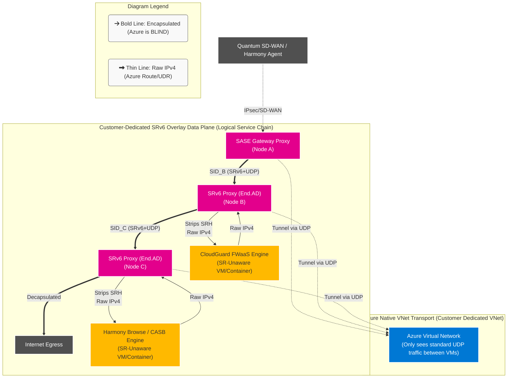
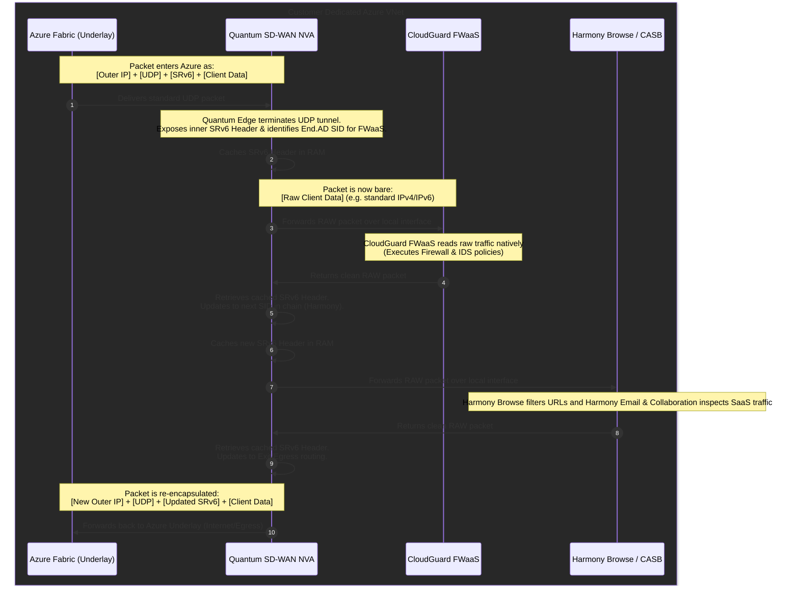

# Cloud-Native SASE / SD-WAN In Azure

This repository is a technical workspace for building and documenting a cloud-native SASE and SD-WAN architecture in Azure.

The focus is on two related areas:

1. Architecture and product-design thinking for a customer-dedicated SASE platform in Azure
2. Hands-on AKS and dataplane experiments using VPP, DPDK, MANA, Multus, and SRv6-related overlays

## Start Here

- [docs/education/README.md](./docs/education/README.md) - background material for SASE, overlays, SRv6, and cloud constraints
- [docs/architecture/checkpoint_aks_sase.md](./docs/architecture/checkpoint_aks_sase.md) - Azure AKS cloud-native SASE architecture
- [docs/architecture/azure_aks_cni_architecture.md](./docs/architecture/azure_aks_cni_architecture.md) - AKS CNI, Multus, and multi-NIC architecture
- [docs/architecture/azure_aks_nic_performance.md](./docs/architecture/azure_aks_nic_performance.md) - Azure NIC, DPDK, and MANA performance notes
- [docs/architecture/azure_vwan_scale.md](./docs/architecture/azure_vwan_scale.md) - Azure Virtual WAN scale and limits
- [aks-dpdk-poc/START-HERE.md](./aks-dpdk-poc/START-HERE.md) - the practical AKS POC onboarding path

## Repository Map

- [docs/README.md](./docs/README.md) - documentation index
- [manifests/README.md](./manifests/README.md) - lab manifests kept at repository scope
- [tools/README.md](./tools/README.md) - small repository helper scripts
- [aks-dpdk-poc/README.md](./aks-dpdk-poc/README.md) - the main AKS and dataplane POC area

## What The AKS POC Proves Today

- Functional VPP traffic handling using Linux `af-packet`
- Native DPDK on Azure MANA using `dpdk-testpmd`
- A documented and partially working VPP-on-MANA path that still needs dataplane validation

## What Is Still Under Investigation

- Reliable end-to-end forwarding through VPP on top of native Azure MANA DPDK
- The exact practical performance ceiling of each path in AKS
- The cleanest production-relevant architecture for Azure-hosted SASE dataplanes

## Recommended Reading Order

1. [docs/education/README.md](./docs/education/README.md)
2. [docs/architecture/checkpoint_aks_sase.md](./docs/architecture/checkpoint_aks_sase.md)
3. [docs/architecture/azure_aks_cni_architecture.md](./docs/architecture/azure_aks_cni_architecture.md)
4. [aks-dpdk-poc/START-HERE.md](./aks-dpdk-poc/START-HERE.md)
5. [aks-dpdk-poc/poc-concepts-primer.md](./aks-dpdk-poc/poc-concepts-primer.md)
6. [aks-dpdk-poc/experiments/README.md](./aks-dpdk-poc/experiments/README.md)

## Key Distinction

- The documentation under `docs/` explains the architecture and concepts
- The material under `aks-dpdk-poc/` contains the practical AKS experiments and implementation work

## External Sharing Guidance

If you are sharing this repository with Microsoft engineering or another external team, start from:

1. [docs/education/README.md](./docs/education/README.md)
2. [docs/architecture/checkpoint_aks_sase.md](./docs/architecture/checkpoint_aks_sase.md)
3. [aks-dpdk-poc/START-HERE.md](./aks-dpdk-poc/START-HERE.md)

That path gives the conceptual background first, then the Azure architecture, then the concrete POC state.
2. Router forwards packet toward that segment.
3. When the segment endpoint is reached:
   - In **Classic SRH**: The node executes a function, the "Segments Left" counter is decremented, and the pointer moves to the next segment.
   - In **uSID**: It uses a "Shift-and-Forward" instruction where the node looks up the updated Destination Address, shifts the bits left, and forwards it to the next micro-segment.

**Result:** No per-flow state is stored in the core. All state is in the packet.

---

## 8) How is SRv6 Different from MPLS-SR?

| Feature | MPLS-SR | SRv6 |
| :--- | :--- | :--- |
| **Data Plane** | Uses label stack | Uses IPv6 addresses |
| **Dependencies** | Requires MPLS support & label distribution | No MPLS required |
| **Addressing** | Local significance typically | Global addressing model |
| **Capabilities** | Forwarding primarily | Programmable behaviors (not just forwarding) |
| **Overhead** | Smaller headers | Heavier (larger headers) |

---

## 9) What Breaks SRv6 in Real Deployments?

Common issues encountered in real-world scenarios:
- **MTU problems:** SRH increases packet size.
- **Extension header filtering:** Blocked by middleboxes.
- **Hardware constraints:** ASIC limitations on parsing deep headers.
- **Security policies:** Firewall and cloud fabric filtering.
- **Control Plane limitations:** Lack of IPv6 support.
- **Load Balancers:** May strip unknown headers.

---

## 10) How SRv6 is Deployed in Real Telco Networks

**Typical model:**
- **Ingress PE**: SR aware
- **Core routers**: IPv6 forwarding only (No full SR logic required)
- **Egress PE**: SR aware

Only the ingress node and the specific segment endpoints must understand SRv6 behaviors.

---

## 11) SRv6 in Public Cloud Context

Important distinctions:
- **The Cloud does NOT expose its backbone SR capabilities.**
- To experiment with SRv6 in cloud you need:
  - IPv6 support
  - No extension header filtering
  - Ability to deploy router VMs
  - MP-BGP IPv6 if doing dynamic routing

You are *not* using cloud backbone SR; you are building your own SR domain inside VMs. The cloud underlay may filter headers, limit MTU, or restrict BGP IPv6. This is why experimentation varies wildly by provider.

---

## 12) Final Direct Answers

* **Q: How does the source know the path?**
  * **A:** Through a controller or distributed control plane that computes and provides the segment list.
* **Q: Does the source need full topology knowledge?**
  * **A:** No. It needs segment identifiers and policy input.
* **Q: Do all nodes need to be SRv6-aware?**
  * **A:** No. They only need to forward IPv6 and not drop extension headers.
* **Q: If one node is not SRv6-aware, does it break?**
  * **A:** Only if it drops extension headers or cannot forward IPv6 correctly.

---
*End of SRv6 Technical Brief*

---

## Deep Dive: IPv6 SRH Pass-Through in Cloud

**What is it?**
SRH (Segment Routing Header) is a type of IPv6 Extension Header. IPv6 was designed to be extensible, allowing intermediate routers to process additional headers before the actual packet payload (TCP/UDP). "Pass-through" means the cloud network fabric allows these packets to traverse the network without dropping them.

**Why it matters for SASE:**
To build a true SRv6 fabric without tunneling, every router/switch in the path must at least ignore the SRH and forward the packet based on the outer IPv6 destination address. If the cloud provider's underlying hardware load balancers or hypervisor vSwitches are configured to drop unknown extension headers (often done for DDoS protection or legacy hardware limitations), native SRv6 is impossible.

---

## Deep Dive: Router Appliance as WAN Hub

**What is it?**
Instead of using cloud-native hub constructs (like AWS Transit Gateway or Azure Virtual WAN), an ISV deploys their own Virtual Machine running a software router (e.g., VPP, DPDK, FRR) to act as the massive central aggregator for thousands of branch offices.

**Why it matters for SASE:**
ISVs need ultimate control. A custom NVA (Network Virtual Appliance) allows the ISV to run proprietary Deep Packet Inspection (DPI), custom highly-scaled IPsec termination, zero-trust network access (ZTNA) proxies, and segment routing. 
**The challenge:** In cloud networks, dynamically telling the cloud's native subnets to use this new 3rd-party appliance as the absolute center of the universe usually requires complicated and constantly updating API calls (managing UDRs).

---

## Deep Dive: Customer-Controlled L3 Transit

**What is it?**
In classical networking, a router receives a packet on Interface A from Network X, and forwards it out Interface B to Network Y. This is transit.
Cloud networks like Azure VNets or AWS VPCs are purposefully built as **stub networks**, meaning they are destinations, not transit hubs.

**Why it matters for SASE:**
If you want Branch A to talk to Branch B, and they are both connected via IPsec to your cloud-hosted SASE Hub, that cloud Hub must act as a transit router. Cloud providers actively try to prevent tenant VMs from blindly routing traffic they do not own (to prevent spoofing loops). SASE platforms must engineer around these anti-spoofing and non-transit behaviors by utilizing overlays (like VXLAN or encapsulating IPsec traffic tightly from end to end).

---

## Deep Dive: BGP-Driven WAN Fabric

**What is it?**
BGP (Border Gateway Protocol) is the protocol of the internet. A "BGP-driven fabric" means that instead of static routes, every edge device (branch SD-WAN box, remote user gateway, cloud hub) uses BGP to dynamically advertise what IP subnets they own.

**Why it matters for SASE:**
At the enterprise scale (thousands of sites), static routes are impossible. When a new subnet comes online at a branch, it must be instantly known globally. 
**The Cloud friction:** Public clouds usually limit the number of BGP peers or routes you can advertise to their native gateways. By running our *own* BGP daemon strictly within our own encrypted overlay tunnels, we bypass cloud limits entirely and scale to millions of routes.

---

## Deep Dive: SD-WAN Underlay Flexibility vs Managed Simplicity

**What is it?**
This is the classic engineering tradeoff between "easy to use" and "limitless flexibility."
- **Managed Simplicity (e.g., Azure vWAN):** You click a button, and Azure spins up hubs, configures BGP automatically, and attaches VPNs. You are locked into Azure's way of thinking.
- **Underlay Flexibility (e.g., Custom SASE NVA):** You build the Linux VM, install DPDK, compile the dataplane, build the routing daemons, and manage the orchestration. It requires a massive software engineering effort.

**Why it matters for SASE:**
An ISV's entire business model is selling features that the basic cloud provider doesn't have (like granular path steering, advanced payload inspection, WAN optimization). You cannot build a competitive SASE product using vanilla cloud managed services. You must adopt high flexibility.

---

## Deep Dive: Carrier-Grade WAN Patterns

**What is it?**
"Carrier-grade" implies massive scale, 99.999% uptime, determinism, and advanced topologies:
- **Asymmetric Routing:** Traffic leaves via ISP A but returns via ISP B. Cloud firewalls/LBs typically drop this because they are stateful. Carrier networks must support it.
- **Anycast:** Multiple hubs share the same IP address; branch offices automatically connect to the physically closest hub.
- **Traffic Engineering (TE):** Selecting a slower path deliberately because the fast path is dropping VOIP packets.

**Why it matters for SASE:**
To provide a telco-like experience, the SASE ISV's software must reimplement these carrier-grade behaviors inside their software layer, because the underlying cloud SDN is too restrictive to support them natively.

---

## Deep Dive: SRv6 Experimentation Feasible

**What is it?**
The ability for DevOps and Network Engineers to spin up two VMs in the cloud, construct a raw SRv6 IPv6 packet using a Python script or packet generator, and observe it arriving perfectly intact on the other VM using `tcpdump`.

**Why it matters for SASE:**
If a cloud provider drops extension headers, developers cannot test native SRv6 locally. They are forced to build massive encapsulation layers (UDP/VXLAN tunnels) *before* they can run their first "Hello World" SRv6 test. This severely slows down RnD and experimentation for ISVs building next-generation network stacks in the cloud.

---

## Deep Dive: SRv6 Overlay Service Chaining for ISVs in Azure

For Independent Software Vendors (ISVs) deploying Secure Access Service Edge (SASE), SD-WAN, or security platforms in Azure, efficiently routing traffic through a sequence of security or optimization services (firewalls, IDS/IPS, proxies, WAFs) is a critical requirement. This process is known as **Service Chaining**.

### Native Service Chaining vs. SRv6 Overlays

In a native Azure architecture, chaining relies on the SDN (UDRs, Route Servers, and Load Balancers). This lacks granular per-flow control and is often impossible to scale cleanly across multiple virtual appliances without complex NATing.

In an **SRv6 Overlay model**, the ISV abstracts the chain from the Azure network entirely:
1.  **The Underlay (Azure VNet):** Simply acts as a dumb transport layer, forwarding UDP packets.
2.  **The Overlay (SRv6/ISV):** The service chain path is encoded directly into the inner packet header using a Segment Routing Header (SRH).

### How it looks in Architecture: Underlay vs. Overlay

This diagram shows how a packet from a client is encapsulated at the edge, routed across the "dumb" Azure UDP underlay, and proxy-chained through SR-unaware security engines (like Check Point CloudGuard or Harmony engines) using SRv6 `End.AD` behaviors.

### The SRv6 Proxy Mechanisms

Because most security appliances (Firewalls, IDS/IPS) are "SR-unaware" (they don't understand IPv6 SRH headers and drop them), the ISVs deploy the SRv6 logic alongside them using proxy functions:

*   **End.AD (Dynamic Proxy):** The SRv6 endpoint removes the IPv6 and SRH headers, forwarding the pure original inner packet (e.g., IPv4) to the security appliance. When the appliance finishes inspecting it and routes it back, the endpoint retrieves the cached SRH, updates the active Segment to the next hop, and fires it down the chain.
*   **End.AM (Masquerading Proxy):** Used when the appliance can handle IPv6 but not SR-headers. The endpoint "hides" the SRH, modifying the IPv6 destination address to point to the appliance.

By wrapping this entire sequence inside UDP tunnels across the Azure VNets, the cloud provider remains entirely oblivious to the complex, distributed service chaining occurring above it.
### How to Service Chain SASE Products in Azure (The "Peeling the Onion" Flow)

If the traffic is wrapped in an outer UDP tunnel (to hide the SRv6 headers from Azure), **the Azure VNet and any native Azure Load Balancers are completely blind to the actual payload.** They cannot read the inner IP addresses, so they cannot natively sequence traffic through different SASE products (like SD-WAN to FWaaS to SWG to CASB).

Because Azure cannot do it, **your SD-WAN / SASE NVA must act as the "Service Router" and do the decapsulation locally before handing the traffic sequentially to the separate security containers/VMs that make up the customer's SASE environment.**

Here is exactly how this is engineered inside the customer's dedicated Azure VNet, utilizing the SRv6 `End.AD` (Endpoint to Dynamic Proxy) function.

#### The Step-by-Step Mechanism:

1. **The Encapsulated Packet Arrives (from the Branch):** A UDP packet arrives at the customer's Azure VNet from their branch SD-WAN router. Azure simply looks at the Outer IP, routes it to the SD-WAN NVA VM's NIC, and considers its job done.
2. **The SD-WAN NVA "Peels the Onion" (Decapsulation):** The high-performance data plane (like VPP or DPDK) receives the UDP packet, strips off the UDP and Outer IP headers, and exposes the inner `[SRv6 Header]`.
3. **Caching the Route (End.AD for FWaaS):** The NVA reads the SID (Segment Identifier). Recognizing the packet needs to go to the FWaaS product first, it executes the `End.AD` proxy function. It strips the SRv6 header entirely and saves it to a local cache table.
4. **FWaaS Inspection:** The SD-WAN NVA takes the completely bare `[Raw Client Data]` (standard IPv4/IPv6 traffic) and sends it out a dedicated local network interface to the neighboring FWaaS process (a separate VM or container in the customer's deployment). Because the packet is bare, the FWaaS can successfully read, inspect, and filter the traffic based on standard IPs and ports.
5. **The Return to Router:** The FWaaS finishes inspecting the packet. Seeing that it is safe, it routes the raw packet back to the SD-WAN NVA's interface.
6. **Continuing the Chain (SWG/CASB):** The NVA looks up the active flow, retrieves the cached `[SRv6 Header]`, and updates the pointer to the *next* segment in the chain (the SWG/CASB). It repeats the proxy process, sending the raw packet to the SWG container for web filtering.
7. **Re-Encapsulation & Egress:** Once the packet clears all local SASE products in the chain and returns to the SDWAN NVA, the NVA wraps the packet back in a new UDP tunnel or performs NAT, and fires it back into the Azure underlay to reach its final destination (e.g. the public Internet).

*(Architecture Note: To maximize performance and reduce Azure bandwidth costs, modern ISV managed services bundle the SD-WAN gateway, the FWaaS, and the SWG all on the **same large Virtual Machine** or dedicated Kubernetes Node for that customer. They run the NVA router in VPP, and the security apps in Docker containers, using zero-copy memory interfaces like `memif` to pass the raw packets instantly between SASE products without the traffic ever touching the Azure network during the chain!)*

### The Dedicated SASE Controller (The "Brain")

If the Data Plane (the NVAs) are busy wrapping, unwrapping, and steering UDP packets to build the overlay, **how do they know which SIDs to use and which policies to enforce?**

This is achieved via the **SASE Orchestrator and SD-WAN Controller**, which is deployed or logically isolated **per customer**.

* **The Control Plane (The Brain):** A centralized, single-tenant orchestrator maintains the customer's network configurations, global topology map, and all zero-trust unified security policies. It knows exactly where the customer's branches are and what order their SASE products should be chained in.
* **The Data Plane (The Muscle):** The SASE Hub NVAs running inside the Customer's dedicated Azure VNets (VPP/DPDK dataplanes). 

The Controller uses **BGP (with SRv6 extensions)** and management tunnels (e.g., gRPC, Netconf, or a custom protocol) to continuously push *Network routing logic* and *Security policies* down to the customer's NVAs. 

When a customer wants to dynamically add a "CASB Engine" to their security chain, they simply configure it in their SASE Controller UI. The Controller computes the new SRv6 SID path, programs the NVA's local cache tables, and instantly the Data Plane starts injecting the CASB's SID into the `End.AD` routing header. 

**Azure's underlay is completely unaware of these changes, and no Azure APIs are ever queried.** This completely decouples the ISV's feature agility from the underlying Cloud Provider's limitations!

---

## 🚀 Advanced Deployment: AKS Cloud-Native SASE Architecture

As SASE providers scale, migrating from traditional virtual machines to **Cloud-Native Network Functions (CNFs)** hosted on Azure Kubernetes Service (AKS) becomes critical. 

This requires highly advanced container networking capabilities, including **Multi-NIC Pods**, **Multus CNI**, **Azure CNI Powered by Cilium (eBPF)**, and **SR-IOV kernel bypass** to achieve Telco-grade throughput over Azure's Virtual WAN (vWAN).

👉 **[Read the Full Check Point AKS Architecture & Diagrams Here](./docs/architecture/checkpoint_aks_sase.md)**

👉 **[Read the Azure vWAN Global Scale & Limits Breakdown Here](./docs/architecture/azure_vwan_scale.md)**

👉 **[Read the Full Open-Source Educational SASE DPDK POC Guide Here](./aks-dpdk-poc/README.md)**
