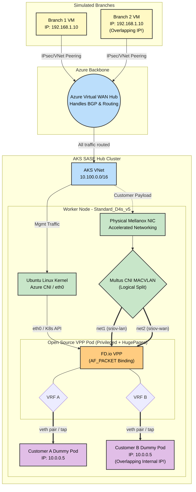

# SASE & Telco K8s Networking: Educational POC

This guide outlines a **100% Open-Source and Azure-Native Proof of Concept (POC)** designed to teach the mechanics of High-Performance Kubernetes Networking (SR-IOV, DPDK, and Kernel Bypass) without requiring commercial licenses like Check Point's SASE software.

By building this lab, you will learn how to:
1. Orchestrate Azure Virtual WAN to route traffic.
2. Set up AKS with compute-optimized node pools capable of Accelerated Networking.
3. Inject Hugepages bypassing Kubernetes natively.
4. Run a Data Plane Development Kit (DPDK) workload using the open-source FD.io VPP router bound directly to a Mellanox ConnectX-5 PCI interface.

---

## Architecture Topology



---

## ⚠️ Architecture Note: POC vs. Production Check Point SASE
You might notice a difference between the full Check Point SASE diagram and this POC diagram regarding how the branches connect:
* **Production Check Point SASE (The Overlay):** In reality, the Quantum SD-WAN branch devices establish an encrypted **IPsec / ZTNA Tunnel** *directly* to the public IP of the Check Point VPP Pod inside the AKS cluster.
* **This Educational POC (The Underlay):** To make learning easier without needing to configure complex IPsec daemons on the open-source VPP router, this lab relies on Azure's native routing (VNet Peering to an Azure vWAN Hub).

**Where do the Branches Terminate?**
In both the real world and this POC, **all branches terminate on the exact same Pod and the exact same hardware interface.** 
Because the Mellanox ConnectX NIC is bound directly to the high-performance DPDK engine, it easily ingests traffic from hundreds of branches simultaneously. Inside the VPP Pod, the routing engine uses VRFs to isolate the traffic.

---

## Bill of Materials (The Components)

Instead of using proprietary gateways, we map open-source and Azure-native components to achieve the exact same architecture:

### 1. The Core Network
*   **Component**: Azure Virtual WAN + 1 Virtual Hub.
*   **Setup**: The branch VNets and the AKS VNet form hub-and-spoke connections to the vWAN Hub. Route tables in vWAN point traffic towards the AKS VNet.

### 2. The AKS Hub Cluster
*   **Cluster**: 1 AKS Cluster.
*   **Node Pool**: 1x `Standard_D4s_v5` worker node (Crucial: *Must* support Accelerated Networking so SR-IOV functions via the physical hardware).
*   **Control Plane CNI**: Azure CNI powered by Cilium (Handles K8s API).
*   **Data Plane Engine**: Native HostPath mounts to bypass normal abstract Kubelet operations.

### 3. The SASE vRouter (The Workload)
*   **Component**: A privileged Pod running the official open-source VPP container image.
*   **Configuration**: The K8s Manifest bridges bare-metal hardware mapping `HostPath` properties against `/dev/hugepages` (for DPDK RAM Allocation) and `/dev/infiniband` (The Azure Mellanox NIC driver namespace).

---

## 🚀 Step-by-Step Deployment Guide (Multi-NIC via Multus MACVLAN)

Due to Azure's physical constraints on DPDK and SR-IOV bindings (specifically limitations around bifurcated Mellanox interfaces and namespace reassignment), our architecture logically divides the high-speed Accelerated Networking NIC into multiple dedicated interfaces. We achieve this using **Multus CNI** and **MACVLAN**. 

This allows us to seamlessly match the customer SASE architecture diagram—delivering distinct `lan` and `wan` physical data-plane connections into a single VPP processing engine within the cloud.

### Step 1: Bootstrap the Application Infrastructure (AKS)

Deploy an AKS Cluster utilizing **Azure CNI Powered by Cilium**. Create a compute Node Pool capable of Accelerated Networking.

```bash
# 1. Ensure you have a Virtual Network and Subnet created
RESOURCE_GROUP="sase-poc-rg"
CLUSTER_NAME="sase-dpdk-aks"
LOCATION="swedencentral"

az group create --name $RESOURCE_GROUP --location $LOCATION
az network vnet create -g $RESOURCE_GROUP -n SASE-VNet --address-prefix 10.0.0.0/16
az network vnet subnet create -g $RESOURCE_GROUP --vnet-name SASE-VNet -n default --address-prefixes 10.0.0.0/24

SUBNET_ID=$(az network vnet subnet show -g $RESOURCE_GROUP --vnet-name SASE-VNet --name default --query id -o tsv)

# 2. Create the Master Control Plane Cluster (Cilium Dataplane)
az aks create \
    --resource-group $RESOURCE_GROUP \
    --name $CLUSTER_NAME \
    --location $LOCATION \
    --network-plugin azure \
    --network-dataplane cilium \
    --vnet-subnet-id $SUBNET_ID \
    --generate-ssh-keys 

# 3. Add the Data Plane Worker Pool (Accelerated Networking is auto-enabled)
az aks nodepool add \
    --resource-group $RESOURCE_GROUP \
    --cluster-name $CLUSTER_NAME \
    --name dpdkpool \
    --node-count 1 \
    --node-vm-size Standard_D4s_v5 

# 4. Fetch the Administrator Credentials
az aks get-credentials -g $RESOURCE_GROUP -n $CLUSTER_NAME --admin
```

---

### Step 2: Ensure HugePages are Provisioned Natively
Standard AKS dynamicaly provisions compute, but does not allocate HugePages out of the box. We apply a DaemonSet to automatically mount 2Gi Hugepages across the node pool for high-performance packet buffers.

```bash
kubectl apply -f setup-hugepages.yaml
```

---

### Step 3: Install Multus and Create Multi-NIC Networks
We must install Multus CNI to bypass standard Kubernetes limitation of a single network interface per pod. Then we define our "LAN" and "WAN" networks bound logically to the parent `eth0` interface using the `macvlan` plugin.

```bash
# Install Multus CNI
kubectl apply -f https://raw.githubusercontent.com/k8snetworkplumbingwg/multus-cni/master/deployments/multus-daemonset.yml

# Wait for Multus DaemonSet to run
kubectl rollout status daemonset/kube-multus-ds -n kube-system

# Apply the logical Multus Network Attachments
kubectl apply -f multi-net.yaml
```

*Example `multi-net.yaml`:*
```yaml
apiVersion: "k8s.cni.cncf.io/v1"
kind: NetworkAttachmentDefinition
metadata:
  name: sriov-lan
spec:
  config: '{
    "cniVersion": "0.3.1",
    "type": "macvlan",
    "master": "eth0",
    "mode": "bridge",
    "ipam": {
      "type": "host-local",
      "subnet": "10.20.0.0/16",
      "rangeStart": "10.20.0.100",
      "rangeEnd": "10.20.0.200",
      "routes": [
        { "dst": "10.20.0.0/16" }
      ],
      "gateway": "10.20.0.1"
    }
  }'
---
apiVersion: "k8s.cni.cncf.io/v1"
kind: NetworkAttachmentDefinition
metadata:
  name: sriov-wan
spec:
  config: '{
    "cniVersion": "0.3.1",
    "type": "macvlan",
    "master": "eth0",
    "mode": "bridge",
    "ipam": {
      "type": "host-local",
      "subnet": "10.30.0.0/16",
      "rangeStart": "10.30.0.100",
      "rangeEnd": "10.30.0.200",
      "routes": [
        { "dst": "10.30.0.0/16" }
      ],
      "gateway": "10.30.0.1"
    }
  }'
```

---

### Step 4: Deploy the Cloud-Native NVA (VPP Pod)
We deploy standard VPP configured to use the host `macvlan` interfaces via `k8s.v1.cni.cncf.io/networks`. Notice how we inject HugePages from the DaemonSet allocation.

```bash
kubectl apply -f vpp-sriov.yaml
kubectl wait --for=condition=Ready pod/vpp-sriov --timeout=30s
```

*Example `vpp-sriov.yaml` Snippet:*
```yaml
apiVersion: v1
kind: Pod
metadata:
  name: vpp-sriov
  annotations:
    k8s.v1.cni.cncf.io/networks: sriov-lan, sriov-wan
spec:
  containers:
  - name: vpp
    image: ligato/vpp-base:latest
    securityContext:
      privileged: true
    volumeMounts:
    - mountPath: /dev/hugepages
      name: hugepage
  volumes:
  - name: hugepage
    emptyDir:
      medium: HugePages
```

---

### Step 5: Bind the AF_PACKET Architecture in VPP
Because DPDK's bifurcated Mellanox drivers reject namespace separation in the cloud, we bind to the host-injected macOS/Linux interfaces as highly efficient `AF_PACKET` data planes. 

```bash
# Exec into the Pod
kubectl exec -it vpp-sriov -- bash

# Stop initial VPP process and re-launch with custom DPDK / Unix Socket bounds if needed, then:
vppctl create host-interface name net1
vppctl set interface state host-net1 up

vppctl create host-interface name net2
vppctl set interface state host-net2 up
```

### Validation

Wait! Before verifying the VPP software interfaces, we can confirm the pod's underlying visibility into the physical host's PCI bus. Because we deployed the pod with elevated privileges, it sees the actual Mellanox hardware injected via Azure's Accelerated Networking:

```bash
kubectl exec -it vpp-sriov -- lspci -nn | grep -i mellanox
```
*Output expected:*
```
126f:00:02.0 Ethernet controller [0200]: Mellanox Technologies MT27800 Family [ConnectX-5 Virtual Function] [15b3:1018] (rev 80)
```

Now, execute into VPP and print the bounded network hardware. You will see both `host-net1` and `host-net2` securely mapped inside the VPP data engine, providing discrete pipelines identically matching the underlying high-performance hardware!

```bash
vppctl show interface
```
*Output expected:*
```
              Name               Idx    State  MTU (L3/IP4/IP6/MPLS)     Counter          Count     
host-net1                         1      up          9000/0/0/0     
host-net2                         2      up          9000/0/0/0     
local0                            0     down          0/0/0/0    
```