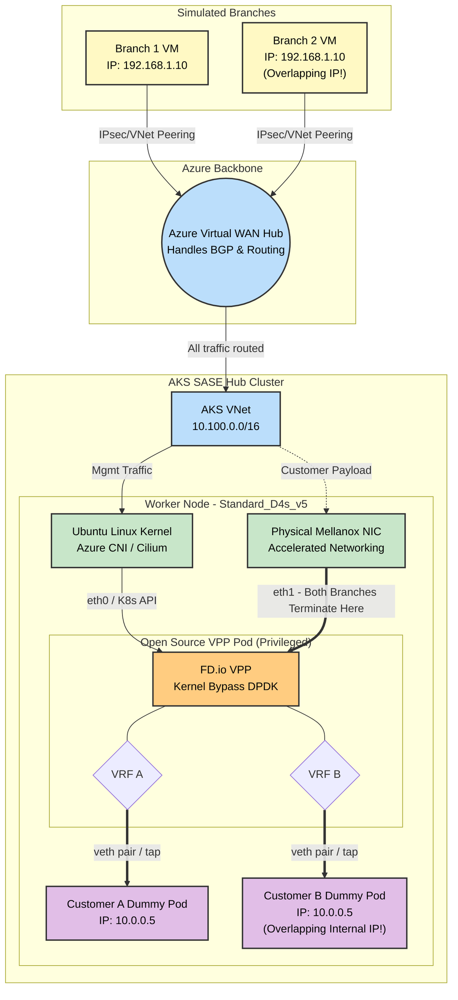

# SASE & Telco K8s Networking: Educational POC

This guide outlines a **100% Open-Source and Azure-Native Proof of Concept (POC)** designed to teach the mechanics of High-Performance Kubernetes Networking (SR-IOV, DPDK, and Kernel Bypass) without requiring commercial licenses like Check Point's SASE software.

By building this lab, you will learn how to:
1. Orchestrate Azure Virtual WAN to route traffic.
2. Set up AKS with compute-optimized node pools capable of Accelerated Networking.
3. Inject Hugepages bypassing Kubernetes natively.
4. Run a Data Plane Development Kit (DPDK) workload using the open-source FD.io VPP router bound directly to a Mellanox ConnectX-5 PCI interface.

---

## Architecture Topology



---

## ⚠️ Architecture Note: POC vs. Production Check Point SASE
You might notice a difference between the full Check Point SASE diagram and this POC diagram regarding how the branches connect:
* **Production Check Point SASE (The Overlay):** In reality, the Quantum SD-WAN branch devices establish an encrypted **IPsec / ZTNA Tunnel** *directly* to the public IP of the Check Point VPP Pod inside the AKS cluster.
* **This Educational POC (The Underlay):** To make learning easier without needing to configure complex IPsec daemons on the open-source VPP router, this lab relies on Azure's native routing (VNet Peering to an Azure vWAN Hub).

**Where do the Branches Terminate?**
In both the real world and this POC, **all branches terminate on the exact same Pod and the exact same hardware interface.** 
Because the Mellanox ConnectX NIC is bound directly to the high-performance DPDK engine, it easily ingests traffic from hundreds of branches simultaneously. Inside the VPP Pod, the routing engine uses VRFs to isolate the traffic.

---

## Bill of Materials (The Components)

Instead of using proprietary gateways, we map open-source and Azure-native components to achieve the exact same architecture:

### 1. The Core Network
*   **Component**: Azure Virtual WAN + 1 Virtual Hub.
*   **Setup**: The branch VNets and the AKS VNet form hub-and-spoke connections to the vWAN Hub. Route tables in vWAN point traffic towards the AKS VNet.

### 2. The AKS Hub Cluster
*   **Cluster**: 1 AKS Cluster.
*   **Node Pool**: 1x `Standard_D4s_v5` worker node (Crucial: *Must* support Accelerated Networking so SR-IOV functions via the physical hardware).
*   **Control Plane CNI**: Azure CNI powered by Cilium (Handles K8s API).
*   **Data Plane Engine**: Native HostPath mounts to bypass normal abstract Kubelet operations.

### 3. The SASE vRouter (The Workload)
*   **Component**: A privileged Pod running the official open-source VPP container image.
*   **Configuration**: The K8s Manifest bridges bare-metal hardware mapping `HostPath` properties against `/dev/hugepages` (for DPDK RAM Allocation) and `/dev/infiniband` (The Azure Mellanox NIC driver namespace).

---

## 🚀 Step-by-Step Deployment Guide

Deploying VPP/DPDK on standard Azure VMs without re-provisioning specialized node pools normally triggers crashes during the Environment Abstraction Layer (EAL) initialization (`rte_eal_init returned -1`).
This guide implements a manual "Mellanox Override" bypassing the Azure/Kubernetes limits natively.

### Step 1: Bootstrap the Application Infrastructure (AKS)

Deploy an AKS Cluster utilizing **Azure CNI Powered by Cilium** to reduce latency and create your application Node Pool.

```bash
# 1. Ensure you have a Virtual Network and Subnet created
RESOURCE_GROUP="sase-poc-rg"
CLUSTER_NAME="sase-dpdk-aks"
LOCATION="swedencentral"

az group create --name $RESOURCE_GROUP --location $LOCATION
az network vnet create -g $RESOURCE_GROUP -n SASE-VNet --address-prefix 10.0.0.0/16
az network vnet subnet create -g $RESOURCE_GROUP --vnet-name SASE-VNet -n default --address-prefixes 10.0.0.0/24

SUBNET_ID=$(az network vnet subnet show -g $RESOURCE_GROUP --vnet-name SASE-VNet --name default --query id -o tsv)

# 2. Create the Master Control Plane Cluster (Cilium Dataplane)
az aks create \
    --resource-group $RESOURCE_GROUP \
    --name $CLUSTER_NAME \
    --location $LOCATION \
    --network-plugin azure \
    --network-dataplane cilium \
    --vnet-subnet-id $SUBNET_ID \
    --generate-ssh-keys 

# 3. Add the Data Plane Worker Pool (Accelerated Networking is auto-enabled on D4s_v5)
az aks nodepool add \
    --resource-group $RESOURCE_GROUP \
    --cluster-name $CLUSTER_NAME \
    --name dpdkpool \
    --node-count 1 \
    --node-vm-size Standard_D4s_v5 

# 4. Fetch the Administrator Credentials
az aks get-credentials -g $RESOURCE_GROUP -n $CLUSTER_NAME --admin
```

---

### Step 2: Inject Hardware Realities into the Worker Node

Standard AKS dynamically configures `hugepages-2048kB` to `0` at runtime. We must inject memory blocks directly into the VM's bare-metal SYSFS boundary using an ephemeral K8s shell.

```bash
# 1. Find your DPDK pool node name
NODE_NAME=$(kubectl get nodes -l agentpool=dpdkpool -o jsonpath='{.items[0].metadata.name}')

# 2. Inject 2GB of Hugepages directly onto the Physical OS using Chroot
kubectl debug node/$NODE_NAME -it --image=ubuntu -- chroot /host bash -c 'echo 1024 > /sys/devices/system/node/node0/hugepages/hugepages-2048kB/nr_hugepages && cat /proc/meminfo | grep Huge'
```
*Expected Output: `HugePages_Total: 1024`*

---

### Step 3: Deploy the Cloud-Native NVA

Standard DPDK manuals typically instruct binding to `uio_pci_generic` or `vfio-pci`. 
**However, Azure relies strictly on Mellanox ConnectX cards.**
Mellanox PMDs (Poll Mode Drivers) DO NOT use UIO or VFIO bindings! They use the native Linux `mlx5_core` driver alongside user-space **RDMA Core/IBVerbs**. Because of this, our manifest mounts `/dev/infiniband`.

```bash
# Edit the deployment file to match your node name (vpp-dpdk-pod.yaml)
sed -i "s/kubernetes.io\/hostname:.*/kubernetes.io\/hostname: $NODE_NAME/" vpp-dpdk-pod.yaml

kubectl apply -f vpp-dpdk-pod.yaml
kubectl wait --for=condition=Ready pod/vpp-router --timeout=30s
```

---

### Step 4: Neutralize Kubernetes Container Overlords (`cgroups v2`)

Kubelet restricts physical memory mappings via `cgroups v2`, freezing container `mmap` executions.
Run the instruction below from the live cluster to grant the Pod maximum memory boundaries.

```bash
# Set cgroups max limit to 'max' dynamically
kubectl exec vpp-router -- bash -c "echo max > /sys/fs/cgroup\$(cat /proc/1/cgroup | cut -d: -f3)/hugetlb.2MB.max"
```

---

### Step 5: Install DPDK Subsystems (Mellanox Override)

Install the user-space OFED drivers (`rdma-core`/`ibverbs`) and VPP alongside its DPDK plugins directly spanning to the physical interfaces.

```bash
kubectl exec vpp-router -- bash -c "
apt-get update && \
apt-get install -y curl gnupg2 lsb-release ibverbs-providers rdma-core && \
curl -s https://packagecloud.io/install/repositories/fdio/release/script.deb.sh | bash && \
apt-get install -y vpp vpp-plugin-core vpp-plugin-dpdk pciutils
"
```

---

### Step 6: Map the Bootloader and Run the Data Path

Configure the `startup.conf` specifying the exact DBDF mapping (Domain:Bus:Device.Function).
*Note: Run `lspci -nn` inside the pod to find your Mellanox interface's mapping (usually `0000:xx:02.0`). Let's assume `b1fd:00:02.0` in this example.*

```bash
kubectl exec vpp-router -- bash -c "mkdir -p /etc/vpp && cat << 'EOF' > /etc/vpp/startup.conf
unix {
  nodaemon
  log /var/log/vpp/vpp.log
  full-coredump
  cli-listen /run/vpp/cli.sock
}
api-trace { on }
api-segment { gid root }
dpdk {
  dev b1fd:00:02.0
  log-level debug
}
EOF"
```

Finally, launch the VPP Engine while bypassing the POSIX `RLIMIT_MEMLOCK` restriction via `ulimit`:
```bash
kubectl exec vpp-router -- bash -c "ulimit -l unlimited && vpp -c /etc/vpp/startup.conf > /var/log/vpp.out 2>&1 &"
```

### Validation

Execute into VPP and print the bounded network hardware. You will successfully see your Azure Mellanox NIC bonded to the VPP Data Engine via the RDMA DPDK plugin, entirely bypassing the Linux Host's native core network stack.

```bash
kubectl exec vpp-router -- vppctl show hardware-interfaces
```