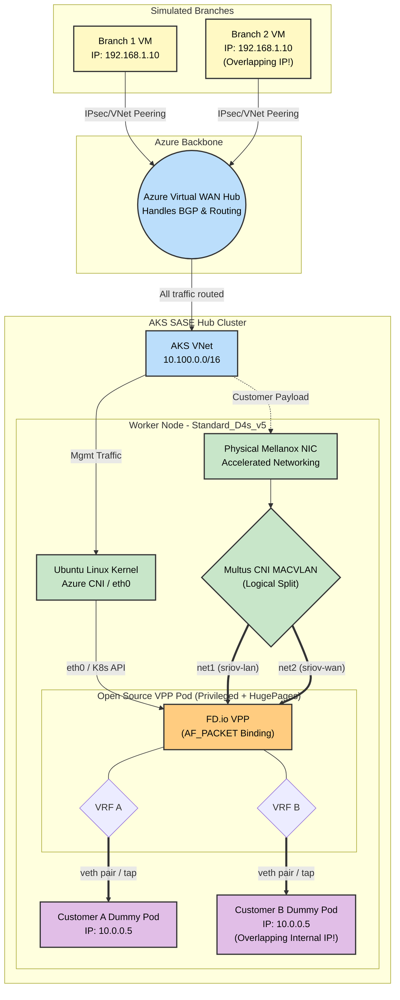

# SASE & Telco K8s Networking: Educational POC

This guide outlines a **100% Open-Source and Azure-Native Proof of Concept (POC)** designed to teach the mechanics of High-Performance Kubernetes Networking (SR-IOV, DPDK, and Kernel Bypass) without requiring commercial licenses like Check Point's SASE software.

By building this lab, you will learn how to:
1. Orchestrate Azure Virtual WAN to route traffic.
2. Set up AKS with compute-optimized node pools capable of Accelerated Networking.
3. Inject Hugepages bypassing Kubernetes natively.
4. Run a Data Plane Development Kit (DPDK) workload using the open-source FD.io VPP router bound directly to a Mellanox ConnectX-5 PCI interface.
5. **Build a VXLAN overlay tunnel** from an external VM to a VPP pod inside AKS.
6. **Configure SRv6 segment routing** for multi-tenant traffic isolation with overlapping IPs.
7. **Forward traffic at 100 Mbps+ with 0% packet loss** through VPP's L3 routing engine.

### Table of Contents
1. [Architecture Topology](#architecture-topology)
2. [POC Results Summary](#poc-results-summary)
3. [Architecture Note: POC vs Production](#️-architecture-note-poc-vs-production-check-point-sase)
4. [Bill of Materials](#bill-of-materials-the-components)
5. [Step-by-Step Deployment Guide](#-step-by-step-deployment-guide-multi-nic-via-multus-macvlan)
6. [VXLAN Tunnel Setup](#vxlan-tunnel-setup-branch-vm-to-vpp-pod)
7. [SRv6 Multi-Tenant Routing](#srv6-multi-tenant-routing)
8. [VPP Command Reference](#vpp-command-reference)
9. [Performance Testing](#performance-testing-iperf3)
10. [Known Issues & Recovery](#known-issues--recovery)
11. [TCP Checksum Deep Dive](#tcp-checksum-issue-deep-dive)
12. [af-packet vs DPDK](#af-packet-vs-dpdk-why-production-needs-dpdk)
13. [Azure AKS Lessons Learned](#lessons-learned-from-azure-aks)

---

## Architecture Topology

### Full Data Path: Branch VM → VXLAN → SRv6 → VPP → Client Pod

```
┌─────────────────────────────────────────────────────────────────┐
│  branch-vm  (Azure VM - simulates SD-WAN branch)               │
│  eth0: 10.110.2.4                                              │
│                                                                 │
│  vxlan100 (Linux VXLAN, VNI 100, UDP port 8472)                │
│    IPv4: 10.50.0.2/30                                          │
│    IPv6: fc00::2/64                                            │
│                                                                 │
│  SRv6 encap: 10.20.0.0/16 → encap seg6 segs fc00::a:1:e004   │
│  (Customer A traffic gets SRv6 header with SID fc00::a:1:e004) │
└───────────────┬─────────────────────────────────────────────────┘
                │ VXLAN outer: 10.110.2.4 → 10.110.1.x (pod IP)
                │ VXLAN inner: IPv6+SRH → fc00::a:1:e004
                │ Azure SDN routes the outer IPv4 packet
                ▼
┌─────────────────────────────────────────────────────────────────┐
│  AKS Node: aks-dpdkpool  (Standard_D4s_v5)                    │
│  ┌───────────────────────────────────────────────────────────┐ │
│  │  vpp-sriov pod (privileged, HugePages, Multus)            │ │
│  │                                                           │ │
│  │  Linux vxlan100 (decaps VXLAN, no IP assigned)            │ │
│  │      ↓ af-packet raw socket                               │ │
│  │  VPP host-vxlan100 (10.50.0.1/30, fc00::1/64)            │ │
│  │      ↓ SRv6 localsid match                               │ │
│  │  ┌─────────────────────────────────────────────────────┐  │ │
│  │  │  SRv6 LocalSID Table                                │  │ │
│  │  │  fc00::a:1:e004 → End.DT4 fib-table 0 (Customer A) │  │ │
│  │  │  fc00::b:1:e004 → End.DT4 fib-table 2 (Customer B) │  │ │
│  │  └─────────────────────────────────────────────────────┘  │ │
│  │      ↓ decap SRv6, lookup inner IPv4 in VRF              │ │
│  │  VPP host-net1 (10.20.0.254/16, macvlan bridge)           │ │
│  │  VPP host-net2 (10.30.0.254/16, macvlan bridge)           │ │
│  │      ↓ L3 forward to client-pod MAC                      │ │
│  └───────┬───────────────────────────────────────────────────┘ │
│          │ macvlan (same-node L2)                               │
│  ┌───────┴───────────────────────────────────────────────────┐ │
│  │  client-pod                                                │ │
│  │  net1: 10.20.1.24/16 (Customer A network)                 │ │
│  │  route: 10.50.0.0/30 via 10.20.0.254                     │ │
│  │  iperf3 -s (listening on port 5201)                       │ │
│  └───────────────────────────────────────────────────────────┘ │
└─────────────────────────────────────────────────────────────────┘
```

### Mermaid Diagram

### POC Results Summary

| Test | Result | Path |
|------|--------|------|
| ICMP ping (IPv4 via VXLAN) | **0% loss** | branch-vm → VXLAN → VPP L3 → macvlan → client-pod |
| ICMP ping (SRv6 via VXLAN) | **0% loss** | branch-vm → SRv6 encap → VXLAN → VPP SRv6 End.DT4 → macvlan → client-pod |
| iperf3 UDP 100 Mbps | **0% loss, 0.338ms jitter** | Full path through VPP af-packet |
| iperf3 TCP | **Fails** (checksum issue) | Known af-packet limitation — see [TCP Checksum Deep Dive](#tcp-checksum-issue-deep-dive) |
| VPP SRv6 localsid processing | **23+ packets processed** | End.DT4 decap with per-customer VRF selection |



---

## ⚠️ Architecture Note: POC vs. Production Check Point SASE
You might notice a difference between the full Check Point SASE diagram and this POC diagram regarding how the branches connect:
* **Production Check Point SASE (The Overlay):** In reality, the Quantum SD-WAN branch devices establish an encrypted **IPsec / ZTNA Tunnel** *directly* to the public IP of the Check Point VPP Pod inside the AKS cluster.
* **This Educational POC (The Underlay):** To make learning easier without needing to configure complex IPsec daemons on the open-source VPP router, this lab relies on Azure's native routing (VNet Peering to an Azure vWAN Hub).

**Where do the Branches Terminate?**
In both the real world and this POC, **all branches terminate on the exact same Pod and the exact same hardware interface.** 
Because the Mellanox ConnectX NIC is bound directly to the high-performance DPDK engine, it easily ingests traffic from hundreds of branches simultaneously. Inside the VPP Pod, the routing engine uses VRFs to isolate the traffic.

---

## Bill of Materials (The Components)

Instead of using proprietary gateways, we map open-source and Azure-native components to achieve the exact same architecture:

### 1. The Core Network
*   **Component**: Azure Virtual WAN + 1 Virtual Hub.
*   **Setup**: The branch VNets and the AKS VNet form hub-and-spoke connections to the vWAN Hub. Route tables in vWAN point traffic towards the AKS VNet.

### 2. The AKS Hub Cluster
*   **Cluster**: 1 AKS Cluster.
*   **Node Pool**: 1x `Standard_D4s_v5` worker node (Crucial: *Must* support Accelerated Networking so SR-IOV functions via the physical hardware).
*   **Control Plane CNI**: Azure CNI powered by Cilium (Handles K8s API).
*   **Data Plane Engine**: Native HostPath mounts to bypass normal abstract Kubelet operations.

### 3. The SASE vRouter (The Workload)
*   **Component**: A privileged Pod running the official open-source VPP container image.
*   **Configuration**: The K8s Manifest bridges bare-metal hardware mapping `HostPath` properties against `/dev/hugepages` (for DPDK RAM Allocation) and `/dev/infiniband` (The Azure Mellanox NIC driver namespace).

---

## 🚀 Step-by-Step Deployment Guide (Multi-NIC via Multus MACVLAN)

Due to Azure's physical constraints on DPDK and SR-IOV bindings (specifically limitations around bifurcated Mellanox interfaces and namespace reassignment), our architecture logically divides the high-speed Accelerated Networking NIC into multiple dedicated interfaces. We achieve this using **Multus CNI** and **MACVLAN**. 

This allows us to seamlessly match the customer SASE architecture diagram—delivering distinct `lan` and `wan` physical data-plane connections into a single VPP processing engine within the cloud.

### Step 1: Bootstrap the Application Infrastructure (AKS)

Deploy an AKS Cluster utilizing **Azure CNI Powered by Cilium**. Create a compute Node Pool capable of Accelerated Networking.

```bash
# 1. Ensure you have a Virtual Network and Subnet created
RESOURCE_GROUP="sase-poc-rg"
CLUSTER_NAME="sase-dpdk-aks"
LOCATION="swedencentral"

az group create --name $RESOURCE_GROUP --location $LOCATION
az network vnet create -g $RESOURCE_GROUP -n SASE-VNet --address-prefix 10.0.0.0/16
az network vnet subnet create -g $RESOURCE_GROUP --vnet-name SASE-VNet -n default --address-prefixes 10.0.0.0/24

SUBNET_ID=$(az network vnet subnet show -g $RESOURCE_GROUP --vnet-name SASE-VNet --name default --query id -o tsv)

# 2. Create the Master Control Plane Cluster (Cilium Dataplane)
az aks create \
    --resource-group $RESOURCE_GROUP \
    --name $CLUSTER_NAME \
    --location $LOCATION \
    --network-plugin azure \
    --network-dataplane cilium \
    --vnet-subnet-id $SUBNET_ID \
    --generate-ssh-keys 

# 3. Add the Data Plane Worker Pool (Accelerated Networking is auto-enabled)
az aks nodepool add \
    --resource-group $RESOURCE_GROUP \
    --cluster-name $CLUSTER_NAME \
    --name dpdkpool \
    --node-count 1 \
    --node-vm-size Standard_D4s_v5 

# 4. Fetch the Administrator Credentials
az aks get-credentials -g $RESOURCE_GROUP -n $CLUSTER_NAME --admin
```

---

### Step 2: Ensure HugePages are Provisioned Natively
Standard AKS dynamicaly provisions compute, but does not allocate HugePages out of the box. We apply a DaemonSet to automatically mount 2Gi Hugepages across the node pool for high-performance packet buffers.

```bash
kubectl apply -f setup-hugepages.yaml
```

---

### Step 3: Install Multus and Create Multi-NIC Networks
We must install Multus CNI to bypass standard Kubernetes limitation of a single network interface per pod. Then we define our "LAN" and "WAN" networks bound logically to the parent `eth0` interface using the `macvlan` plugin.

```bash
# Install Multus CNI
kubectl apply -f https://raw.githubusercontent.com/k8snetworkplumbingwg/multus-cni/master/deployments/multus-daemonset.yml

# Wait for Multus DaemonSet to run
kubectl rollout status daemonset/kube-multus-ds -n kube-system

# Apply the logical Multus Network Attachments
kubectl apply -f multi-net.yaml
```

*Example `multi-net.yaml`:*
```yaml
apiVersion: "k8s.cni.cncf.io/v1"
kind: NetworkAttachmentDefinition
metadata:
  name: sriov-lan
spec:
  config: '{
    "cniVersion": "0.3.1",
    "type": "macvlan",
    "master": "eth0",
    "mode": "bridge",
    "ipam": {
      "type": "host-local",
      "subnet": "10.20.0.0/16",
      "rangeStart": "10.20.0.100",
      "rangeEnd": "10.20.0.200",
      "routes": [
        { "dst": "10.20.0.0/16" }
      ],
      "gateway": "10.20.0.1"
    }
  }'
---
apiVersion: "k8s.cni.cncf.io/v1"
kind: NetworkAttachmentDefinition
metadata:
  name: sriov-wan
spec:
  config: '{
    "cniVersion": "0.3.1",
    "type": "macvlan",
    "master": "eth0",
    "mode": "bridge",
    "ipam": {
      "type": "host-local",
      "subnet": "10.30.0.0/16",
      "rangeStart": "10.30.0.100",
      "rangeEnd": "10.30.0.200",
      "routes": [
        { "dst": "10.30.0.0/16" }
      ],
      "gateway": "10.30.0.1"
    }
  }'
```

---

### Step 4: Deploy the Cloud-Native NVA (VPP Pod)
We deploy standard VPP configured to use the host `macvlan` interfaces via `k8s.v1.cni.cncf.io/networks`. Notice how we inject HugePages from the DaemonSet allocation.

```bash
kubectl apply -f vpp-sriov.yaml
kubectl wait --for=condition=Ready pod/vpp-sriov --timeout=30s
```

*Example `vpp-sriov.yaml` Snippet:*
```yaml
apiVersion: v1
kind: Pod
metadata:
  name: vpp-sriov
  annotations:
    k8s.v1.cni.cncf.io/networks: sriov-lan, sriov-wan
spec:
  containers:
  - name: vpp
    image: ligato/vpp-base:latest
    securityContext:
      privileged: true
    volumeMounts:
    - mountPath: /dev/hugepages
      name: hugepage
  volumes:
  - name: hugepage
    emptyDir:
      medium: HugePages
```

---

### Step 5: Bind the AF_PACKET Architecture in VPP
Because DPDK's bifurcated Mellanox drivers reject namespace separation in the cloud, we bind to the host-injected macOS/Linux interfaces as highly efficient `AF_PACKET` data planes. 

```bash
# Exec into the Pod
kubectl exec -it vpp-sriov -- bash

# Stop initial VPP process and re-launch with custom DPDK / Unix Socket bounds if needed, then:
vppctl create host-interface name net1
vppctl set interface state host-net1 up

vppctl create host-interface name net2
vppctl set interface state host-net2 up
```

### Validation

Wait! Before verifying the VPP software interfaces, we can confirm the pod's underlying visibility into the physical host's PCI bus. Because we deployed the pod with elevated privileges, it sees the actual Mellanox hardware injected via Azure's Accelerated Networking:

```bash
kubectl exec -it vpp-sriov -- lspci -nn | grep -i mellanox
```
*Output expected:*
```
126f:00:02.0 Ethernet controller [0200]: Mellanox Technologies MT27800 Family [ConnectX-5 Virtual Function] [15b3:1018] (rev 80)
```

Now, execute into VPP and print the bounded network hardware. You will see both `host-net1` and `host-net2` securely mapped inside the VPP data engine, providing discrete pipelines identically matching the underlying high-performance hardware!

```bash
vppctl show interface
```
*Output expected:*
```
              Name               Idx    State  MTU (L3/IP4/IP6/MPLS)     Counter          Count     
host-net1                         1      up          9000/0/0/0     
host-net2                         2      up          9000/0/0/0     
local0                            0     down          0/0/0/0    
```

---

## VXLAN Tunnel Setup (Branch VM to VPP Pod)

Azure's SDN cannot deliver external packets into a pod's macvlan overlay via UDR. We bypass this with a VXLAN tunnel between the branch-vm and the VPP pod.

> **Critical**: Use **UDP port 8472**, NOT 4789. VPP registers a global listener on port 4789 that intercepts all VXLAN packets before Linux can decapsulate them.

### On the VPP Pod

```bash
# Get the pod's CNI IP
POD_IP=$(ip -4 addr show eth0 | grep -oP '(?<=inet )\S+' | cut -d/ -f1)

# Create Linux VXLAN tunnel (port 8472!)
ip link add vxlan100 type vxlan id 100 remote 10.110.2.4 local $POD_IP dstport 8472 dev eth0
ip link set vxlan100 up
ip link set vxlan100 mtu 1400
ethtool -K vxlan100 rx off tx off    # Only vxlan100! NEVER eth0!

# DO NOT assign Linux IP on vxlan100 — VPP owns the IP via af-packet

# Connect VPP to the VXLAN interface
vppctl create host-interface name vxlan100
vppctl set interface state host-vxlan100 up
vppctl set interface ip address host-vxlan100 10.50.0.1/30
```

### On the Branch VM

```bash
VPP_POD_IP=10.110.1.49  # Get from: kubectl get pod vpp-sriov -o wide

sudo ip link add vxlan100 type vxlan id 100 \
  remote $VPP_POD_IP local 10.110.2.4 dstport 8472 dev eth0
sudo ip addr add 10.50.0.2/30 dev vxlan100
sudo ip link set vxlan100 up
sudo ethtool -K vxlan100 rx off tx off
sudo ip route add 10.20.0.0/16 via 10.50.0.1 dev vxlan100
```

### Verify Tunnel

```bash
# From branch-vm:
ping -c 2 10.50.0.1      # Should reply from VPP
ping -c 2 10.20.1.24      # Should reach client-pod through VPP
```

### Important: Client Pod Return Route

The client-pod needs a route back to the tunnel subnet:
```bash
kubectl exec client-pod -- ip route add 10.50.0.0/30 via 10.20.0.254 dev net1
```

---

## SRv6 Multi-Tenant Routing

SRv6 (Segment Routing over IPv6) allows multi-tenant traffic isolation using IPv6 Segment Identifiers (SIDs). Each customer gets a unique SID that maps to a VRF table in VPP, enabling **overlapping IP addresses** between customers.

### How SRv6 Solves Overlapping IPs

```
Customer A Branch (10.0.0.0/24)           Customer B Branch (10.0.0.0/24)
         │                                         │
         │ SRv6 SID: fc00::a:1:e004                │ SRv6 SID: fc00::b:1:e004
         │ (same inner IPs, different SIDs)        │
         ▼                                         ▼
    ┌──────────────────────────────────────────────────┐
    │  VPP Pod                                          │
    │                                                   │
    │  sr localsid fc00::a:1:e004 → end.dt4 table 0    │  ← Customer A → VRF 0
    │  sr localsid fc00::b:1:e004 → end.dt4 table 2    │  ← Customer B → VRF 2
    │                                                   │
    │  VRF 0: 10.0.0.0/24 → customer-a-pod             │
    │  VRF 2: 10.0.0.0/24 → customer-b-pod             │
    │  (Same IPs, completely isolated!)                 │
    └──────────────────────────────────────────────────┘
```

### Step 1: Configure VPP SRv6 (on VPP Pod)

```bash
# Enable IPv6 on the VXLAN-facing interface
vppctl enable ip6 interface host-vxlan100

# Assign IPv6 address for the tunnel
vppctl set interface ip address host-vxlan100 fc00::1/64

# Create VRF tables for multi-tenancy
vppctl ip table add 1    # VRF 1 = Customer A (alternative)
vppctl ip table add 2    # VRF 2 = Customer B

# Configure SRv6 Local SIDs
# Customer A: decapsulate SRv6 → lookup inner IPv4 in default FIB (table 0)
vppctl sr localsid address fc00::a:1:e004 behavior end.dt4 0

# Customer B: decapsulate SRv6 → lookup inner IPv4 in VRF 2
vppctl sr localsid address fc00::b:1:e004 behavior end.dt4 2
```

*Expected output:*
```bash
vppctl show sr localsids
```
```
SRv6 - My LocalSID Table:
=========================
        Address:        fc00::a:1:e004/128
        Behavior:       DT4 (Endpoint with decapsulation and specific IPv4 table lookup)
        Table:  0
        Good traffic:   [23 packets : 1932 bytes]
        Bad traffic:    [0 packets : 0 bytes]
--------------------
        Address:        fc00::b:1:e004/128
        Behavior:       DT4 (Endpoint with decapsulation and specific IPv4 table lookup)
        Table:  2
        Good traffic:   [0 packets : 0 bytes]
        Bad traffic:    [0 packets : 0 bytes]
--------------------
```

### Step 2: Configure Branch VM for SRv6

```bash
# Add IPv6 address to the VXLAN tunnel
sudo ip -6 addr add fc00::2/64 dev vxlan100

# Verify IPv6 connectivity to VPP
ping6 -c 2 fc00::1
# Expected: 64 bytes from fc00::1: icmp_seq=1 ttl=64 time=15.0 ms

# Add IPv6 route to the SRv6 SID via VPP gateway
sudo ip -6 route add fc00::a:1:e004/128 via fc00::1 dev vxlan100

# Remove old IPv4-only route
sudo ip route del 10.20.0.0/16 via 10.50.0.1 dev vxlan100 2>/dev/null

# Add SRv6 encapsulation route for Customer A traffic
# All traffic to 10.20.0.0/16 gets wrapped in SRv6 with SID fc00::a:1:e004
sudo ip route add 10.20.0.0/16 encap seg6 mode encap segs fc00::a:1:e004 dev vxlan100
```

### Step 3: Test SRv6 End-to-End

```bash
# From branch-vm:
ping -c 4 10.20.1.24
```
*Expected output:*
```
PING 10.20.1.24 (10.20.1.24) 56(84) bytes of data.
64 bytes from 10.20.1.24: icmp_seq=1 ttl=63 time=15.2 ms
64 bytes from 10.20.1.24: icmp_seq=2 ttl=63 time=14.3 ms
```

### Step 4: Verify SRv6 Counters in VPP

```bash
vppctl show sr localsids
```
The `Good traffic` counter for `fc00::a:1:e004` should increment with each ping — proving the packet went through the full SRv6 path:

```
branch-vm ping 10.20.1.24
  → Linux seg6 encap (outer IPv6 dst: fc00::a:1:e004, inner: ICMP 10.20.1.24)
    → VXLAN encap (outer: UDP:8472, 10.110.2.4 → 10.110.1.49)
      → Azure SDN routes outer IPv4 to VPP pod
        → Linux VXLAN decap
          → VPP af-packet receives IPv6+SRH
            → VPP matches localsid fc00::a:1:e004
              → End.DT4: strip SRv6 header, lookup inner IPv4 in table 0
                → VPP forwards to client-pod (10.20.1.24) via host-net1 ✅
```

### SRv6 Key Insight

The SRv6 SID **IS the customer identifier**. No separate VLAN tagging, VNI mapping, or IPsec SA lookup is needed. The SID encodes:
- `fc00::a` → Customer A
- `fc00::b` → Customer B
- The VPP `End.DT4` behavior automatically maps SID → VRF table → isolated FIB

This is the same architecture used by major telcos (SoftBank, Deutsche Telekom) for multi-tenant network slicing.

---

## VPP Command Reference

### Interface Management

```bash
# Show all interfaces with IP addresses
vppctl show interface addr
```
*Expected:*
```
host-net1 (up):
  L3 10.20.0.254/16
host-net2 (up):
  L3 10.30.0.254/16
host-vxlan100 (up):
  L3 10.50.0.1/30
  L3 fc00::1/64
local0 (dn):
```

```bash
# Show interface counters (packets/bytes/drops)
vppctl show interface

# Show hardware details
vppctl show hardware-interfaces host-net1

# Create af-packet interface on a Linux interface
vppctl create host-interface name net1

# Set interface up/down
vppctl set interface state host-net1 up

# Assign IP address
vppctl set interface ip address host-net1 10.20.0.254/16

# Match VPP MAC to Linux MAC (CRITICAL for macvlan ARP!)
LINUX_MAC=$(ip link show net1 | grep ether | awk '{print $2}')
vppctl set interface mac address host-net1 $LINUX_MAC
```

### Routing (FIB)

```bash
# Show all IPv4 routes
vppctl show ip fib

# Show specific route
vppctl show ip fib 10.20.0.0/16

# Show VRF tables
vppctl show ip table

# Show routes in specific VRF
vppctl show ip fib table 2

# Add a static route
vppctl ip route add 10.0.0.0/24 via 10.20.1.30 host-net1

# Add route in specific VRF
vppctl ip route add 10.0.0.0/24 table 2 via 10.20.1.40 host-net1

# Show IPv6 routes
vppctl show ip6 fib
```

### ARP / Neighbors

```bash
# Show IPv4 ARP table
vppctl show ip neighbor
```
*Expected:*
```
     Age                IP                    Flags      Ethernet              Interface
    223.7068         10.20.1.24                D    76:56:4b:58:4e:39    host-net1
   3386.7107          10.50.0.2                D    aa:5a:4b:6e:6a:9b    host-vxlan100
```

```bash
# Show IPv6 NDP table
vppctl show ip6 neighbor
```
*Expected:*
```
     Age                IP                    Flags      Ethernet              Interface
    298.2028           fc00::2                 D    aa:5a:4b:6e:6a:9b    host-vxlan100
```

```bash
# Ping from VPP
vppctl ping 10.20.1.24 repeat 3
vppctl ping fc00::2 repeat 2
```

### SRv6

```bash
# Show SRv6 local SIDs with counters
vppctl show sr localsids

# Add a localsid (End.DT4 = decap + IPv4 table lookup)
vppctl sr localsid address fc00::a:1:e004 behavior end.dt4 0

# Delete a localsid
vppctl sr localsid del address fc00::a:1:e004

# Show SRv6 steering policies
vppctl show sr policies

# Show SRv6 steering
vppctl show sr steering

# Available SRv6 behaviors:
#   End        → Endpoint (transit)
#   End.X      → Endpoint with L3 cross-connect
#   End.DT4    → Decap + IPv4 FIB lookup (multi-tenant!)
#   End.DT6    → Decap + IPv6 FIB lookup
#   End.DX4    → Decap + IPv4 cross-connect to specific next-hop
#   End.DX6    → Decap + IPv6 cross-connect
#   End.DX2    → Decap + L2 cross-connect
```

### VRF Tables

```bash
# Create VRF table
vppctl ip table add 1
vppctl ip table add 2

# Show all VRF tables
vppctl show ip table
```
*Expected:*
```
[0] table_id:0 ipv4-VRF:0
[1] table_id:1 ipv4-VRF:1
[2] table_id:2 ipv4-VRF:2
```

### Debugging & Tracing

```bash
# Clear and set up packet trace
vppctl clear trace
vppctl trace add af-packet-input 50

# Show captured trace (after sending traffic)
vppctl show trace max 10

# Show error counters
vppctl show errors

# Show VPP's UDP port listeners (check for 4789 conflict!)
vppctl show udp ports
```
*Expected (shows the VXLAN port conflict):*
```
port proto     node      desc
4789   ip4 vxlan4-input vxlan6
```

```bash
# Clear all interface counters
vppctl clear interfaces

# Show VPP runtime statistics
vppctl show runtime

# Show VPP version
vppctl show version
```

---

## Performance Testing (iperf3)

### Start iperf3 Server (on client-pod)
```bash
kubectl exec client-pod -- bash -c 'iperf3 -s -D && echo "server started"'
```

### Safe Test Commands (from branch-vm)

```bash
# UDP 100 Mbps (baseline)
iperf3 -c 10.20.1.24 -t 5 -u -b 100M

# UDP 500 Mbps
iperf3 -c 10.20.1.24 -t 5 -u -b 500M

# UDP 1 Gbps
iperf3 -c 10.20.1.24 -t 5 -u -b 1G

# Reverse direction (download)
iperf3 -c 10.20.1.24 -t 5 -u -b 100M -R

# Multiple parallel streams
iperf3 -c 10.20.1.24 -t 5 -u -b 100M -P 4
```

### ⚠️ NEVER Run

```bash
# NEVER: unlimited bandwidth floods af-packet and crashes iperf3
iperf3 -c 10.20.1.24 -u -b 0

# NEVER: TCP mode fails due to checksum issue
iperf3 -c 10.20.1.24 -t 5    # (without -u)
```

### Expected Bandwidth Limits

| Component | Max Bandwidth |
|-----------|--------------|
| Azure Standard_D4s_v5 NIC | ~12.5 Gbps |
| VXLAN encap/decap (Linux kernel) | ~8-10 Gbps |
| **VPP af-packet mode** | **~2-5 Gbps** (single core) |
| VPP DPDK mode (production) | ~10-40 Gbps |

---

## Known Issues & Recovery

### Issue 1: VPP Steals VXLAN Packets (Port 4789)
**Symptom**: Linux vxlan100 receives 0 packets, VPP logs `vxlan4-input: no such tunnel`
**Fix**: Use port 8472 for VXLAN, never 4789

### Issue 2: VPP af-packet MAC Mismatch
**Symptom**: `vppctl ping` fails but Linux `ping -I net1` works
**Fix**: `vppctl set interface mac address host-net1 $(ip link show net1 | grep ether | awk '{print $2}')`

### Issue 3: eth0 Offload Corruption
**Symptom**: Pod can't ping anything after running `ethtool -K eth0 ...`
**Fix**: Delete and recreate the pod. **NEVER** modify eth0 offload.

### Issue 4: Pods on Different Nodes
**Symptom**: Macvlan L2 between VPP and client-pod fails
**Fix**: Add `nodeName: aks-dpdkpool-...` to both pod specs

### Issue 5: Linux IP Conflict on vxlan100
**Symptom**: VPP af-packet sees 0 packets on host-vxlan100
**Fix**: Remove Linux IP: `ip addr del 10.50.0.1/30 dev vxlan100` — only VPP should own it

### Issue 6: UDP Flood Crashes iperf3
**Symptom**: All connectivity lost after `iperf3 -u -b 0`
**Fix**:
```bash
# On branch-vm
sudo ip neigh flush dev vxlan100
# On client-pod
kubectl exec client-pod -- bash -c 'pkill -9 iperf3; iperf3 -s -D'
```

### Full Recovery (VPP Dead)
```bash
kubectl exec vpp-sriov -- bash -c '
  pkill -9 vpp; sleep 2
  vpp -c /etc/vpp/startup.conf &; sleep 3
  vppctl create host-interface name net1
  vppctl set interface state host-net1 up
  vppctl set interface ip address host-net1 10.20.0.254/16
  vppctl create host-interface name net2
  vppctl set interface state host-net2 up
  vppctl set interface ip address host-net2 10.30.0.254/16
  LINUX_MAC=$(ip link show net1 | grep ether | awk "{print \$2}")
  vppctl set interface mac address host-net1 $LINUX_MAC
  vppctl create host-interface name vxlan100
  vppctl set interface state host-vxlan100 up
  vppctl set interface ip address host-vxlan100 10.50.0.1/30
  vppctl enable ip6 interface host-vxlan100
  vppctl set interface ip address host-vxlan100 fc00::1/64
  vppctl ip table add 2
  vppctl sr localsid address fc00::a:1:e004 behavior end.dt4 0
  vppctl sr localsid address fc00::b:1:e004 behavior end.dt4 2
'
```

---

## TCP Checksum Issue: Deep Dive

TCP iperf3 shows initial burst then stalls because VPP's af-packet intercepts packets with **partial checksums** (hardware offload hasn't computed them yet). The receiving kernel drops these packets as corrupted.

UDP works because UDP checksum is optional in IPv4.

**Production fix**: DPDK mode (VPP computes all checksums in software).

---

## af-packet vs DPDK: Why Production Needs DPDK

| | af-packet (This POC) | DPDK (Production) |
|---|---|---|
| **Packet path** | NIC → Kernel → Copy → VPP → Copy → Kernel → NIC | NIC → DMA → VPP → DMA → NIC |
| **Copies** | 2 per packet | 0 (zero-copy) |
| **Throughput** | ~2-5 Gbps | ~10-40 Gbps |
| **TCP checksums** | Broken | Works (VPP computes them) |
| **Requires** | Nothing special | HugePages, IOMMU, VFIO |

**Why DPDK doesn't work on AKS today**:
1. No IOMMU on AKS nodes (VFIO-PCI binding fails)
2. Mellanox bifurcated driver requires `mlx5_core` in kernel — unbinding kills pod eth0
3. No `sriov-network-device-plugin` on AKS for dedicated DPDK VFs
4. Zero Microsoft documentation on any of these topics

---

## Lessons Learned from Azure AKS

### What Works
- Azure CNI + Cilium dataplane
- Macvlan via Multus on same-node pods
- VXLAN tunnels between pods and VMs (any UDP port)
- SRv6 encapsulation inside VXLAN tunnels
- VPP SRv6 localsid processing (End.DT4)
- IP Forwarding on VMSS NICs

### What Does NOT Work
- ❌ Azure UDR routing to pod macvlan overlay IPs
- ❌ DPDK on AKS (no IOMMU, no docs)
- ❌ L2 macvlan between pods on different nodes
- ❌ Modifying eth0 checksum offload (breaks Cilium)
- ❌ VPP native VXLAN on port 4789 (conflicts with af-packet Linux VXLAN)

### Critical Rules
1. **Port 8472** for VXLAN — never 4789
2. **Match VPP MAC** to Linux interface MAC
3. **Pin pods to same node** with `nodeName`
4. **Never assign Linux IP** to VPP-managed interfaces
5. **Never touch eth0 offload**
6. **Always cap iperf3 bandwidth**