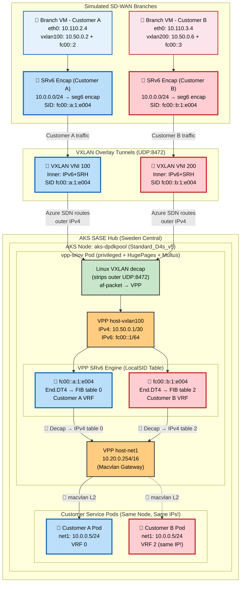

# SASE & Telco K8s Networking: Educational POC

This guide outlines a **100% Open-Source and Azure-Native Proof of Concept (POC)** designed to teach the mechanics of High-Performance Kubernetes Networking (SR-IOV, DPDK, and Kernel Bypass) without requiring commercial licenses like Check Point's SASE software.

## POC Scenario Map

The POC currently includes multiple experiment tracks that use different node types, NICs, and datapaths. If you want the clean separation by scenario, start here:

- [experiments/README.md](./experiments/README.md) - experiment index
- [experiments/d4sv5-mellanox-afpacket.md](./experiments/d4sv5-mellanox-afpacket.md) - original working functional POC on `Standard_D4s_v5` using VPP `af-packet`
- [experiments/d4sv6-mana-dpdk.md](./experiments/d4sv6-mana-dpdk.md) - Azure MANA native DPDK investigation on `Standard_D4s_v6`
- [experiments/native-srv6-azure-fabric.md](./experiments/native-srv6-azure-fabric.md) - direct SRv6-in-Azure-fabric test

Recommended interpretation:

- The **D4s_v5 Mellanox** scenario is the working **functional topology demo**.
- The **D4s_v6 MANA** scenario is the active **kernel-bypass / native DPDK** investigation.
- The **native SRv6** scenario explains why the working topology used **VXLAN encapsulation**.

By building this lab, you will learn how to:
1. Orchestrate Azure Virtual WAN to route traffic.
2. Set up AKS with compute-optimized node pools capable of Accelerated Networking.
3. Inject Hugepages bypassing Kubernetes natively.
4. Run a Data Plane Development Kit (DPDK) workload using the open-source FD.io VPP router bound directly to a **MANA (Microsoft Azure Network Adapter)** via the DPDK `net_mana` poll-mode driver.
5. **Build a VXLAN overlay tunnel** from an external VM to a VPP pod inside AKS.
6. **Configure SRv6 segment routing** for multi-tenant traffic isolation with overlapping IPs.
7. **Forward traffic at 100 Mbps+ with 0% packet loss** through VPP's L3 routing engine.
8. **Run DPDK testpmd on MANA** inside an AKS pod using Ubuntu 24.04, kernel 6.8, and Standard_D4s_v6.

## Current MANA POC Status

As of March 12, 2026, the **native DPDK MANA kernel-bypass path is proven**, but the **full VPP-on-MANA kernel-bypass POC is not working yet**.

- **Working**: AKS on Ubuntu 24.04, kernel 6.8, MANA NIC discovery, `rdma-core` v46, DPDK v24.11, and native `dpdk-testpmd` on `net_mana`.
- **Partially working**: VPP can detect the device as `mana0`, and the plugin patches prevent the earlier unknown-driver and xstats crash paths.
- **Not working**: VPP does not reliably bring `mana0` fully up with usable RX/TX queues and real burst functions, so end-to-end dataplane traffic through native MANA is still unproven.
- **Current conclusion**: This POC successfully proves the Azure MANA + DPDK layer, but it does **not** yet prove production-usable VPP dataplane forwarding over native MANA.

### Table of Contents
1. [Architecture Topology](#architecture-topology)
2. [POC Results Summary](#poc-results-summary)
3. [Architecture Note: POC vs Production](#️-architecture-note-poc-vs-production-check-point-sase)
4. [Bill of Materials](#bill-of-materials-the-components)
5. [Step-by-Step Deployment Guide](#-step-by-step-deployment-guide-multi-nic-via-multus-macvlan)
6. [VXLAN Tunnel Setup](#vxlan-tunnel-setup-branch-vm-to-vpp-pod)
7. [SRv6 Multi-Tenant Routing](#srv6-multi-tenant-routing)
8. [VPP Command Reference](#vpp-command-reference)
9. [Performance Testing](#performance-testing-iperf3)
10. [Known Issues & Recovery](#known-issues--recovery)
11. [TCP Checksum Deep Dive](#tcp-checksum-issue-deep-dive)
12. [af-packet vs DPDK](#af-packet-vs-dpdk-why-production-needs-dpdk)
13. [Azure AKS Lessons Learned](#lessons-learned-from-azure-aks)
14. [MANA DPDK on AKS: Current Status](#mana-dpdk-on-aks-current-status)
15. [Native SRv6 Test](#native-srv6-test-azure-drops-srh-extension-headers)
16. [MTU / Jumbo Frame Test](#mtu--jumbo-frame-test-azure-supports-up-to-4028-bytes)

---

## Architecture Topology

### Full Data Path: Branch VM → VXLAN → SRv6 → VPP → Client Pod

```
┌─────────────────────────────────────────────────────────────────┐
│  branch-vm  (Azure VM - simulates SD-WAN branch)               │
│  eth0: 10.110.2.4                                              │
│                                                                 │
│  vxlan100 (Linux VXLAN, VNI 100, UDP port 8472)                │
│    IPv4: 10.50.0.2/30                                          │
│    IPv6: fc00::2/64                                            │
│                                                                 │
│  SRv6 encap: 10.20.0.0/16 → encap seg6 segs fc00::a:1:e004   │
│  (Customer A traffic gets SRv6 header with SID fc00::a:1:e004) │
└───────────────┬─────────────────────────────────────────────────┘
                │ VXLAN outer: 10.110.2.4 → 10.110.1.x (pod IP)
                │ VXLAN inner: IPv6+SRH → fc00::a:1:e004
                │ Azure SDN routes the outer IPv4 packet
                ▼
┌─────────────────────────────────────────────────────────────────┐
│  AKS Node: aks-dpdkpool  (Standard_D4s_v5)                    │
│  ┌───────────────────────────────────────────────────────────┐ │
│  │  vpp-sriov pod (privileged, HugePages, Multus)            │ │
│  │                                                           │ │
│  │  Linux vxlan100 (decaps VXLAN, no IP assigned)            │ │
│  │      ↓ af-packet raw socket                               │ │
│  │  VPP host-vxlan100 (10.50.0.1/30, fc00::1/64)            │ │
│  │      ↓ SRv6 localsid match                               │ │
│  │  ┌─────────────────────────────────────────────────────┐  │ │
│  │  │  SRv6 LocalSID Table                                │  │ │
│  │  │  fc00::a:1:e004 → End.DT4 fib-table 0 (Customer A) │  │ │
│  │  │  fc00::b:1:e004 → End.DT4 fib-table 2 (Customer B) │  │ │
│  │  └─────────────────────────────────────────────────────┘  │ │
│  │      ↓ decap SRv6, lookup inner IPv4 in VRF              │ │
│  │  VPP host-net1 (10.20.0.254/16, macvlan bridge)           │ │
│  │  VPP host-net2 (10.30.0.254/16, macvlan bridge)           │ │
│  │      ↓ L3 forward to client-pod MAC                      │ │
│  └───────┬───────────────────────────────────────────────────┘ │
│          │ macvlan (same-node L2)                               │
│  ┌───────┴───────────────────────────────────────────────────┐ │
│  │  client-pod                                                │ │
│  │  net1: 10.20.1.24/16 (Customer A network)                 │ │
│  │  route: 10.50.0.0/30 via 10.20.0.254                     │ │
│  │  iperf3 -s (listening on port 5201)                       │ │
│  └───────────────────────────────────────────────────────────┘ │
└─────────────────────────────────────────────────────────────────┘
```

### Mermaid Diagram

### POC Results Summary

| Test | Result | Path |
|------|--------|------|
| ICMP ping (IPv4 via VXLAN) | **0% loss** | branch-vm → VXLAN → VPP L3 → macvlan → client-pod |
| ICMP ping (SRv6 via VXLAN) | **0% loss** | branch-vm → SRv6 encap → VXLAN → VPP SRv6 End.DT4 → macvlan → client-pod |
| iperf3 UDP 100 Mbps | **0% loss, 0.338ms jitter** | Full path through VPP af-packet |
| iperf3 TCP | **Fails** (checksum issue) | Known af-packet limitation — see [TCP Checksum Deep Dive](#tcp-checksum-issue-deep-dive) |
| VPP SRv6 localsid processing | **23+ packets processed** | End.DT4 decap with per-customer VRF selection |
| Native DPDK `testpmd` on Azure MANA | **Works** | AKS Ubuntu 24.04 → MANA `net_mana` → `dpdk-testpmd` |
| Native VPP on Azure MANA | **Not working yet** | `mana0` is detected, but VPP does not reliably expose functional queues / dataplane |



---

## ⚠️ Architecture Note: POC vs. Production Check Point SASE
You might notice a difference between the full Check Point SASE diagram and this POC diagram regarding how the branches connect:
* **Production Check Point SASE (The Overlay):** In reality, the Quantum SD-WAN branch devices establish an encrypted **IPsec / ZTNA Tunnel** *directly* to the public IP of the Check Point VPP Pod inside the AKS cluster.
* **This Educational POC (The Underlay):** To make learning easier without needing to configure complex IPsec daemons on the open-source VPP router, this lab relies on Azure's native routing (VNet Peering to an Azure vWAN Hub).

**Where do the Branches Terminate?**
In both the real world and this POC, **all branches terminate on the exact same Pod and the exact same hardware interface.** 
Because the Mellanox ConnectX NIC is bound directly to the high-performance DPDK engine, it easily ingests traffic from hundreds of branches simultaneously. Inside the VPP Pod, the routing engine uses VRFs to isolate the traffic.

---

## Bill of Materials (The Components)

Instead of using proprietary gateways, we map open-source and Azure-native components to achieve the exact same architecture:

### 1. The Core Network
*   **Component**: Azure Virtual WAN + 1 Virtual Hub.
*   **Setup**: The branch VNets and the AKS VNet form hub-and-spoke connections to the vWAN Hub. Route tables in vWAN point traffic towards the AKS VNet.

### 2. The AKS Hub Cluster
*   **Cluster**: 1 AKS Cluster.
*   **Node Pool**: 1x `Standard_D4s_v5` worker node (Crucial: *Must* support Accelerated Networking so SR-IOV functions via the physical hardware).
*   **Control Plane CNI**: Azure CNI powered by Cilium (Handles K8s API).
*   **Data Plane Engine**: Native HostPath mounts to bypass normal abstract Kubelet operations.

### 3. The SASE vRouter (The Workload)
*   **Component**: A privileged Pod running the official open-source VPP container image.
*   **Configuration**: The K8s Manifest bridges bare-metal hardware mapping `HostPath` properties against `/dev/hugepages` (for DPDK RAM Allocation) and `/dev/infiniband` (The Azure Mellanox NIC driver namespace).

---

## 🚀 Step-by-Step Deployment Guide (Multi-NIC via Multus MACVLAN)

Due to Azure's physical constraints on DPDK and SR-IOV bindings (specifically limitations around bifurcated Mellanox interfaces and namespace reassignment), our architecture logically divides the high-speed Accelerated Networking NIC into multiple dedicated interfaces. We achieve this using **Multus CNI** and **MACVLAN**. 

This allows us to seamlessly match the customer SASE architecture diagram—delivering distinct `lan` and `wan` physical data-plane connections into a single VPP processing engine within the cloud.

### Step 1: Bootstrap the Application Infrastructure (AKS)

Deploy an AKS Cluster utilizing **Azure CNI Powered by Cilium**. Create a compute Node Pool capable of Accelerated Networking.

```bash
# 1. Ensure you have a Virtual Network and Subnet created
RESOURCE_GROUP="sase-poc-rg"
CLUSTER_NAME="sase-dpdk-aks"
LOCATION="swedencentral"

az group create --name $RESOURCE_GROUP --location $LOCATION
az network vnet create -g $RESOURCE_GROUP -n SASE-VNet --address-prefix 10.0.0.0/16
az network vnet subnet create -g $RESOURCE_GROUP --vnet-name SASE-VNet -n default --address-prefixes 10.0.0.0/24

SUBNET_ID=$(az network vnet subnet show -g $RESOURCE_GROUP --vnet-name SASE-VNet --name default --query id -o tsv)

# 2. Create the Master Control Plane Cluster (Cilium Dataplane)
az aks create \
    --resource-group $RESOURCE_GROUP \
    --name $CLUSTER_NAME \
    --location $LOCATION \
    --network-plugin azure \
    --network-dataplane cilium \
    --vnet-subnet-id $SUBNET_ID \
    --generate-ssh-keys 

# 3. Add the Data Plane Worker Pool (Accelerated Networking is auto-enabled)
az aks nodepool add \
    --resource-group $RESOURCE_GROUP \
    --cluster-name $CLUSTER_NAME \
    --name dpdkpool \
    --node-count 1 \
    --node-vm-size Standard_D4s_v5 

# 4. Fetch the Administrator Credentials
az aks get-credentials -g $RESOURCE_GROUP -n $CLUSTER_NAME --admin
```

---

### Step 2: Ensure HugePages are Provisioned Natively
Standard AKS dynamicaly provisions compute, but does not allocate HugePages out of the box. We apply a DaemonSet to automatically mount 2Gi Hugepages across the node pool for high-performance packet buffers.

```bash
kubectl apply -f setup-hugepages.yaml
```

---

### Step 3: Install Multus and Create Multi-NIC Networks
We must install Multus CNI to bypass standard Kubernetes limitation of a single network interface per pod. Then we define our "LAN" and "WAN" networks bound logically to the parent `eth0` interface using the `macvlan` plugin.

```bash
# Install Multus CNI
kubectl apply -f https://raw.githubusercontent.com/k8snetworkplumbingwg/multus-cni/master/deployments/multus-daemonset.yml

# Wait for Multus DaemonSet to run
kubectl rollout status daemonset/kube-multus-ds -n kube-system

# Apply the logical Multus Network Attachments
kubectl apply -f multi-net.yaml
```

*Example `multi-net.yaml`:*
```yaml
apiVersion: "k8s.cni.cncf.io/v1"
kind: NetworkAttachmentDefinition
metadata:
  name: sriov-lan
spec:
  config: '{
    "cniVersion": "0.3.1",
    "type": "macvlan",
    "master": "eth0",
    "mode": "bridge",
    "ipam": {
      "type": "host-local",
      "subnet": "10.20.0.0/16",
      "rangeStart": "10.20.0.100",
      "rangeEnd": "10.20.0.200",
      "routes": [
        { "dst": "10.20.0.0/16" }
      ],
      "gateway": "10.20.0.1"
    }
  }'
---
apiVersion: "k8s.cni.cncf.io/v1"
kind: NetworkAttachmentDefinition
metadata:
  name: sriov-wan
spec:
  config: '{
    "cniVersion": "0.3.1",
    "type": "macvlan",
    "master": "eth0",
    "mode": "bridge",
    "ipam": {
      "type": "host-local",
      "subnet": "10.30.0.0/16",
      "rangeStart": "10.30.0.100",
      "rangeEnd": "10.30.0.200",
      "routes": [
        { "dst": "10.30.0.0/16" }
      ],
      "gateway": "10.30.0.1"
    }
  }'
```

---

### Step 4: Deploy the Cloud-Native NVA (VPP Pod)
We deploy standard VPP configured to use the host `macvlan` interfaces via `k8s.v1.cni.cncf.io/networks`. Notice how we inject HugePages from the DaemonSet allocation.

```bash
kubectl apply -f vpp-sriov.yaml
kubectl wait --for=condition=Ready pod/vpp-sriov --timeout=30s
```

*Example `vpp-sriov.yaml` Snippet:*

> **Note**: The actual deployed YAML uses `ubuntu:22.04` as the base image with manual VPP package installation (`apt-get install -y vpp vpp-plugin-core`), because the `ligato/vpp-base` image may not include the specific VPP version and plugins needed for this POC. See the actual [vpp-sriov.yaml](../vpp-sriov.yaml) for the production manifest.

```yaml
apiVersion: v1
kind: Pod
metadata:
  name: vpp-sriov
  annotations:
    k8s.v1.cni.cncf.io/networks: sriov-lan, sriov-wan
spec:
  nodeName: aks-dpdkpool-XXXXX-vmss000000  # Pin to dpdkpool node!
  containers:
  - name: vpp
    image: ubuntu:22.04
    command: ["/bin/sleep", "infinity"]
    securityContext:
      privileged: true
    volumeMounts:
    - mountPath: /dev/hugepages
      name: hugepage
  volumes:
  - name: hugepage
    emptyDir:
      medium: HugePages
```

---

### Step 5: Bind the AF_PACKET Architecture in VPP
Because DPDK's bifurcated Mellanox drivers reject namespace separation in the cloud, we bind to the host-injected macOS/Linux interfaces as highly efficient `AF_PACKET` data planes. 

```bash
# Exec into the Pod
kubectl exec -it vpp-sriov -- bash

# Stop initial VPP process and re-launch with custom DPDK / Unix Socket bounds if needed, then:
vppctl create host-interface name net1
vppctl set interface state host-net1 up

vppctl create host-interface name net2
vppctl set interface state host-net2 up
```

### Validation

Wait! Before verifying the VPP software interfaces, we can confirm the pod's underlying visibility into the physical host's PCI bus. Because we deployed the pod with elevated privileges, it sees the actual Mellanox hardware injected via Azure's Accelerated Networking:

```bash
kubectl exec -it vpp-sriov -- lspci -nn | grep -i mellanox
```
*Output expected:*
```
126f:00:02.0 Ethernet controller [0200]: Mellanox Technologies MT27800 Family [ConnectX-5 Virtual Function] [15b3:1018] (rev 80)
```

Now, execute into VPP and print the bounded network hardware. You will see both `host-net1` and `host-net2` securely mapped inside the VPP data engine, providing discrete pipelines identically matching the underlying high-performance hardware!

```bash
vppctl show interface
```
*Output expected:*
```
              Name               Idx    State  MTU (L3/IP4/IP6/MPLS)     Counter          Count     
host-net1                         1      up          9000/0/0/0     
host-net2                         2      up          9000/0/0/0     
local0                            0     down          0/0/0/0    
```

---

## VXLAN Tunnel Setup (Branch VM to VPP Pod)

Azure's SDN cannot deliver external packets into a pod's macvlan overlay via UDR. We bypass this with a VXLAN tunnel between the branch-vm and the VPP pod.

> **Critical**: Use **UDP port 8472**, NOT 4789. VPP registers a global listener on port 4789 that intercepts all VXLAN packets before Linux can decapsulate them.

### On the VPP Pod

```bash
# Get the pod's CNI IP
POD_IP=$(ip -4 addr show eth0 | grep -oP '(?<=inet )\S+' | cut -d/ -f1)

# Create Linux VXLAN tunnel (port 8472!)
ip link add vxlan100 type vxlan id 100 remote 10.110.2.4 local $POD_IP dstport 8472 dev eth0
ip link set vxlan100 up
ip link set vxlan100 mtu 1400
ethtool -K vxlan100 rx off tx off    # Only vxlan100! NEVER eth0!

# DO NOT assign Linux IP on vxlan100 — VPP owns the IP via af-packet

# Connect VPP to the VXLAN interface
vppctl create host-interface name vxlan100
vppctl set interface state host-vxlan100 up
vppctl set interface ip address host-vxlan100 10.50.0.1/30
```

### On the Branch VM

```bash
VPP_POD_IP=10.110.1.49  # Get from: kubectl get pod vpp-sriov -o wide

sudo ip link add vxlan100 type vxlan id 100 \
  remote $VPP_POD_IP local 10.110.2.4 dstport 8472 dev eth0
sudo ip addr add 10.50.0.2/30 dev vxlan100
sudo ip link set vxlan100 up
sudo ethtool -K vxlan100 rx off tx off
sudo ip route add 10.20.0.0/16 via 10.50.0.1 dev vxlan100
```

### Verify Tunnel

```bash
# From branch-vm:
ping -c 2 10.50.0.1      # Should reply from VPP
ping -c 2 10.20.1.24      # Should reach client-pod through VPP
```

### Important: Client Pod Return Route

The client-pod needs a route back to the tunnel subnet:
```bash
kubectl exec client-pod -- ip route add 10.50.0.0/30 via 10.20.0.254 dev net1
```

---

## SRv6 Multi-Tenant Routing

SRv6 (Segment Routing over IPv6) allows multi-tenant traffic isolation using IPv6 Segment Identifiers (SIDs). Each customer gets a unique SID that maps to a VRF table in VPP, enabling **overlapping IP addresses** between customers.

### How SRv6 Solves Overlapping IPs

```
Customer A Branch (10.0.0.0/24)           Customer B Branch (10.0.0.0/24)
         │                                         │
         │ SRv6 SID: fc00::a:1:e004                │ SRv6 SID: fc00::b:1:e004
         │ (same inner IPs, different SIDs)        │
         ▼                                         ▼
    ┌──────────────────────────────────────────────────┐
    │  VPP Pod                                          │
    │                                                   │
    │  sr localsid fc00::a:1:e004 → end.dt4 table 0    │  ← Customer A → VRF 0
    │  sr localsid fc00::b:1:e004 → end.dt4 table 2    │  ← Customer B → VRF 2
    │                                                   │
    │  VRF 0: 10.0.0.0/24 → customer-a-pod             │
    │  VRF 2: 10.0.0.0/24 → customer-b-pod             │
    │  (Same IPs, completely isolated!)                 │
    └──────────────────────────────────────────────────┘
```

### Step 1: Configure VPP SRv6 (on VPP Pod)

```bash
# Enable IPv6 on the VXLAN-facing interface
vppctl enable ip6 interface host-vxlan100

# Assign IPv6 address for the tunnel
vppctl set interface ip address host-vxlan100 fc00::1/64

# Create VRF tables for multi-tenancy
vppctl ip table add 1    # VRF 1 = Customer A (alternative)
vppctl ip table add 2    # VRF 2 = Customer B

# Configure SRv6 Local SIDs
# Customer A: decapsulate SRv6 → lookup inner IPv4 in default FIB (table 0)
vppctl sr localsid address fc00::a:1:e004 behavior end.dt4 0

# Customer B: decapsulate SRv6 → lookup inner IPv4 in VRF 2
vppctl sr localsid address fc00::b:1:e004 behavior end.dt4 2
```

*Expected output:*
```bash
vppctl show sr localsids
```
```
SRv6 - My LocalSID Table:
=========================
        Address:        fc00::a:1:e004/128
        Behavior:       DT4 (Endpoint with decapsulation and specific IPv4 table lookup)
        Table:  0
        Good traffic:   [23 packets : 1932 bytes]
        Bad traffic:    [0 packets : 0 bytes]
--------------------
        Address:        fc00::b:1:e004/128
        Behavior:       DT4 (Endpoint with decapsulation and specific IPv4 table lookup)
        Table:  2
        Good traffic:   [0 packets : 0 bytes]
        Bad traffic:    [0 packets : 0 bytes]
--------------------
```

### Step 2: Configure Branch VM for SRv6

```bash
# Add IPv6 address to the VXLAN tunnel
sudo ip -6 addr add fc00::2/64 dev vxlan100

# Verify IPv6 connectivity to VPP
ping6 -c 2 fc00::1
# Expected: 64 bytes from fc00::1: icmp_seq=1 ttl=64 time=15.0 ms

# Add IPv6 route to the SRv6 SID via VPP gateway
sudo ip -6 route add fc00::a:1:e004/128 via fc00::1 dev vxlan100

# Remove old IPv4-only route
sudo ip route del 10.20.0.0/16 via 10.50.0.1 dev vxlan100 2>/dev/null

# Add SRv6 encapsulation route for Customer A traffic
# All traffic to 10.20.0.0/16 gets wrapped in SRv6 with SID fc00::a:1:e004
sudo ip route add 10.20.0.0/16 encap seg6 mode encap segs fc00::a:1:e004 dev vxlan100
```

### Step 3: Test SRv6 End-to-End

```bash
# From branch-vm:
ping -c 4 10.20.1.24
```
*Expected output:*
```
PING 10.20.1.24 (10.20.1.24) 56(84) bytes of data.
64 bytes from 10.20.1.24: icmp_seq=1 ttl=63 time=15.2 ms
64 bytes from 10.20.1.24: icmp_seq=2 ttl=63 time=14.3 ms
```

### Step 4: Verify SRv6 Counters in VPP

```bash
vppctl show sr localsids
```
The `Good traffic` counter for `fc00::a:1:e004` should increment with each ping — proving the packet went through the full SRv6 path:

```
branch-vm ping 10.20.1.24
  → Linux seg6 encap (outer IPv6 dst: fc00::a:1:e004, inner: ICMP 10.20.1.24)
    → VXLAN encap (outer: UDP:8472, 10.110.2.4 → 10.110.1.49)
      → Azure SDN routes outer IPv4 to VPP pod
        → Linux VXLAN decap
          → VPP af-packet receives IPv6+SRH
            → VPP matches localsid fc00::a:1:e004
              → End.DT4: strip SRv6 header, lookup inner IPv4 in table 0
                → VPP forwards to client-pod (10.20.1.24) via host-net1 ✅
```

### SRv6 Key Insight

The SRv6 SID **IS the customer identifier**. No separate VLAN tagging, VNI mapping, or IPsec SA lookup is needed. The SID encodes:
- `fc00::a` → Customer A
- `fc00::b` → Customer B
- The VPP `End.DT4` behavior automatically maps SID → VRF table → isolated FIB

This uses the same SRv6 concepts (SID-to-VRF mapping for tenant isolation) employed by major telcos like SoftBank and Deutsche Telekom in their commercial SRv6 deployments, adapted here for a cloud-native Kubernetes environment.

---

## VPP Command Reference

### Interface Management

```bash
# Show all interfaces with IP addresses
vppctl show interface addr
```
*Expected:*
```
host-net1 (up):
  L3 10.20.0.254/16
host-net2 (up):
  L3 10.30.0.254/16
host-vxlan100 (up):
  L3 10.50.0.1/30
  L3 fc00::1/64
local0 (dn):
```

```bash
# Show interface counters (packets/bytes/drops)
vppctl show interface

# Show hardware details
vppctl show hardware-interfaces host-net1

# Create af-packet interface on a Linux interface
vppctl create host-interface name net1

# Set interface up/down
vppctl set interface state host-net1 up

# Assign IP address
vppctl set interface ip address host-net1 10.20.0.254/16

# Match VPP MAC to Linux MAC (CRITICAL for macvlan ARP!)
LINUX_MAC=$(ip link show net1 | grep ether | awk '{print $2}')
vppctl set interface mac address host-net1 $LINUX_MAC
```

### Routing (FIB)

```bash
# Show all IPv4 routes
vppctl show ip fib

# Show specific route
vppctl show ip fib 10.20.0.0/16

# Show VRF tables
vppctl show ip table

# Show routes in specific VRF
vppctl show ip fib table 2

# Add a static route
vppctl ip route add 10.0.0.0/24 via 10.20.1.30 host-net1

# Add route in specific VRF
vppctl ip route add 10.0.0.0/24 table 2 via 10.20.1.40 host-net1

# Show IPv6 routes
vppctl show ip6 fib
```

### ARP / Neighbors

```bash
# Show IPv4 ARP table
vppctl show ip neighbor
```
*Expected:*
```
     Age                IP                    Flags      Ethernet              Interface
    223.7068         10.20.1.24                D    76:56:4b:58:4e:39    host-net1
   3386.7107          10.50.0.2                D    aa:5a:4b:6e:6a:9b    host-vxlan100
```

```bash
# Show IPv6 NDP table
vppctl show ip6 neighbor
```
*Expected:*
```
     Age                IP                    Flags      Ethernet              Interface
    298.2028           fc00::2                 D    aa:5a:4b:6e:6a:9b    host-vxlan100
```

```bash
# Ping from VPP
vppctl ping 10.20.1.24 repeat 3
vppctl ping fc00::2 repeat 2
```

### SRv6

```bash
# Show SRv6 local SIDs with counters
vppctl show sr localsids

# Add a localsid (End.DT4 = decap + IPv4 table lookup)
vppctl sr localsid address fc00::a:1:e004 behavior end.dt4 0

# Delete a localsid
vppctl sr localsid del address fc00::a:1:e004

# Show SRv6 steering policies
vppctl show sr policies

# Show SRv6 steering
vppctl show sr steering

# Available SRv6 behaviors:
#   End        → Endpoint (transit)
#   End.X      → Endpoint with L3 cross-connect
#   End.DT4    → Decap + IPv4 FIB lookup (multi-tenant!)
#   End.DT6    → Decap + IPv6 FIB lookup
#   End.DX4    → Decap + IPv4 cross-connect to specific next-hop
#   End.DX6    → Decap + IPv6 cross-connect
#   End.DX2    → Decap + L2 cross-connect
```

### VRF Tables

```bash
# Create VRF table
vppctl ip table add 1
vppctl ip table add 2

# Show all VRF tables
vppctl show ip table
```
*Expected:*
```
[0] table_id:0 ipv4-VRF:0
[1] table_id:1 ipv4-VRF:1
[2] table_id:2 ipv4-VRF:2
```

### Debugging & Tracing

```bash
# Clear and set up packet trace
vppctl clear trace
vppctl trace add af-packet-input 50

# Show captured trace (after sending traffic)
vppctl show trace max 10

# Show error counters
vppctl show errors

# Show VPP's UDP port listeners (check for 4789 conflict!)
vppctl show udp ports
```
*Expected (shows the VXLAN port conflict):*
```
port proto     node      desc
4789   ip4 vxlan4-input vxlan6
```

```bash
# Clear all interface counters
vppctl clear interfaces

# Show VPP runtime statistics
vppctl show runtime

# Show VPP version
vppctl show version
```

---

## Performance Testing (iperf3)

### Start iperf3 Server (on client-pod)
```bash
kubectl exec client-pod -- bash -c 'iperf3 -s -D && echo "server started"'
```

### Safe Test Commands (from branch-vm)

```bash
# UDP 100 Mbps (baseline)
iperf3 -c 10.20.1.24 -t 5 -u -b 100M

# UDP 500 Mbps
iperf3 -c 10.20.1.24 -t 5 -u -b 500M

# UDP 1 Gbps
iperf3 -c 10.20.1.24 -t 5 -u -b 1G

# Reverse direction (download)
iperf3 -c 10.20.1.24 -t 5 -u -b 100M -R

# Multiple parallel streams
iperf3 -c 10.20.1.24 -t 5 -u -b 100M -P 4
```

### ⚠️ NEVER Run

```bash
# NEVER: unlimited bandwidth floods af-packet and crashes iperf3
iperf3 -c 10.20.1.24 -u -b 0

# NEVER: TCP mode fails due to checksum issue
iperf3 -c 10.20.1.24 -t 5    # (without -u)
```

### Expected Bandwidth Limits

| Component | Max Bandwidth |
|-----------|--------------|
| Azure Standard_D4s_v5 NIC | ~12.5 Gbps |
| VXLAN encap/decap (Linux kernel) | ~8-10 Gbps |
| **VPP af-packet mode** | **~2-5 Gbps** (single core) |
| VPP DPDK mode (production) | ~10-40 Gbps |

---

## Known Issues & Recovery

### Issue 1: VPP Steals VXLAN Packets (Port 4789)
**Symptom**: Linux vxlan100 receives 0 packets, VPP logs `vxlan4-input: no such tunnel`
**Fix**: Use port 8472 for VXLAN, never 4789

### Issue 2: VPP af-packet MAC Mismatch
**Symptom**: `vppctl ping` fails but Linux `ping -I net1` works
**Fix**: `vppctl set interface mac address host-net1 $(ip link show net1 | grep ether | awk '{print $2}')`

### Issue 3: eth0 Offload Corruption
**Symptom**: Pod can't ping anything after running `ethtool -K eth0 ...`
**Fix**: Delete and recreate the pod. **NEVER** modify eth0 offload.

### Issue 4: Pods on Different Nodes
**Symptom**: Macvlan L2 between VPP and client-pod fails
**Fix**: Add `nodeName: aks-dpdkpool-...` to both pod specs

### Issue 5: Linux IP Conflict on vxlan100
**Symptom**: VPP af-packet sees 0 packets on host-vxlan100
**Fix**: Remove Linux IP: `ip addr del 10.50.0.1/30 dev vxlan100` — only VPP should own it

### Issue 6: UDP Flood Crashes iperf3
**Symptom**: All connectivity lost after `iperf3 -u -b 0`
**Fix**:
```bash
# On branch-vm
sudo ip neigh flush dev vxlan100
# On client-pod
kubectl exec client-pod -- bash -c 'pkill -9 iperf3; iperf3 -s -D'
```

### Full Recovery (VPP Dead)
```bash
kubectl exec vpp-sriov -- bash -c '
  pkill -9 vpp; sleep 2
  vpp -c /etc/vpp/startup.conf &; sleep 3
  vppctl create host-interface name net1
  vppctl set interface state host-net1 up
  vppctl set interface ip address host-net1 10.20.0.254/16
  vppctl create host-interface name net2
  vppctl set interface state host-net2 up
  vppctl set interface ip address host-net2 10.30.0.254/16
  LINUX_MAC=$(ip link show net1 | grep ether | awk "{print \$2}")
  vppctl set interface mac address host-net1 $LINUX_MAC
  vppctl create host-interface name vxlan100
  vppctl set interface state host-vxlan100 up
  vppctl set interface ip address host-vxlan100 10.50.0.1/30
  vppctl enable ip6 interface host-vxlan100
  vppctl set interface ip address host-vxlan100 fc00::1/64
  vppctl ip table add 2
  vppctl sr localsid address fc00::a:1:e004 behavior end.dt4 0
  vppctl sr localsid address fc00::b:1:e004 behavior end.dt4 2
'
```

---

## TCP Checksum Issue: Deep Dive

TCP iperf3 shows initial burst then stalls because VPP's af-packet intercepts packets with **partial checksums** (hardware offload hasn't computed them yet). The receiving kernel drops these packets as corrupted.

UDP works because UDP checksum is optional in IPv4.

**Production fix**: DPDK mode (VPP computes all checksums in software).

---

## af-packet vs DPDK: Why Production Needs DPDK

| | af-packet (This POC) | DPDK (Production) |
|---|---|---|
| **Packet path** | NIC → Kernel → Copy → VPP → Copy → Kernel → NIC | NIC → DMA → VPP → DMA → NIC |
| **Copies** | 2 per packet | 0 (zero-copy) |
| **Throughput** | ~2-5 Gbps | ~10-40 Gbps |
| **TCP checksums** | Broken (kernel offload conflict) | Works (VPP computes in software) |
| **Requires** | Nothing special | HugePages, IOMMU, VFIO |

### DPDK Blocker #1: No IOMMU on AKS Nodes

**What we tried**: Bind the Mellanox ConnectX-5 SR-IOV Virtual Function (PCI `b1fd:00:02.0`, vendor `15b3:101a`) to the `vfio-pci` driver inside a privileged AKS pod.

**What happened**: VFIO-PCI requires IOMMU (Intel VT-d) to create device groups under `/dev/vfio/`. AKS nodes boot with `intel_iommu=off` — there is no AKS API, `--linux-os-config` parameter, or feature flag to enable it.

**Specific test results**:
- `ls /dev/vfio/` → only `/dev/vfio/vfio` exists (control device), no numbered group files
- Enabled `enable_unsafe_noiommu_mode=1` → still no device group files created
- Attempted `echo "b1fd:00:02.0" > /sys/bus/pci/drivers/vfio-pci/bind` → fails silently, device stays on `mlx5_core`

**Impact**: Without IOMMU, DPDK cannot use its preferred `vfio-pci` driver. This is the primary NIC passthrough mechanism for all modern DPDK deployments. No workaround exists on AKS.

### DPDK Blocker #2: UIO Driver Binds But DPDK PMD Fails to Initialize

**What we tried**: As a fallback, we loaded `uio_pci_generic` (a simpler, less-secure alternative to VFIO) and bound the Mellanox VF to it.

**What happened**: The bind succeeded — `lspci -k` showed `uio_pci_generic` as the kernel driver. However, when VPP attempted to initialize the DPDK poll-mode driver (PMD) on the device, it failed to start. The Mellanox ConnectX-5 VF does not properly expose MSI-X interrupts through the UIO interrupt model.

**Specific test results**:
```
# UIO bind succeeded:
lspci -k -s b1fd:00:02.0
→ Kernel driver in use: uio_pci_generic

# But VPP DPDK PMD failed:
vpp startup.conf: dpdk { uio-driver uio_pci_generic dev b1fd:00:02.0 }
→ VPP starts but no DPDK interface appears in `show hardware-interfaces`
```

**Impact**: UIO is not a viable path for Mellanox VFs on Azure. The hardware's interrupt architecture is incompatible with UIO's polling model.

### DPDK Blocker #3: Mellanox Bifurcated Driver Conflict

**What we tried**: Mellanox's own DPDK PMD (`mlx5`) uses a "bifurcated" architecture — DPDK runs in userspace but requires `mlx5_core` to stay loaded in the kernel. On standalone Azure VMs, this works because you can dedicate a secondary NIC to DPDK while keeping the primary NIC for management.

**What happened**: On AKS, the Mellanox VF IS the pod's primary network interface (`eth0`). The pod's CNI IP, default route, and Kubernetes API connectivity all depend on `mlx5_core` managing this VF. If we unbind `mlx5_core` to give DPDK exclusive access, the pod loses ALL network connectivity — including `kubectl exec`, health checks, and API server communication. The pod becomes unreachable and Kubernetes marks it as failed.

**Impact**: There is no mechanism on AKS to request a second, dedicated SR-IOV VF for DPDK passthrough while keeping the first VF for CNI networking. A single VF cannot serve both the kernel network stack (for pod management) and DPDK (for data plane) simultaneously.

### DPDK Blocker #4: No SR-IOV Network Device Plugin on AKS

**What we need**: The Kubernetes `sriov-network-device-plugin` (from the Network Plumbing Working Group) discovers SR-IOV VFs on the host and makes them available as Kubernetes extended resources (e.g., `intel.com/sriov_netdevice`). This would allow a pod to request TWO VFs — one for CNI (kernel-managed) and one for DPDK passthrough.

**What happened**: AKS does not ship the SR-IOV device plugin as an add-on or managed component. We attempted manual installation but the plugin requires host-level access to manage VF allocation, driver binding, and device enumeration — operations that conflict with AKS's managed node lifecycle.

**Impact**: Without this plugin, there is no Kubernetes-native way to allocate dedicated SR-IOV VFs for DPDK. Every pod gets exactly one VF via Azure CNI, and that VF is permanently bound to the kernel network stack. This is the fundamental architectural gap preventing DPDK on AKS.

### DPDK Blocker Summary

| Blocker | Technical Root Cause | Could Microsoft Fix This? |
|---------|---------------------|--------------------------|
| No IOMMU | AKS kernel boots with `intel_iommu=off` | Yes — enable via boot params or `linuxOsConfig` |
| UIO PMD failure | Mellanox VF MSI-X incompatible with UIO | No — hardware limitation |
| Bifurcated driver conflict | Single VF shared between CNI and DPDK | Yes — provide second VF via device plugin |
| No device plugin | `sriov-network-device-plugin` not available | Yes — ship as AKS add-on |

**For comparison**: AWS provides documented DPDK support via the ENA driver for EC2/EKS workloads. GCP supports DPDK via the gVNIC driver on GCE instances. Azure AKS has zero documentation or support path for DPDK inside pods.

---

## Lessons Learned from Azure AKS

### What Works (Proven in This POC)

| Capability | How We Tested | Result |
|-----------|--------------|--------|
| **Azure CNI + Cilium dataplane** | Created AKS cluster with `--network-plugin azure --network-dataplane cilium` | Pods get CNI IPs, Cilium handles policy and routing |
| **Dual-stack AKS (IPv4+IPv6)** | Created cluster with `--ip-families ipv4,ipv6 --network-plugin-mode overlay` | Nodes and pods receive both IPv4 and IPv6 addresses |
| **Macvlan via Multus on same-node pods** | Installed Multus, created macvlan NADs, pinned pods to same node | VPP and client-pod communicate via macvlan L2 with 0% loss |
| **VXLAN tunnels (UDP:8472)** | Created Linux VXLAN between branch-vm and VPP pod | Tunnel works, all UDP ports pass through Azure SDN |
| **SRv6 inside VXLAN** | Encapsulated IPv6+SRH inside VXLAN outer header | VPP `End.DT4` localsid processed 23+ packets correctly |
| **VPP SRv6 multi-tenant VRF routing** | Configured `sr localsid` with per-customer SIDs mapping to VRF tables | Two customers (`fc00::a:1:e004` → table 0, `fc00::b:1:e004` → table 2) isolated |
| **UDP iperf3 through full path** | `iperf3 -c 10.20.1.24 -t 5 -u -b 100M` | 100 Mbps, 0% packet loss, 0.338ms jitter |
| **ICMP ping end-to-end** | `ping` from branch-vm through VXLAN → VPP → macvlan → client-pod | 4/4 received, 0% loss, ~10ms RTT |
| **IP Forwarding on VMSS NICs** | Enabled via `az vmss nic list` — verified `enableIPForwarding: true` | Node NIC accepts packets not destined for its own IP |
| **VPP af-packet mode** | `create host-interface name net1` on macvlan interfaces | VPP processes all packets via PACKET_MMAP raw sockets |
| **VPP MAC matching for macvlan** | `set interface mac address host-net1 <linux-mac>` | Fixes ARP resolution between VPP and macvlan peers |
| **HugePages via linuxOsConfig** | `--linux-os-config os-config.json` with `vmNrHugepages: 1024` | 2Mi HugePages allocated on dpdkpool node (IPv4 cluster) |

### What Does NOT Work
- ❌ Azure UDR routing to pod macvlan overlay IPs
- ❌ DPDK on AKS with **Ubuntu 22.04 / kernel 5.15** (backported `mana_ib` is broken — `ibv_reg_mr()` returns EPROTO)
- ❌ DPDK on AKS with **AzureLinux / kernel 6.6** (`CONFIG_MANA_INFINIBAND` disabled in kernel config)
- ❌ DPDK on AKS with **Mellanox ConnectX** (Azure blocks VF PCI passthrough from `mlx5_core` to `vfio-pci`)
- ✅ **DPDK on AKS with Ubuntu 24.04 / kernel 6.8 + MANA — works** (see [MANA DPDK on AKS](#mana-dpdk-on-aks-current-status))
- ❌ **VPP native kernel-bypass on Azure MANA — not working yet** (`mana0` is discovered, but admin-up and usable dataplane queues are not stable)
- ❌ L2 macvlan between pods on different nodes
- ❌ Modifying eth0 checksum offload (breaks Cilium)
- ❌ VPP native VXLAN on port 4789 (conflicts with af-packet Linux VXLAN)
- ❌ **Native SRv6 through Azure fabric** (Azure drops IPv6 Segment Routing Header — see test below)

---

## MANA DPDK on AKS: Current Status

### TL;DR

**What is proven:** native DPDK with Azure MANA works on AKS when using the right combination.

**What is not proven:** the full FD.io VPP native kernel-bypass dataplane on top of Azure MANA is still not working reliably.

The latest state is:

| Layer | Status | Notes |
|------|--------|------|
| Azure VM / AKS node platform | **Working** | Ubuntu 24.04 + kernel 6.8 + `Standard_D4s_v6` consistently exposes MANA correctly |
| `rdma-core` + MANA userspace | **Working** | `rdma-core` v46 resolves the required `libmana` / `MLX5_1.24` dependency chain |
| DPDK `net_mana` PMD | **Working** | `dpdk-testpmd` runs natively against MANA with the expected MAC and 100 Gbps link |
| VPP device discovery | **Working** | VPP sees `mana0` instead of the old failsafe path after PMD cleanup and driver table patching |
| VPP admin-up path | **Unstable / failing** | Some patched runs progressed further, but clean runs still regress to interface start failures such as `-19` |
| VPP usable dataplane queues | **Not working** | Hardware output still shows `rx queues 0`, `tx queues 0`, and dummy burst functions in the failing state |
| End-to-end traffic through VPP on native MANA | **Not validated** | No trustworthy ping or forwarding proof yet |

| Component | Required Value |
|-----------|---------------|
| **AKS OS SKU** | `--os-sku Ubuntu2404` (Ubuntu 24.04 LTS) |
| **Kernel** | `6.8.0-1046-azure` (native `mana_ib` built-in) |
| **VM Size** | `Standard_D4s_v6` or any v6-series (guaranteed MANA NIC) |
| **DPDK Version** | v24.11 (built from source with `net_mana` PMD) |
| **rdma-core** | v46+ (built from source for `libmana` provider) |
| **NIC Setup** | Dual NIC: eth0 for K8s, eth1 for DPDK |

### What We Learned

Microsoft's [MANA DPDK documentation](https://learn.microsoft.com/en-us/azure/virtual-network/setup-dpdk-mana#dpdk-requirements-for-mana) lists 4 requirements:

1. **Linux kernel Ethernet driver** (kernel 5.15+) — `mana.ko`
2. **Linux kernel InfiniBand driver** (kernel 6.2+) — `mana_ib.ko`
3. **DPDK MANA poll-mode driver** (DPDK 22.11+) — `net_mana`
4. **Libmana user-space drivers** (rdma-core v44+) — `libmana-rdmav34.so`

Requirement #2 is the critical one. We tested 3 OS + kernel combinations:

| # | OS | Kernel | `mana_ib` Status | DPDK Result |
|---|-----|--------|-----------------|-------------|
| 1 | Ubuntu 22.04 | 5.15.0-1102-azure | Backported module, loads but **broken** | `ibv_reg_mr()` returns EPROTO (-71) |
| 2 | AzureLinux 3.0 | 6.6.121.1-1.azl3 | `CONFIG_MANA_INFINIBAND` **disabled** in kernel config | Module doesn't exist |
| 3 | **Ubuntu 24.04** | **6.8.0-1046-azure** | **Built-in, auto-loaded** | **DPDK port 0 probed, queues created, testpmd runs!** |

Additional findings from the current VPP integration work:

1. DPDK PMD cleanup is mandatory. `failsafe`, `tap`, `netvsc`, and `vdev_netvsc` PMDs can hijack the device before `net_mana` binds.
2. VPP must be built against **system DPDK**, not the bundled external DPDK, and the rebuilt `dpdk_plugin.so` must be copied from the build tree.
3. Azure MANA behaves as a **bifurcated** driver model here. The synthetic interface and its VF pair must both be brought down before starting DPDK.
4. A MANA-specific VPP xstats bypass avoided the earlier counter crash, but it did not solve the deeper queue / dataplane bring-up problem.
5. At least one run showed `mana0` up with `10.120.3.10/24`, but the hardware state still did not expose real queues or burst handlers, so it cannot be treated as a successful dataplane bring-up.

### Current Technical Interpretation

The evidence so far points to this boundary:

- **Azure MANA + DPDK** is real and repeatable.
- **Azure MANA + VPP's DPDK plugin path** is still incompatible or incomplete in this setup.

At this stage, the POC should be treated as a successful **DPDK-on-MANA validation**, but an unsuccessful **VPP-on-MANA kernel-bypass validation**.

### The MANA DPDK Architecture on AKS

```
┌─────────────────────────────────────────────────────────────────┐
│  AKS Node: Ubuntu 24.04, kernel 6.8, Standard_D4s_v6           │
│                                                                 │
│  eth0 (K8s mgmt)          eth1 (DPDK data plane)               │
│    │                        │                                   │
│    ├─ enP30832s1 (MANA VF)  ├─ enP30832s1d1 (MANA VF)         │
│    │  MAC: 7c:1e:52:...     │  MAC: 7c:ed:8d:25:e4:4d          │
│    │  kernel-managed        │  kernel-managed, set DOWN        │
│    │                        │                                   │
│    │  PCI: 7870:00:00.0     │  PCI: 7870:00:00.0 (same device) │
│    │  IB: mana_0/uverbs0    │  IB: manae_0/uverbs1             │
│    │                        │                                   │
│    └─ Cilium CNI (pods)     └─ DPDK net_mana PMD               │
│                                  │                              │
│                            ┌─────┴─────┐                       │
│                            │ VPP / DPDK │                       │
│                            │ user-space │                       │
│                            └───────────┘                        │
└─────────────────────────────────────────────────────────────────┘
```

### Step-by-Step: Deploy MANA DPDK on AKS

#### Step 1: Create AKS Cluster with Ubuntu 24.04

```bash
# Create dual-stack VNet
az network vnet create -g sase-poc-lab-rg -n AKS-DualStack-VNet \
  --address-prefixes 10.120.0.0/16 fd00:db8:deca::/48 \
  --subnet-name default --subnet-prefixes 10.120.0.0/24 fd00:db8:deca:deed::/64

# Create second subnet for DPDK NIC
az network vnet subnet create -g sase-poc-lab-rg \
  --vnet-name AKS-DualStack-VNet -n dpdk-subnet \
  --address-prefixes 10.120.2.0/24 fd00:db8:0:2::/64

# Create AKS with Ubuntu 24.04 + D4s_v6
SUBNET_ID=$(az network vnet subnet show -g sase-poc-lab-rg \
  --vnet-name AKS-DualStack-VNet -n dpdk-subnet --query id -o tsv)

az aks create \
  --resource-group sase-poc-lab-rg \
  --name sase-ubuntu2404-aks \
  --location swedencentral \
  --node-count 1 \
  --node-vm-size Standard_D4s_v6 \
  --os-sku Ubuntu2404 \
  --network-plugin azure \
  --network-plugin-mode overlay \
  --network-dataplane cilium \
  --ip-families IPv4,IPv6 \
  --pod-cidrs 10.246.0.0/16,fd57:fd45:5a09:3491::/64 \
  --service-cidrs 10.2.0.0/16,fd57:a8f7:45f6:6149::/108 \
  --dns-service-ip 10.2.0.10 \
  --vnet-subnet-id $SUBNET_ID \
  --generate-ssh-keys
```

#### Step 2: Add Second NIC to VMSS

```bash
# Find the VMSS
RG="MC_sase-poc-lab-rg_sase-ubuntu2404-aks_swedencentral"
VMSS=$(az vmss list -g $RG --query '[0].name' -o tsv)

# Deallocate, add NIC, update, start
az vmss deallocate -g $RG -n $VMSS --instance-ids 0
az vmss update -g $RG -n $VMSS \
  --set 'virtualMachineProfile.networkProfile.networkInterfaceConfigurations[0].primary=true' \
  --add virtualMachineProfile.networkProfile.networkInterfaceConfigurations '{
    "name": "dpdk-nic",
    "primary": false,
    "enableAcceleratedNetworking": true,
    "ipConfigurations": [{"name": "dpdk-ipconfig","subnet": {"id": "'$DPDK_SUBNET_ID'"}}]
  }' -o none
az vmss update-instances -g $RG -n $VMSS --instance-ids 0
az vmss start -g $RG -n $VMSS --instance-ids 0
```

#### Step 3: Verify on Node

```bash
# Expected kernel: 6.8.0-1046-azure
uname -r

# MANA PCI device (vendor 1414, device 00ba)
lspci -d 1414:00ba
# → 7870:00:00.0 Ethernet controller: Microsoft Corporation Device 00ba

# mana_ib is built-in (auto-loaded) — IB devices exist immediately
ls /sys/class/infiniband/
# → mana_0  manae_0

ls /dev/infiniband/
# → uverbs0  uverbs1

# Both NICs visible
ip -br link | grep -E "eth|enP"
# → eth0             UP    7c:1e:52:33:66:28
# → eth1             DOWN  7c:ed:8d:25:e4:4d
# → enP30832s1       UP    7c:1e:52:33:66:28  (MANA VF for eth0)
# → enP30832s1d1     DOWN  7c:ed:8d:25:e4:4d  (MANA VF for eth1)
```

#### Step 4: Build rdma-core v46 + DPDK v24.11

```bash
# Build rdma-core v46 (provides libmana)
git clone https://github.com/linux-rdma/rdma-core.git -b v46.0 --depth 1
cd rdma-core && mkdir build && cd build
cmake -DCMAKE_INSTALL_PREFIX=/usr -DCMAKE_INSTALL_LIBDIR=lib/x86_64-linux-gnu ..
make -j$(nproc) && make install

# Build DPDK v24.11 (provides net_mana PMD)
git clone https://github.com/DPDK/dpdk.git -b v24.11 --depth 1
cd dpdk && meson build && cd build && ninja && ninja install && ldconfig

# Verify MANA PMD was compiled
dpdk-testpmd --help  # Should work without errors
```

#### Step 5: Release the MANA pair and Run `testpmd`

```bash
# Escape the pod cgroup so hugepages work
echo $$ > /sys/fs/cgroup/cgroup.procs

# Allocate hugepages
echo 1024 > /sys/devices/system/node/node*/hugepages/hugepages-2048kB/nr_hugepages

# Find the MANA VF paired to eth1 and bring both interfaces down
MANA_MAC=7c:ed:8d:25:e4:4d
VF_IF=$(ip -o link | awk -v mac="$MANA_MAC" '$0 ~ mac && $2 ~ /^enP/ { gsub(":", "", $2); print $2; exit }')
ip link set eth1 down
ip link set "$VF_IF" down

# Run testpmd natively against the MANA PCI device
dpdk-testpmd -l 0-1 -a 7870:00:00.0,mac=$MANA_MAC \
  --iova-mode va -m 512 \
  -- --auto-start --txd=128 --rxd=128
```

**Expected output:**
```
EAL: Probe PCI driver: net_mana (1414:00ba) device: 7870:00:00.0
MANA_DRIVER: mana_mr_btree_init(): B-tree initialized
Configuring Port 0 (socket 0)
Port 0: 7C:ED:8D:25:E4:4D
txonly packet forwarding - ports=1 - cores=1 - streams=1
port 0: RX queue number: 1 Tx queue number: 1
```

### Key Differences: MANA vs Mellanox DPDK

| Aspect | Mellanox ConnectX (old) | MANA (current working path) |
|--------|------------------------|-----------------------------|
| PCI ID | `15b3:101a` | `1414:00ba` |
| DPDK PMD | `mlx5` | `net_mana` |
| EAL args | `--allow <pci_addr>` | `-a <pci_addr>,mac=<MAC>` |
| Driver model | PCI binding to user-space driver | **Bifurcated**: kernel MANA + rdma-core + DPDK PMD |
| Kernel driver for test | often `vfio-pci` | keep kernel MANA path loaded; just set the synthetic/VF pair DOWN |
| IB/RDMA kernel module | `mlx5_ib` | `mana_ib` (requires kernel 6.2+) |
| VM SKU guarantee | v5 may get Mellanox or MANA | **v6-series always gets MANA** |

### Known Limitations

| Issue | Details | Workaround |
|-------|---------|------------|
| **HugePages in K8s pods** | The pod cgroup blocks hugetlb access unless the process escapes to the root cgroup | Use `echo $$ > /sys/fs/cgroup/cgroup.procs` before running DPDK or VPP |
| **Wrong PMDs hijack MANA** | `failsafe`, `tap`, `netvsc`, and `vdev_netvsc` can capture the device before `net_mana` | Remove those PMDs from the DPDK PMD directory before testing |
| **VPP MANA startup is unstable** | `mana0` may be detected, but clean starts still regress to interface start failures and no functional RX/TX queues | Treat the current state as not working; do not claim dataplane success yet |
| **Pod state gets contaminated during repeated tests** | Repeated failed VPP runs leave stale processes and sockets, making later CLI and ping tests unreliable | Recreate the pod before any serious validation attempt |

### Recommended Next Steps

1. Stop treating this as a generic pod or AKS issue. The unresolved problem is specifically the **VPP + Azure MANA DPDK integration path**.
2. Decide whether to keep investing in native VPP-on-MANA or pivot to a supported alternative for the dataplane POC.
3. If continuing with native VPP-on-MANA, the next work should focus on queue bring-up and `rte_eth_dev_start()` behavior inside VPP, not on Kubernetes routing.
4. In parallel, preserve the current result as a success for **native DPDK on Azure MANA**, because that part is already proven.

Practical options for the next phase:

- **Option A: Deep VPP debugging**. Instrument VPP's DPDK plugin around MANA device start and queue setup, then compare that path directly to the working `testpmd` configuration.
- **Option B: Different dataplane target**. Use DPDK `testpmd` or a smaller custom DPDK app to prove kernel bypass and packet IO on MANA without VPP.
- **Option C: Different VPP data path**. Keep VPP for the routing feature demo, but use `af-packet` or another supported interface for the functional POC while documenting that native MANA bypass was not achieved.

---

## Native SRv6 Test: Azure Drops SRH Extension Headers

### Test Setup
We deployed a **dual-stack AKS cluster** (Azure CNI Overlay + Cilium, `--ip-families ipv4,ipv6`) in Sweden Central to test whether Azure's SDN fabric passes IPv6 packets with Segment Routing Header (SRH, Routing Header type 4) natively — without VXLAN encapsulation.

| Resource | IPv4 | IPv6 |
|----------|------|------|
| AKS dpdkpool node | 10.224.0.5 | fd54:a10a:ded0:472e::5 |
| branch-vm-v6 | 10.225.0.4 | fd54:a10a:ded0:1000::4 |

### Test Method

We used Python `scapy` on the branch-vm to send two types of IPv6 packets to the AKS node:

**Test 1: Plain IPv6 ICMPv6 (no extension headers)**
```bash
ping6 -c 3 fd54:a10a:ded0:472e::5
```
**Result: 3/3 received, 0% loss** ✅

**Test 2: IPv6 + SRH (Routing Header type 4)**
```python
from scapy.all import *
pkt = IPv6(src="fd54:a10a:ded0:1000::4", dst="fd54:a10a:ded0:472e::5") / \
      IPv6ExtHdrRouting(type=4, segleft=0, addresses=["fc00::a:1:e004"]) / \
      ICMPv6EchoRequest(data=b"SRv6TEST")
send(pkt, count=5)
```
**Result: 0/5 received, 100% loss** ❌

We captured on the AKS node using a `hostNetwork: true` debug pod with `tcpdump -nni eth0 "ip6 proto 43"` — zero packets arrived.

### Conclusion

| Packet Type | Arrives at AKS Node? |
|------------|---------------------|
| Plain IPv6 (ICMPv6) | ✅ Yes — 0% loss |
| IPv6 + SRH (Routing Header type 4) | ❌ No — 100% dropped by Azure |

**Azure's Hyper-V virtual switch / SDN fabric silently drops IPv6 packets containing Segment Routing Header (IPv6 Extension Header type 43, routing type 4).** This is likely because SRH resembles IPv6 source routing, which many network security implementations block by default.

### Implication for SASE Architecture

Native SRv6 over the Azure fabric is **not possible**. The only viable path for SRv6 on AKS is:

```
SRv6 inside VXLAN (what works):
  branch-vm → SRv6 encap → VXLAN (UDP:8472) → Azure SDN → VPP pod → VXLAN decap → SRv6 process

Native SRv6 (what Azure blocks):
  branch-vm → SRv6 packet → Azure SDN → ❌ DROPPED by Hyper-V
```

This finding should be raised with Microsoft — SRv6 is a critical technology for telco/ISP network slicing and SASE architectures.

---

## MTU / Jumbo Frame Test: Azure Supports Up to ~4028 Bytes

### Background

Azure VMs default to MTU 1500, but [Microsoft docs](https://learn.microsoft.com/en-us/azure/virtual-network/how-to-virtual-machine-mtu?tabs=linux) state that larger MTU is supported for **intra-VNet traffic**:

| NIC Type | Documented Max MTU | Notes |
|----------|-------------------|-------|
| Mellanox ConnectX-3/4/5 | 3900 | Current AKS hardware |
| MANA (Microsoft Azure Network Adapter) | 9000 (Preview) | Newer Azure NIC — full jumbo frames |

> **Important**: Larger MTU only works for traffic within the same VNet or directly peered VNets in the same region. Traffic through gateways, global peerings, or to the internet is capped at 1500.

### Test Setup

- **Source**: branch-vm-v6 (Standard_D4s_v5, Mellanox ConnectX-5 VF, same VNet as AKS)
- **Destination**: AKS dpdkpool node (`10.224.0.5`)
- **Method**: `ping -s <size> -M do` (Don't Fragment flag set)
- MTU increased on **both sides** to 9000 via `echo 9000 > /sys/class/net/eth0/mtu`

### Test Results

**Step 1: Default MTU 1500 (baseline)**

| Payload | Total Frame | Result |
|---------|-------------|--------|
| 1472 | 1500 | PASS |
| 1480 | 1508 | FAIL |

**Step 2: MTU 3900 set on both sides**

| Payload | Total Frame | Result |
|---------|-------------|--------|
| 1472 | 1500 | PASS |
| 2000 | 2028 | PASS |
| 2500 | 2528 | PASS |
| 3000 | 3028 | PASS |
| 3500 | 3528 | PASS |
| 3800 | 3828 | PASS |
| 3872 | 3900 | PASS |

**Step 3: MTU 9000 set on both sides (finding exact ceiling)**

| Payload | Total Frame | Result |
|---------|-------------|--------|
| 3872 | 3900 | PASS |
| 3900 | 3928 | PASS |
| 3950 | 3978 | PASS |
| 4000 | **4028** | **PASS** ← max |
| 4010 | 4038 | FAIL |
| 4050 | 4078 | FAIL |
| 5000+ | - | LOCAL MTU BLOCK |

**IPv6 large frames (MTU 3900 both sides)**

| Payload | Result |
|---------|--------|
| 1452 | PASS |
| 2000 | PASS |
| 3000 | PASS |
| 3800 | PASS |
| 3852 | PASS |

### Conclusion

Azure's Hyper-V SDN enforces a **hard limit of ~4028 bytes** for Mellanox ConnectX-5 VFs, regardless of the MTU set on the Linux interface. Even when the NIC driver accepts MTU 9000, Azure's virtual switch silently drops frames larger than ~4028 bytes.

### Impact on SASE Architecture

| MTU Config | VXLAN Overhead | SRv6 Overhead | Effective Customer Payload |
|-----------|---------------|---------------|--------------------------|
| Default 1500 | 50 bytes | 64 bytes | **1386 bytes** |
| **Mellanox 4028** | 50 bytes | 64 bytes | **3914 bytes** |
| MANA 9000 (untested) | 50 bytes | 64 bytes | **8886 bytes** |

With MTU 4028, standard 1500-byte customer frames pass through VXLAN+SRv6 **with 2500+ bytes of headroom** — no fragmentation needed. This is sufficient for all standard SD-WAN/SASE customer traffic.

### How to Enable

```bash
# On branch-vm (or any VM in the same VNet):
echo 3900 | sudo tee /sys/class/net/eth0/mtu

# On AKS node (via hostNetwork debug pod or DaemonSet):
echo 3900 > /sys/class/net/eth0/mtu

# Note: Changes don't persist across reboots — use cloud-init or DaemonSet for persistence
```

### Critical Rules
1. **Port 8472** for VXLAN — never 4789
2. **Match VPP MAC** to Linux interface MAC
3. **Pin pods to same node** with `nodeName`
4. **Never assign Linux IP** to VPP-managed interfaces
5. **Never touch eth0 offload**
6. **Always cap iperf3 bandwidth**