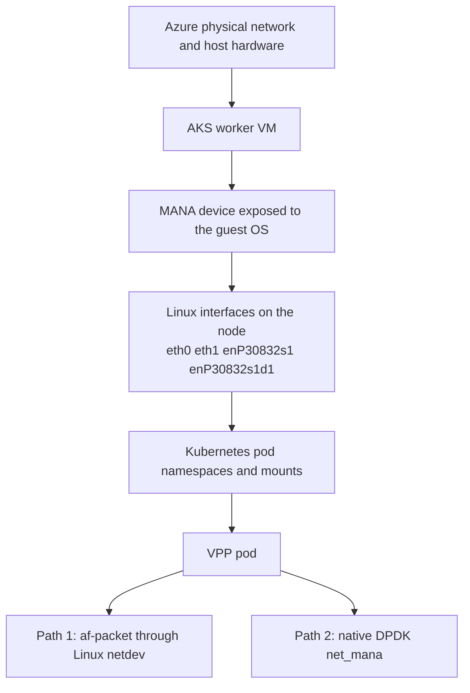
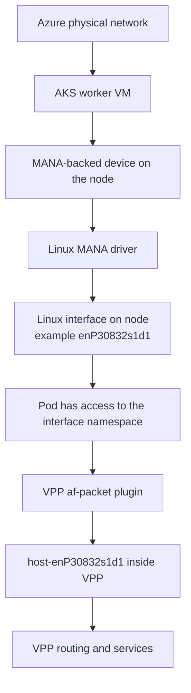
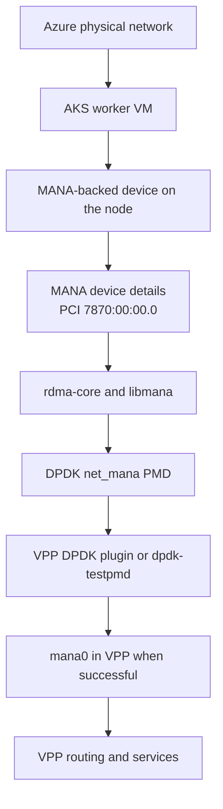
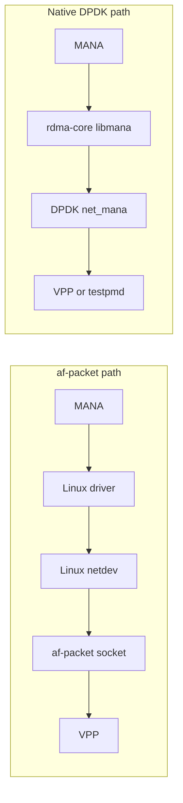

# POC Concepts Primer

This page explains the main networking terms used in this POC in plain English.

The goal is to answer four questions:

1. What is MANA?
2. What is VPP?
3. What is `af-packet`?
4. Where is the network card, and what is the full path from the Azure network to the VPP pod?

This primer is written specifically for the current AKS POC, not as a generic networking textbook.

---

## Start With The Big Picture

In this POC, the traffic does **not** jump directly from an Azure physical NIC into VPP.

There are several layers in between:

1. Azure physical network hardware in the cloud platform
2. The AKS worker VM that Azure gives us
3. Linux network interfaces inside that VM
4. The Kubernetes pod running on that VM
5. VPP inside the pod
6. Either the Linux `af-packet` path or the native DPDK path

That layering is the source of most of the confusion.

## Layered View

### What to remember

- The real physical hardware is part of Azure's platform, not something you directly plug into the pod.
- The pod runs on an AKS worker node, which is itself a VM.
- Inside that VM, Azure exposes a MANA-backed device and Linux interfaces.
- VPP is just a process inside the pod. It only sees what the pod and host make available to it.

---

## Term 1: MANA

`MANA` stands for **Microsoft Azure Network Adapter**.

In this POC, MANA is the Azure NIC technology used on the `Standard_D4s_v6` node type.

### What MANA means here

- It is the Azure-side network device family used by the AKS worker VM.
- It is the thing that DPDK talks to through the `net_mana` driver.
- It is also the reason the Ubuntu 24.04 plus kernel 6.8 combination matters in this POC.

### Important clarification

From the POC point of view, you can think of MANA as **the NIC technology visible to the AKS node**.

That does **not** mean the pod owns a bare-metal NIC directly.

It means:

- Azure exposes a MANA-backed device into the guest VM
- Linux sees interfaces related to that device
- VPP may either use Linux networking on top of it, or try to use DPDK directly on top of it

### MANA in this POC

- Management path: `eth0`
- Data-plane test path: `eth1`
- PCI device used by DPDK: `7870:00:00.0`
- Tested DPDK MAC: `7c:ed:8d:25:e4:4d`

---

## Term 2: VPP

`VPP` stands for **Vector Packet Processing**.

In this POC, VPP is the software router running inside the pod.

### What VPP does here

- receives packets
- decapsulates VXLAN
- processes SRv6 logic
- does VRF-based routing
- forwards traffic toward the client pod

So when you say "the VPP pod," what you really mean is:

- a privileged Kubernetes pod
- running a Linux userspace process called VPP
- using either Linux host interfaces or DPDK devices as its packet I/O path

### Important clarification

VPP is **not** the NIC.

VPP is the software packet engine that sits above the NIC access method.

It can use different input/output methods:

- `af-packet`
- DPDK
- other VPP interface types

---

## Term 3: af-packet

`af-packet` is a Linux raw-packet socket mechanism.

In VPP, `af-packet` means:

- Linux owns the network interface
- VPP opens a raw socket on top of that Linux interface
- packets go through the Linux networking path before VPP sees them

### Why `af-packet` is useful

- easy to bring up
- good for functional demos
- good when native DPDK is blocked or unstable

### Why `af-packet` is not kernel bypass

Because Linux still owns the interface.

The path is roughly:

MANA -> Linux driver -> Linux netdev -> `af-packet` socket -> VPP

That means:

- more overhead
- lower throughput
- more sensitivity to Linux offload behavior
- checksum quirks like the TCP issue already seen in this POC

### `af-packet` in this POC

The script [scripts/mana/run/start-vpp-afpacket.sh](./scripts/mana/run/start-vpp-afpacket.sh) shows this model clearly:

- the DPDK plugin is disabled
- the `af_packet_plugin.so` is enabled
- VPP creates `host-enP30832s1d1` from the Linux interface

---

## Term 4: DPDK

`DPDK` stands for **Data Plane Development Kit**.

In this POC, DPDK is the userspace packet I/O framework used to try to reach native high-performance packet processing on MANA.

### What DPDK means here

- VPP or `dpdk-testpmd` accesses the NIC from userspace
- Linux is not the main packet forwarding path for those packets
- this is the path we call **kernel bypass intent**

### Why DPDK matters

This is the path that is relevant for the performance-oriented target.

The native MANA DPDK proof is already real in this POC:

- `dpdk-testpmd` works with `net_mana`

What is still incomplete is:

- VPP on top of that native DPDK path is not yet reliable

### Important clarification

Having DPDK libraries installed inside the pod does **not** automatically mean traffic is using kernel bypass.

It only counts as kernel bypass when VPP is actually forwarding packets through a DPDK-owned interface.

---

## Term 5: Kernel Bypass

`Kernel bypass` means the packet data path avoids the normal Linux kernel networking stack.

### In this POC, kernel bypass means

- VPP or `testpmd` talks to the MANA device through DPDK
- Linux does not remain the main packet forwarding owner for those packets

### In this POC, kernel bypass does not mean

- the pod magically owns a bare-metal NIC
- every packet avoids every kernel interaction everywhere
- installing DPDK packages alone is enough

### Simple rule

- `af-packet` path: not kernel bypass
- native DPDK `net_mana` path: kernel-bypass intent

---

## Term 6: SR-IOV

`SR-IOV` is a hardware virtualization method that lets one physical NIC expose multiple virtual functions.

In many on-prem or telco environments, SR-IOV is the common way to hand a high-performance NIC function to a VM or container.

### In this POC

- SR-IOV is part of the broader learning context
- but the Azure MANA investigation is not the same thing as a classic "here is a VF passed directly into a pod" story
- MANA here behaves more like an Azure-specific high-performance path with its own driver model

So if you think of the POC as "standard SR-IOV into a pod," that will mislead you.

---

## Where Is The Physical Network Card?

This is the most important conceptual question.

### Short answer

The physical network hardware is in Azure's cloud platform.

What the AKS worker node sees is a MANA-backed device exposed into the guest VM.

What the pod sees depends on how the pod is configured:

- regular Linux interfaces
- host mounts and privileges
- or a DPDK path using the MANA device

### Practical POC view

For troubleshooting, you should think in these layers:

1. Azure physical network hardware
2. Azure virtualized NIC presentation to the AKS VM
3. Linux interfaces on the AKS node
4. pod namespace and privileges
5. VPP interface type

That is the path that actually matters for this repo.

---

## Full Path To The VPP Pod

## Path A: `af-packet`

This is the simpler functional path.

### Interpretation of Path A

- Linux owns the interface
- VPP attaches on top of Linux
- easier to debug
- lower performance ceiling
- not native kernel bypass

---

## Path B: Native DPDK on MANA

This is the high-performance target path.

### Interpretation of Path B

- this is the kernel-bypass intent
- this is the path already proven with `dpdk-testpmd`
- this is the path not yet fully proven with VPP dataplane forwarding

---

## Side-By-Side Comparison

### The one-line summary

- `af-packet` means Linux stays in the data path
- DPDK means userspace is trying to own the packet path directly

---

## What Is Actually Working In This Repo

### Working today

- Functional VPP topology with `af-packet`
- Native DPDK `testpmd` on MANA

### Not fully working today

- Reliable end-to-end VPP forwarding over native MANA DPDK

That is why the repo is split into separate scenario pages.

---

## Fast Mental Model

If you want the shortest possible summary, use this:

- `MANA` is the Azure NIC technology seen by the AKS node
- `VPP` is the software router inside the pod
- `af-packet` means VPP is using Linux networking underneath
- `DPDK` means VPP or `testpmd` tries to access the NIC from userspace directly
- `kernel bypass` only applies when the actual traffic path is the native DPDK path

---

## Recommended Reading After This Page

- [README.md](./README.md)
- [scripts/README.md](./scripts/README.md)
- [experiments/README.md](./experiments/README.md)
- [experiments/d4sv5-mellanox-afpacket.md](./experiments/d4sv5-mellanox-afpacket.md)
- [experiments/d4sv6-mana-dpdk.md](./experiments/d4sv6-mana-dpdk.md)