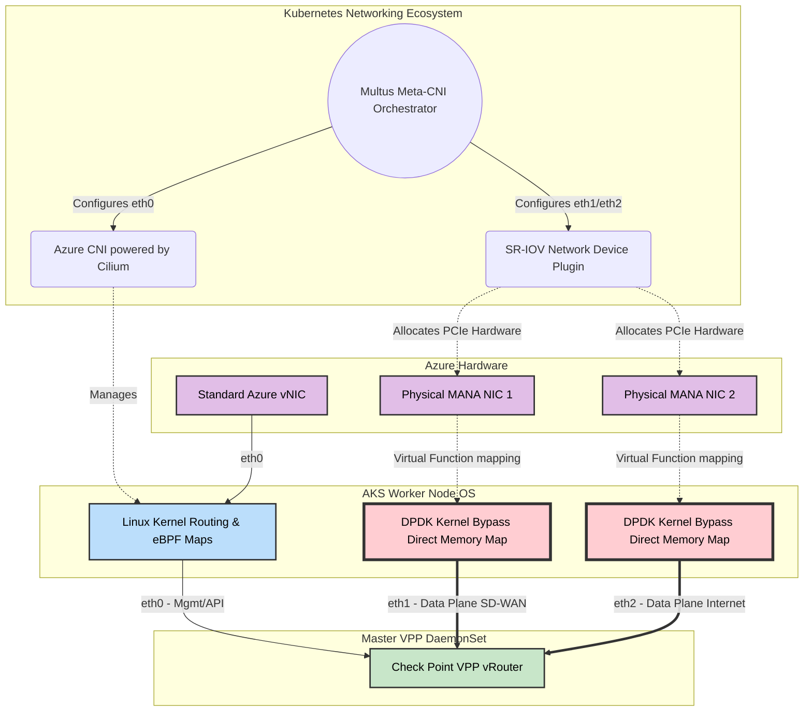

# Azure AKS CNI Architecture for Telco-Grade SASE

Standard Kubernetes networking (relying on `kube-proxy`, `iptables`, or standard Linux bridging) is designed for typical web microservices. It is completely incapable of handling Telco-grade network security workloads (like a Check Point SASE Hub) that require millions of packets per second (PPS) and 10+ Gbps throughput per node.

To solve this in Azure Kubernetes Service (AKS), the architecture abandons the "one pod, one interface" K8s default. Instead, it utilizes a **Multi-CNI (Container Network Interface)** architecture to physically separate the "slow" Kubernetes Control Plane from the "blindingly fast" Customer Data Plane.

## The Goal: Why Are We Doing This?
When building a massive multi-tenant SASE architecture handling 10,000+ customers, we face two critical physical limitations:
1.  **The CPU Bottleneck:** If customer payload traffic touches the Linux kernel routing table, it triggers a CPU hardware interrupt (IRQ) for *every single packet*. The CPU will max out at ~1-2 Million Packets Per Second (Mpps), choking the entire node and creating massive latency.
2.  **The Overlapping IP Problem:** Customers' private subnets overlap (e.g., everyone uses `192.168.1.0/24`). We absolutely cannot allow customer data to mix with the Kubernetes management routing table.

**The Solution:** We must completely bypass the Linux kernel for customer data (`eth1` / `eth2`) using DPDK while preserving standard K8s management routing for our own control plane (`eth0`).

### CNI Logical Flow Architecture

Here is the comprehensive breakdown of the CNI stack used in this deployment.

---

## 1. The Meta-Plugin: Multus CNI
Kubernetes natively expects exactly one network interface (`eth0`) per Pod. Because our architecture requires separate interfaces for Management, Intranet routing, and Internet breakout, we must deploy **Multus CNI**.
*   **What it does:** Multus is a "Meta-CNI." It acts as a multiplexer that allows multiple other CNI plugins to operate simultaneously on a single Pod or DaemonSet.
*   **The Result:** Multus allows the Master VPP DaemonSet to boot up with `eth0`, `eth1`, and `eth2` attached to completely different physical hardware and logical network paths.

---

## 2. The Control Plane (`eth0`): Azure CNI Powered by Cilium
The primary interface for the worker nodes and pods acts as the K8s Control Plane. This handles Kubernetes API calls, SSH, Control Plane Telemetry, metrics, and communication with the Check Point Infinity Portal.

*   **The Plugin:** We utilize **Azure CNI Powered by Cilium**.
*   **Why Cilium (eBPF)?:** Check Point does not need to perform complex routing here, but it does need rock-solid cluster security. Cilium operates using **eBPF (Extended Berkeley Packet Filter)**, allowing K8s network policies to be enforced dynamically in the Linux kernel without the terrible performance overhead of massive `iptables` chains. 
*   **Boundary & Overlapping IPs:** The Azure CNI fully manages the `eth0` network utilizing **your Infrastructure IP space** (e.g., standard Azure VNet CIDRs). **This interface does NOT have to deal with overlapping IPs.** Because the IP space belongs entirely to the SASE Provider (Check Point) for internal cluster management, there are no tenant collisions. It does **not** use SRv6 over UDP; it uses standard native Azure routing and Cilium eBPF mesh over IPv4/IPv6.

---

## 3. The Data Plane (`eth1` & `eth2`): SR-IOV Network Device Plugin
The Customer Data Plane completely bypasses the Azure CNI and the host worker node's operating system. 

*   **The Hardware:** The physical Azure NICs (handling Intranet vWAN and WWW internet bounds) are sliced into Virtual Functions (VFs) using **Single Root I/O Virtualization (SR-IOV)**.
*   **The Plugin:** The cluster runs the **SR-IOV Network Device Plugin for Kubernetes**.
*   **The Kernel Bypass (DPDK):** When Multus calls the SR-IOV plugin, it assigns the physical PCIe Virtual Function directly to the Master VPP DaemonSet. The VPP container uses DPDK (Data Plane Development Kit) to bind directly to the NIC hardware (`dpdk-devbind`). 
*   **The Result:** When customer packets arrive from Azure vWAN, the worker node's Linux Kernel does not raise an interrupt. The packet is written via **Direct Memory Map** directly into the Hugepages RAM allocated to the VPP container. `eth1` and `eth2` are entirely invisible to `eth0` and standard K8s services.

---

## 4. Internal Service Chaining (Pod-to-Pod)
While the Master VPP DaemonSet handles the external high-speed transport (SR-IOV), it must route packets through the internal Check Point Microservices (IPsec, QoS, Firewall, CASB).

*   Since these specialized Service Pods do not use complex shared memory architectures (`memif`), the VPP vRouter distributes the traffic through the Service Chain using highly-optimized **standard Linux virtual interfaces** (like DPDK-tuned `TAP` or `veth` pairs). 
*   Because the VPP engine has already absorbed the packet from the physical hardware, it essentially acts as an ultra-fast internal load balancer, orchestrating the hop-by-hop traversal through the SASE security products before shipping the packet back out of the SR-IOV `eth1` or `eth2` interfaces.

---

## Summary Topology of the Interfaces

| K8s Interface | Bound Hardware | Responsible CNI | Traffic Purpose | Kernel State |
| :--- | :--- | :--- | :--- | :--- |
| **`eth0`** | Standard Azure vNIC | Azure CNI (+ Cilium) | Cluster Mgmt, API, Infinity Portal, SSH | Standard K8s / eBPF Kernel |
| **`eth1`** | Azure Physical NIC 1 | Multus + SR-IOV Plugin | SD-WAN Intranet (SRv6 over UDP via vWAN) | Kernel Bypass (DPDK VPP) |
| **`eth2`** | Azure Physical NIC 2 | Multus + SR-IOV Plugin | Local Internet Breakout (Cleartext NAT) | Kernel Bypass (DPDK VPP) |

*Without this strict Multus layer orchestrating hardware-level bypass, the SASE packet engine would collapse under the latency of standard Kubernetes software-defined networking.*