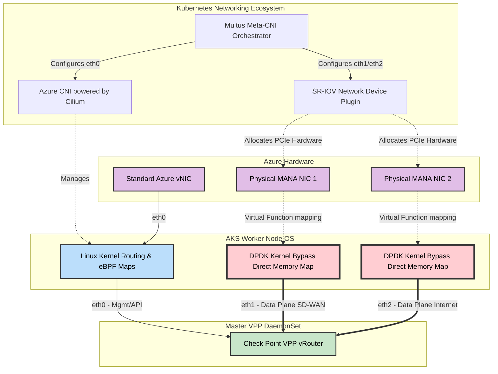

# Azure AKS CNI Architecture for Telco-Grade SASE

Standard Kubernetes networking (relying on `kube-proxy`, `iptables`, or standard Linux bridging) is designed for typical web microservices. It is completely incapable of handling Telco-grade network security workloads (like a Check Point SASE Hub) that require millions of packets per second (PPS) and 10+ Gbps throughput per node.

To solve this in Azure Kubernetes Service (AKS), the architecture abandons the "one pod, one interface" K8s default. Instead, it utilizes a **Multi-CNI (Container Network Interface)** architecture to physically separate the "slow" Kubernetes Control Plane from the "blindingly fast" Customer Data Plane.

## The Goal: Why Are We Doing This?
When building a massive multi-tenant SASE architecture handling 10,000+ customers, we face two critical physical limitations:
1.  **The CPU Bottleneck:** If customer payload traffic touches the Linux kernel routing table, it triggers a CPU hardware interrupt (IRQ) for *every single packet*. The CPU will max out at ~1-2 Million Packets Per Second (Mpps), choking the entire node and creating massive latency.
2.  **The Overlapping IP Problem:** Customers' private subnets overlap (e.g., everyone uses `192.168.1.0/24`). We absolutely cannot allow customer data to mix with the Kubernetes management routing table.

**The Solution:** We must completely bypass the Linux kernel for customer data (`eth1` / `eth2`) using DPDK while preserving standard K8s management routing for our own control plane (`eth0`).

### CNI Logical Flow Architecture



Here is the comprehensive breakdown of the CNI stack used in this deployment.

---

## 1. The Meta-Plugin: Multus CNI
Kubernetes natively expects exactly one network interface (`eth0`) per Pod. Because our architecture requires separate interfaces for Management, Intranet routing, and Internet breakout, we must deploy **Multus CNI**.
*   **What it does:** Multus is a "Meta-CNI." It acts as a multiplexer that allows multiple other CNI plugins to operate simultaneously on a single Pod or DaemonSet.
*   **The Result:** Multus allows the Master VPP DaemonSet to boot up with `eth0`, `eth1`, and `eth2` attached to completely different physical hardware and logical network paths.

---

## 2. The Control Plane (`eth0`): Azure CNI Powered by Cilium
The primary interface for the worker nodes and pods acts as the K8s Control Plane. This handles Kubernetes API calls, SSH, Control Plane Telemetry, metrics, and communication with the Check Point Infinity Portal.

*   **The Plugin:** We utilize **Azure CNI Powered by Cilium**.
*   **Why Cilium (eBPF)?:** Check Point does not need to perform complex routing here, but it does need rock-solid cluster security. Cilium operates using **eBPF (Extended Berkeley Packet Filter)**, allowing K8s network policies to be enforced dynamically in the Linux kernel without the terrible performance overhead of massive `iptables` chains. 
*   **Boundary & Overlapping IPs:** The Azure CNI fully manages the `eth0` network utilizing **your Infrastructure IP space** (e.g., standard Azure VNet CIDRs). **This interface does NOT have to deal with overlapping IPs.** Because the IP space belongs entirely to the SASE Provider (Check Point) for internal cluster management, there are no tenant collisions. It does **not** use SRv6 over UDP; it uses standard native Azure routing and Cilium eBPF mesh over IPv4/IPv6.

---

## 3. The Data Plane (`eth1` & `eth2`): SR-IOV Network Device Plugin
The Customer Data Plane completely bypasses the Azure CNI and the host worker node's operating system. 

*   **The Hardware:** The physical Azure NICs (handling Intranet vWAN and WWW internet bounds) are sliced into Virtual Functions (VFs) using **Single Root I/O Virtualization (SR-IOV)**.
*   **The Plugin:** The cluster runs the **SR-IOV Network Device Plugin for Kubernetes**.
*   **The Kernel Bypass (DPDK):** When Multus calls the SR-IOV plugin, it assigns the physical PCIe Virtual Function directly to the Master VPP DaemonSet. The VPP container uses DPDK (Data Plane Development Kit) to bind directly to the NIC hardware (`dpdk-devbind`). 
*   **The Result:** When customer packets arrive from Azure vWAN, the worker node's Linux Kernel does not raise an interrupt. The packet is written via **Direct Memory Map** directly into the Hugepages RAM allocated to the VPP container. `eth1` and `eth2` are entirely invisible to `eth0` and standard K8s services.

---

## Deep Dive: How 1 physical Azure NIC becomes 3 Pod NICs (SR-IOV Slicing)

One of the most confusing elements of Kubernetes High-Performance Networking is how an Azure AKS Worker Node, which only has **one** Primary Network Interface configured in the Azure portal, can magically provide `eth0`, `eth1`, and `eth2` to a Pod. 

The secret lies in the fact that **Accelerated Networking** in Azure is actually a hardware technology called **Single Root I/O Virtualization (SR-IOV)**.

### The "Hardware Slicer" Architecture

```mermaid
graph TD
    classDef hardware fill:#e1bee7,stroke:#333,stroke-width:2px,color:#000
    classDef virtual fill:#b3e5fc,stroke:#333,stroke-width:2px,color:#000
    classDef k8s fill:#c8e6c9,stroke:#333,stroke-width:2px,color:#000
    classDef pod fill:#ffcc80,stroke:#333,stroke-width:2px,color:#000

    subgraph Azure Datacenter Rack
        SmartNIC["Physical SmartNIC (Mellanox/MANA)<br>100+ Gbps"]:::hardware
        PF["Physical Function (PF)"]:::hardware
        VF1["Virtual Function 1 (VF)"]:::hardware
        VF2["Virtual Function 2 (VF)"]:::hardware
        
        SmartNIC --- PF
        SmartNIC --- VF1
        SmartNIC --- VF2
    end

    subgraph AKS Worker Node OS (Standard_D4s_v5)
        vSwitch["Azure Virtual Switch (Hyper-V)"]:::virtual
        OS_NIC["Primary Azure VM NIC (VM level)"]:::virtual
        PCIe_1["PCIe Device mapped to /dev/vfio/1"]:::hardware
        PCIe_2["PCIe Device mapped to /dev/vfio/2"]:::hardware
    end

    subgraph Kubernetes Networking Ecosystem
        Cilium["Azure CNI / Cilium<br>(Standard Networking)"]:::k8s
        Multus["Multus CNI + SR-IOV Plugin<br>(Hardware Plumber)"]:::k8s
    end

    subgraph Check Point VPP Pod
        eth0["eth0<br>Mgmt & K8s API"]:::pod
        eth1["eth1<br>Internal/LAN DPDK"]:::pod
        eth2["eth2<br>External/WAN DPDK"]:::pod
    end

    %% The Slow Path (eth0)
    PF -->|Standard Traffic| vSwitch
    vSwitch --> OS_NIC
    OS_NIC --> Cilium
    Cilium --> eth0

    %% The Fast Path (eth1 & eth2)
    VF1 ==>|PCIe Passthrough (Bypasses vSwitch)| PCIe_1
    VF2 ==>|PCIe Passthrough (Bypasses vSwitch)| PCIe_2

    PCIe_1 ==>|Discovered by| Multus
    PCIe_2 ==>|Discovered by| Multus

    Multus ==>|Direct PCIe Injection via CRD| eth1
    Multus ==>|Direct PCIe Injection via CRD| eth2
```

### The Slicing Process Explained:
1.  **The Physical Card (PF):** Your AKS VM sits on a server with a massive 100 Gbps network card. This card is represented as a **Physical Function (PF)**.
2.  **The Slices (VFs):** Because the card supports SR-IOV, the motherboard can slice that single physical PF into dozens of distinct **Virtual Functions (VFs)** at the PCIe hardware level. Each VF has its own independent MAC address and memory queues, but all VFs share the massive bandwidth pipeline of the parent SmartNIC.
3.  **The Standard Path (`eth0`):** The primary VM NIC gets its K8s IP address from standard Azure routing traversing the hypervisor vSwitch. Azure CNI/Cilium hands this to your Pod as `eth0`.
4.  **The Hardware Path (`eth1` & `eth2`):** The K8s `sriov-network-device-plugin` scans the Node's PCIe bus and discovers all the available hardware slices (VFs) that Azure mapped to your VM. 
5.  **Multus Assembly:** When the Pod starts, Multus intercepts it. It looks at our `NetworkAttachmentDefinition`, grabs one physical slice for `eth1` (Internal Data) and another slice for `eth2` (External Data), and literally passes the PCI hardware directly through the Pod's namespace walls.

Because of this slicing, you **do not** configure multiple NIC subnets in the `az aks create` command. You simply ask Azure for a VM size that supports Accelerated Networking, and let Multus + SR-IOV "carve out" the required interfaces internally.

---

## 4. Internal Service Chaining (Pod-to-Pod)
While the Master VPP DaemonSet handles the external high-speed transport (SR-IOV), it must route packets through the internal Check Point Microservices (IPsec, QoS, Firewall, CASB).

*   Since these specialized Service Pods do not use complex shared memory architectures (`memif`), the VPP vRouter distributes the traffic through the Service Chain using highly-optimized **standard Linux virtual interfaces** (like DPDK-tuned `TAP` or `veth` pairs). 
*   Because the VPP engine has already absorbed the packet from the physical hardware, it essentially acts as an ultra-fast internal load balancer, orchestrating the hop-by-hop traversal through the SASE security products before shipping the packet back out of the SR-IOV `eth1` or `eth2` interfaces.

---

## 5. Ingress: The 1:1 Public IP Mapping (Bypassing K8s LoadBalancers)
A critical requirement for terminating millions of customer IPsec / SD-WAN tunnels is having a reachable Public IP. 
In standard Kubernetes, exposing a workload means creating a `Service` of `type: LoadBalancer`. This asks Azure to create an Azure Load Balancer, which routes traffic to the Node's `eth0`, hitting the Linux Kernel's `kube-proxy` or `Cilium` tables. **This would instantly destroy the DPDK kernel bypass.**

To solve this, the architecture physically maps the IP directly to the hardware:
1.  **The Azure Resource:** An **Azure Public IP Address** is assigned *directly* to the physical Virtual Machine Network Interface (the specific NIC that will become `eth2` via SR-IOV).
2.  **The 1:1 NAT:** The Azure SDN fabric performs a 1:1 wire-speed NAT from the Public IP directly to the hardware NIC's private physical IP.
3.  **Direct Ingestion:** When the branch SD-WAN appliance connects, the IPSec packet (UDP 500/4500) flies through the Azure Switch directly onto the hardware NIC, and directly into the Master VPP DaemonSet's RAM. Kubernetes ingress, `kube-proxy`, and the LoadBalancer never see the connection.

---

## Summary Topology of the Interfaces

| K8s Interface | Bound Hardware | Responsible CNI | Traffic Purpose | Kernel State |
| :--- | :--- | :--- | :--- | :--- |
| **`eth0`** | Standard Azure vNIC | Azure CNI (+ Cilium) | Cluster Mgmt, API, Infinity Portal, SSH | Standard K8s / eBPF Kernel |
| **`eth1`** | Azure Physical NIC 1 | Multus + SR-IOV Plugin | SD-WAN Intranet (SRv6 over UDP via vWAN) | Kernel Bypass (DPDK VPP) |
| **`eth2`** | Azure Physical NIC 2 | Multus + SR-IOV Plugin | Local Internet Breakout (Cleartext NAT) | Kernel Bypass (DPDK VPP) |

*Without this strict Multus layer orchestrating hardware-level bypass, the SASE packet engine would collapse under the latency of standard Kubernetes software-defined networking.*