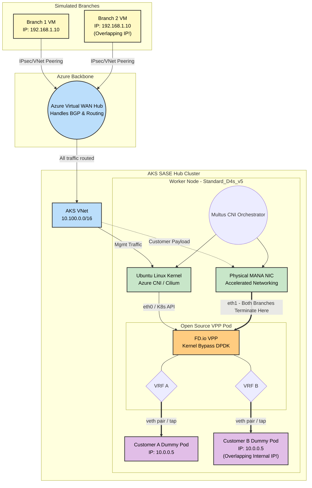

# SASE & Telco K8s Networking: Educational POC

This guide outlines a **100% Open-Source and Azure-Native Proof of Concept (POC)** designed to teach the mechanics of High-Performance Kubernetes Networking (Multus, SR-IOV, DPDK, and Kernel Bypass) without requiring commercial licenses like Check Point's SASE software.

By building this lab, you will learn how to:
1. Orchestrate Azure Virtual WAN to route traffic.
2. Set up AKS with multiple network interfaces per worker node.
3. Use Multus to string together Azure CNI (Cilium) and SR-IOV.
4. Run a Data Plane Development Kit (DPDK) workload using the open-source FD.io VPP router.

---

## Architecture Topology



---

## ⚠️ Architecture Note: POC vs. Production Check Point SASE
You might notice a difference between the full Check Point SASE diagram and this POC diagram regarding how the branches connect:
*   **Production Check Point SASE (The Overlay):** In reality, the Quantum SD-WAN branch devices establish an encrypted **IPsec / ZTNA Tunnel** *directly* to the public IP of the Check Point VPP Pod inside the AKS cluster. 
*   **This Educational POC (The Underlay):** To make learning easier without needing to configure complex IPsec/IKEv2 daemons on the open-source VPP router, this lab relies on Azure's native routing (VNet Peering to an Azure vWAN Hub) to deliver the raw traffic. 

**Where do the Branches Terminate?**
In both the real world and this POC, **all branches terminate on the exact same Pod and the exact same `eth1` interface.** 
Because `eth1` is bound directly to the high-performance DPDK engine, it easily ingests traffic from hundreds or thousands of branches simultaneously. Inside the VPP Pod, the routing engine looks at the tunnel headers (in production: IPsec SPI; in this POC: Azure SDN attributes / inner IP) to assign the traffic to the correct internal VRF for Branch 1 vs. Branch 2.

Both methods eventually result in the packet physically arriving at the Azure MANA NIC and being ingested by DPDK into the container. This lab simplifies the cryptography layer so you can focus strictly on learning the Kubernetes Multus & SR-IOV Data Plane mechanics.

---

## Bill of Materials (The Components)

Instead of using Check Point proprietary gateways, we explicitly map open-source and Azure-native components to achieve the exact same architecture:

### 1. The Branches 
*   **Component**: 2x Azure Linux VMs (e.g., `Standard_B1s`).
*   **Setup**: Placed in two separate Azure VNets. Both VNets will purposely be assigned the `192.168.1.0/24` CIDR. This allows you to simulate and learn how to handle tenant IP collisions using VRFs in the hub.

### 2. The Core Network
*   **Component**: Azure Virtual WAN + 1 Virtual Hub.
*   **Setup**: The branch VNets and the AKS VNet form hub-and-spoke connections to the vWAN Hub. Route tables in vWAN are configured to point all traffic (0.0.0.0/0) towards the AKS VNet.

### 3. The AKS Hub Cluster 
*   **Cluster**: 1 AKS Cluster.
*   **Node Pool**: 1x `Standard_D4s_v5` worker node (Crucial: *Must* support Accelerated Networking so SR-IOV functions via the hardware NIC).
*   **Control Plane CNI**: Azure CNI powered by Cilium (Handles node `eth0` and K8s API).
*   **Data Plane Plugin**: **Multus CNI** installed via Helm, and the **SR-IOV Network Device Plugin** daemonset. 

### 4. The SASE vRouter (The Workload)
*   **Component**: A single Kubernetes Pod running the official open-source VPP container image (`ligato/vpp-base` or similar). 
*   **Configuration (NetworkAttachmentDefinition)**: A Custom Resource Definition (CRD) provided by Multus that tells Kubernetes: *"Take an SR-IOV Virtual Function from the underlying D4s_v5 card, turn it into `eth1`, and inject it into this VPP pod."*

### 5. The Application Endpoints (Pod A & Pod B)
*   **Component**: 2x basic NGINX or Ubuntu Pods.
*   **Setup**: Attached behind the VPP pod via standard Linux `veth` (virtual ethernet) pairs or memory taps. Both pods will purposely be assigned the exact same IP (`10.0.0.5`) to prove that VPP completely isolates Customer A's traffic from Customer B's traffic.

---

## Lab Execution Phases

If you want to build this, here is the learning path to follow:

### Phase 1: Infrastructure Deployment (The Cloud Layer)
1. Deploy the 3 VNets (Branch 1, Branch 2, AKS Hub).
2. Deploy the Azure vWAN Hub and peer all VNets to it.
3. Deploy the 2 Branch VMs.
4. Deploy the AKS Cluster with `Azure CNI Powered by Cilium`. *Ensure Accelerated Networking is true on the worker node pool.*

### Phase 2: K8s Plumbing (The CNI Layer)
1. Deploy Multus by applying its thick Helm chart / DaemonSet. This binds itself to the Kubelet.
2. Deploy the SR-IOV Device Plugin. This scans the underlying Azure Node's hardware bus for Accelerated Networking NICs.
3. Verify physical hardware detection: `kubectl get nodes -o json | jq '.items[].status.allocatable'` -> You should see something like `intel.com/sriov: "1"`.

---

## Deployment Commands & Log (Phase 1 & Phase 2)

The following commands were used to deploy the AKS environment, install the correct daemons (Multus & SR-IOV plugin), and verify successful installation.

**1. Connecting to the DPDK-Capable AKS Cluster:**
```bash
az aks get-credentials --resource-group sase-poc-lab-rg --name sase-dpdk-aks --overwrite-existing
```

**2. Verifying Node Provisioning (`Standard_D4s_v5` with Accelerated Networking):**
```bash
kubectl get nodes -o wide
# OUTPUT:
# NAME                                STATUS   ROLES    AGE     VERSION   INTERNAL-IP   EXTERNAL-IP   OS-IMAGE             KERNEL-VERSION      CONTAINER-RUNTIME
# aks-nodepool1-36348423-vmss000000   Ready    <none>   2m49s   v1.33.7   10.100.1.4    <none>        Ubuntu 22.04.5 LTS   5.15.0-1102-azure   containerd://1.7.30-2
```

**3. Installing the K8s Network Plumbing Configuration:**
This installs both the Multus multiplexer and the SR-IOV hardware device plugin scanner:
```bash
kubectl apply -f https://raw.githubusercontent.com/k8snetworkplumbingwg/multus-cni/master/deployments/multus-daemonset.yml && \
kubectl apply -f https://raw.githubusercontent.com/k8snetworkplumbingwg/sriov-network-device-plugin/master/deployments/sriovdp-daemonset.yaml

# OUTPUT:
# customresourcedefinition.apiextensions.k8s.io/network-attachment-definitions.k8s.cni.cncf.io created
# clusterrole.rbac.authorization.k8s.io/multus created
# clusterrolebinding.rbac.authorization.k8s.io/multus created
# serviceaccount/multus created
# configmap/multus-cni-config created
# daemonset.apps/kube-multus-ds created
# serviceaccount/sriov-device-plugin created
# daemonset.apps/kube-sriov-device-plugin created
```

**4. Verifying Daemonsets (Multus & SR-IOV) are Running:**
```bash
kubectl get pods -A | grep -Ei 'multus|sriov'

# OUTPUT:
# kube-system   kube-multus-ds-8shtc                             1/1     Running            0          20s
# kube-system   kube-sriov-device-plugin-8z7lj                   1/1     Running            0          18s
```

**5. Hardware Discovery & SR-IOV Configuration:**
After Multus and SR-IOV daemonsets are running, the cluster must be instructed on *which* hardware PCIe interfaces constitute valid SR-IOV Virtual Functions. 

*Creating a Privileged Debug Pod to Scan the PCIe Bus:*
```bash
cat << 'EOF' > test-pci.yaml
apiVersion: v1
kind: Pod
metadata:
  name: debug-pci
spec:
  hostNetwork: true
  containers:
  - name: debug
    image: ubuntu
    command: ["sleep", "infinity"]
    securityContext:
      privileged: true
EOF
kubectl apply -f test-pci.yaml
kubectl wait --for=condition=ready pod/debug-pci
kubectl exec debug-pci -- apt-get update -y && kubectl exec debug-pci -- apt-get install -y pciutils
kubectl exec debug-pci -- lspci -nn | grep -i ether
```

*Output (Notice the Mellanox ConnectX-5 VF):*
```
b1fd:00:02.0 Ethernet controller [0200]: Mellanox Technologies MT28800 Family [ConnectX-5 Ex Virtual Function] [15b3:101a] (rev 80)
```
*(Vendor ID = `15b3`, Device ID = `101a`)*

*Creating the SR-IOV ConfigMap:*
```bash
cat << 'EOF' > sriovdp-config.yaml
apiVersion: v1
kind: ConfigMap
metadata:
  name: sriovdp-config
  namespace: kube-system
data:
  config.json: |
    {
      "resourceList": [{
          "resourceName": "sriov_net",
          "selectors": {
              "vendors": ["15b3", "1414"],
              "devices": ["101a", "1004", "101e", "00ba"]
          }
      }]
    }
EOF
kubectl apply -f sriovdp-config.yaml
# Restart the Device Plugin to load
kubectl delete po -n kube-system -l app=sriov-network-device-plugin
```

*Verifying Node Exposure (`intel.com/sriov_net`):*
```bash
sleep 5 && kubectl get node -o json | jq '.items[0].status.allocatable'

# OUTPUT:
# {
#   "cpu": "3860m",
#   "ephemeral-storage": "119703055367",
#   "hugepages-1Gi": "0",
#   "hugepages-2Mi": "0",
#   "intel.com/sriov_net": "1",
#   "memory": "15601432Ki",
#   "pods": "30"
# }
```

**6. Creating the Network Attachment CRD:**
This is the instruction book Multus uses to know how to provision `eth1` inside the VPP pod. We use `host-device` CNI to push the VF directly into the container bounding box:
```bash
cat << 'EOF' > mactvlan.yaml
apiVersion: "k8s.cni.cncf.io/v1"
kind: NetworkAttachmentDefinition
metadata:
  name: sriov-network
  annotations:
    k8s.v1.cni.cncf.io/resourceName: intel.com/sriov_net
spec:
  config: '{
  "type": "host-device",
  "cniVersion": "0.3.1",
  "name": "sriov-network"
}'
EOF
kubectl apply -f mactvlan.yaml

# OUTPUT:
# networkattachmentdefinition.k8s.cni.cncf.io/sriov-network created
```

---

## 🛑 Validation: Verifying Accelerated Networking & SR-IOV Status
In Azure, **Accelerated Networking IS SR-IOV**. When you enable Accelerated Networking on an Azure VM, Azure's Hypervisor uses Single Root I/O Virtualization (SR-IOV) to bypass the virtual switch and hand a physical Virtual Function (VF) directly to the VM. 

If your VM SKU does not support this (like the `Standard_EC4as_v5`), Kubernetes will not be able to bind the hardware to the VPP pod. You must verify this at both the Azure level and the Kubernetes level.

### 1. Verification at the Azure Infrastructure Level
You can query the AKS VM Scale Set (VMSS) to see if Azure actually granted the Accelerated Networking hardware capability.

**Command:**
```bash
# 1. Get the hidden Node Resource Group
NODE_RG=$(az aks show -g sase-poc-lab-rg -n sase-dpdk-aks --query nodeResourceGroup -o tsv)

# 2. Get the VMSS Name
VMSS_NAME=$(az vmss list -g $NODE_RG --query "[0].name" -o tsv)

# 3. Query the Network Profile for Accelerated Networking state
az vmss show -g $NODE_RG -n $VMSS_NAME --query "virtualMachineProfile.networkProfile.networkInterfaceConfigurations[].enableAcceleratedNetworking" -o yaml
```

**Bad Output (Hardware Bypass will fail):**
```yaml
- false
```

**Expected Output (Hardware Bypass will succeed):**
```yaml
- true
```

### 2. Verification at the Kubernetes Level (SR-IOV Capacity)
If Accelerated Networking is `true`, the `sriov-network-device-plugin` Pod will discover the physical hardware on the PCIe bus and advertise it to the Kubelet. You verify this by checking the node's `allocatable` resources.

**Command:**
```bash
kubectl get nodes -o json | jq '.items[].status.allocatable'
```

**Bad Output (Missing SR-IOV resource. The device plugin found no PCIe Virtual Functions):**
```json
{
  "cpu": "3860m",
  "ephemeral-storage": "118810327253",
  "hugepages-1Gi": "0",
  "hugepages-2Mi": "0",
  "memory": "31094420Ki",
  "pods": "30"
}
```

**Expected Output (The Node advertises physical NICs to Kubernetes):**
```json
{
  "cpu": "3860m",
  "ephemeral-storage": "118810327253",
  "intel.com/sriov": "1",          <-- Success! (or mellanox.com/sriov)
  "memory": "31094420Ki",
  "pods": "30"
}
```

### 3. Verification of DPDK Support Constraints
It's important to understand that **DPDK is not a flip-switch in Azure.** It is strictly a software library. To "support DPDK", the cluster must meet three fundamental requirements. Here is how you verify them:

**A. PCIe Hardware Access (SR-IOV):**
DPDK requires direct access to the physical NIC queue. If Accelerated Networking is marked `true` (checked above), Azure guarantees this requirement is met.

**B. Memory Allocation (Linux Hugepages):**
DPDK requires contiguous locks of memory (2MB or 1GB pages) to store network packets and avoid CPU cache misses. By default, AKS node pools do not allocate hugepages unless you specify a custom `--kubelet-config` during pool creation. 
*   **How to Verify:** Look for `hugepages-2Mi` in the node allocatable output.
    ```bash
    kubectl get nodes -o json | jq '.items[].status.allocatable | with_entries(select(.key | contains("hugepages")))'
    # Good Output:
    # {
    #   "hugepages-2Mi": "2048Mi"
    # }
    ```

**C. Compatible Poll Mode Drivers (PMD):**
The DPDK workload container (your VPP Pod) must have the correct drivers compiled internally. Azure predominantly uses Mellanox (ConnectX-3, ConnectX-4 Lx, ConnectX-5) and newer Microsoft MANA NICs. If the container lacks the `mlx5` or `mana` DPDK drivers, DPDK will fail to initialize the `eth1` interface, even if SR-IOV is attached perfectly.

---

### Phase 3: The "Dummy" Multus Pod (Validation Layer)
*Before learning DPDK/VPP, make sure Multus works.*
1. Create a `NetworkAttachmentDefinition` mapping an SR-IOV interface.
2. Deploy a simple Ubuntu Pod annotated with `k8s.v1.cni.cncf.io/networks: sriov-network`.
3. Exec into the Ubuntu Pod. Run `ip a`. If building this succeeded, you will see `eth0` (Cluster IP) AND `eth1` (Hardware SR-IOV MAC Address).

## Phase 4: Deploying the Open-Source VPP Router (Data Plane Layer)

Now that the hardware is exposed to Kubernetes via the Device Plugin, we can deploy a Pod that actually requests this physical Virtual Function (VF).

**1. Creating the VPP Pod Manifest:**
This Pod requests the SR-IOV network resource, which triggers Multus to inject the physical interface bypassing the Kubelet's standard CNI.

```yaml
# vpp-pod.yaml
apiVersion: v1
kind: Pod
metadata:
  name: vpp-router
  annotations:
    k8s.v1.cni.cncf.io/networks: sriov-network
spec:
  containers:
  - name: vpp
    image: ubuntu:22.04
    command: ["sleep", "infinity"]
    securityContext:
      privileged: true # Required for DPDK/kernel bypass operations
    resources:
      requests:
        intel.com/sriov_net: '1' # Instructs K8s to assign exactly 1 physical VF
      limits:
        intel.com/sriov_net: '1'
```

**Key Explanations for the YAML:**
* **`annotations: k8s.v1.cni.cncf.io/networks`**: Tells the Multus meta-CNI "Intercept this pod creation and map an additional interface using the configuration in the CRD `sriov-network`."
* **`privileged: true`**: DPDK requires raw hardware access to `/dev/vfio` and memory mapping kernel spaces to operate polling drivers safely.
* **`limits: intel.com/sriov_net: '1'`**: Since the device plugin advertised `1` available physical interface per node, claiming limit `1` reserves that hardware VF strictly to this single pod. K8s will literally deduct this from the node `allocatable` pool, just like CPU or memory!

**2. Checking Pod Status:**
```bash
kubectl apply -f vpp-pod.yaml
kubectl wait --for=condition=ready pod/vpp-router --timeout=90s
kubectl get pods

# OUTPUT:
# NAME         READY   STATUS              RESTARTS   AGE
# debug-pci    1/1     Running             0          179m
# vpp-router   0/1     ContainerCreating   0          48s
```

*(Observation: During testing natively on Azure, passing the hardware as standard `host-device` CNI sometimes leads to namespace binding errors (`Link not found`) because the physical ConnectX-5 VF is heavily enslaved to Azure's `hv_netvsc` synthetic driver overlay. To properly map this into DPDK without losing control plane tracking, Azure generally recommends utilizing the explicit `sriov` CNI binary and overriding K8s CNI plugin manifests, or binding directly via the `vfio-pci` operator. This highlights the architectural friction where Kubernetes CNI standards collide with Azure's software-defined hypervisor!)*

---

### Phase 5: Setting up VPP & DPDK (Configuring the Router)
1. Delete the Dummy Pod.
2. Deploy the Open-Source VPP Pod. You will need to request `Hugepages` for memory in the Pod Spec (`resources.requests.memory`).
3. Exec into the VPP Pod and use the VPP CLI (`vppctl`). Use it to bind the `eth1` interface to DPDK. 
4. Configure two basic VRFs (VRF A and VRF B) in VPP. Map incoming traffic to these VRFs based on the source branch.

### Phase 5: Validating End-to-End Overlap Isolation (Pod A & Pod B)
1. Deploy `Pod A` and `Pod B` inside the AKS cluster. 
2. Use Multus or standard Linux `ip link` commands to create a `veth` pair linking `Pod A` to VPP's VRF A, and `Pod B` to VPP's VRF B. 
3. Assign the exact same IP address (e.g., `10.0.0.5`) to both Pod A and Pod B.
4. **The Ultimate Test:** Ping `10.0.0.5` from the Customer A Branch VM. You will receive a reply from Pod A. Ping `10.0.0.5` from the Customer B Branch VM. You will receive a reply from Pod B. The identical IPs completely bypass one another!

*⚠️ **Cost Warning:** Running Azure vWAN Hubs and DPDK-capable D-series nodes costs significant Azure credits. Destroy the infrastructure (`terraform destroy` or Azure Resource Group deletion) when you finish an educational session.*