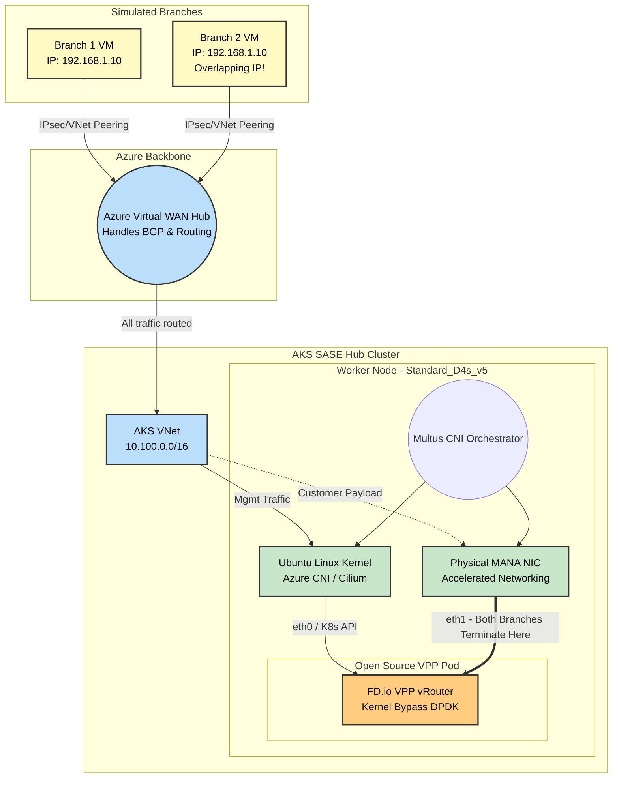

# SASE & Telco K8s Networking: Educational POC

This guide outlines a **100% Open-Source and Azure-Native Proof of Concept (POC)** designed to teach the mechanics of High-Performance Kubernetes Networking (Multus, SR-IOV, DPDK, and Kernel Bypass) without requiring commercial licenses like Check Point's SASE software.

By building this lab, you will learn how to:
1. Orchestrate Azure Virtual WAN to route traffic.
2. Set up AKS with multiple network interfaces per worker node.
3. Use Multus to string together Azure CNI (Cilium) and SR-IOV.
4. Run a Data Plane Development Kit (DPDK) workload using the open-source FD.io VPP router.

---

## Architecture Topology

---

## ⚠️ Architecture Note: POC vs. Production Check Point SASE
You might notice a difference between the full Check Point SASE diagram and this POC diagram regarding how the branches connect:
*   **Production Check Point SASE (The Overlay):** In reality, the Quantum SD-WAN branch devices establish an encrypted **IPsec / ZTNA Tunnel** *directly* to the public IP of the Check Point VPP Pod inside the AKS cluster. 
*   **This Educational POC (The Underlay):** To make learning easier without needing to configure complex IPsec/IKEv2 daemons on the open-source VPP router, this lab relies on Azure's native routing (VNet Peering to an Azure vWAN Hub) to deliver the raw traffic. 

**Where do the Branches Terminate?**
In both the real world and this POC, **all branches terminate on the exact same Pod and the exact same `eth1` interface.** 
Because `eth1` is bound directly to the high-performance DPDK engine, it easily ingests traffic from hundreds or thousands of branches simultaneously. Inside the VPP Pod, the routing engine looks at the tunnel headers (in production: IPsec SPI; in this POC: Azure SDN attributes / inner IP) to assign the traffic to the correct internal VRF for Branch 1 vs. Branch 2.

Both methods eventually result in the packet physically arriving at the Azure MANA NIC and being ingested by DPDK into the container. This lab simplifies the cryptography layer so you can focus strictly on learning the Kubernetes Multus & SR-IOV Data Plane mechanics.

---

## Bill of Materials (The Components)

Instead of using Check Point proprietary gateways, we explicitly map open-source and Azure-native components to achieve the exact same architecture:

### 1. The Branches 
*   **Component**: 2x Azure Linux VMs (e.g., `Standard_B1s`).
*   **Setup**: Placed in two separate Azure VNets. Both VNets will purposely be assigned the `192.168.1.0/24` CIDR. This allows you to simulate and learn how to handle tenant IP collisions using VRFs in the hub.

### 2. The Core Network
*   **Component**: Azure Virtual WAN + 1 Virtual Hub.
*   **Setup**: The branch VNets and the AKS VNet form hub-and-spoke connections to the vWAN Hub. Route tables in vWAN are configured to point all traffic (0.0.0.0/0) towards the AKS VNet.

### 3. The AKS Hub Cluster 
*   **Cluster**: 1 AKS Cluster.
*   **Node Pool**: 1x `Standard_D4s_v5` worker node (Crucial: *Must* support Accelerated Networking so SR-IOV functions via the hardware NIC).
*   **Control Plane CNI**: Azure CNI powered by Cilium (Handles node `eth0` and K8s API).
*   **Data Plane Plugin**: **Multus CNI** installed via Helm, and the **SR-IOV Network Device Plugin** daemonset. 

### 4. The SASE vRouter (The Workload)
*   **Component**: A single Kubernetes Pod running the official open-source VPP container image (`ligato/vpp-base` or similar). 
*   **Configuration (NetworkAttachmentDefinition)**: A Custom Resource Definition (CRD) provided by Multus that tells Kubernetes: *"Take an SR-IOV Virtual Function from the underlying D4s_v5 card, turn it into `eth1`, and inject it into this VPP pod."*

---

## Lab Execution Phases

If you want to build this, here is the learning path to follow:

### Phase 1: Infrastructure Deployment (The Cloud Layer)
1. Deploy the 3 VNets (Branch 1, Branch 2, AKS Hub).
2. Deploy the Azure vWAN Hub and peer all VNets to it.
3. Deploy the 2 Branch VMs.
4. Deploy the AKS Cluster with `Azure CNI Powered by Cilium`. *Ensure Accelerated Networking is true on the worker node pool.*

### Phase 2: K8s Plumbing (The CNI Layer)
1. Deploy Multus by applying its thick Helm chart / DaemonSet. This binds itself to the Kubelet.
2. Deploy the SR-IOV Device Plugin. This scans the underlying Azure Node's hardware bus for Accelerated Networking NICs.
3. Verify physical hardware detection: `kubectl get nodes -o json | jq '.items[].status.allocatable'` -> You should see something like `intel.com/sriov: "1"`.

### Phase 3: The "Dummy" Multus Pod (Validation Layer)
*Before learning DPDK/VPP, make sure Multus works.*
1. Create a `NetworkAttachmentDefinition` mapping an SR-IOV interface.
2. Deploy a simple Ubuntu Pod annotated with `k8s.v1.cni.cncf.io/networks: sriov-network`.
3. Exec into the Ubuntu Pod. Run `ip a`. If building this succeeded, you will see `eth0` (Cluster IP) AND `eth1` (Hardware SR-IOV MAC Address).

### Phase 4: Setting up VPP & DPDK (The Data Plane Layer)
1. Delete the Dummy Pod.
2. Deploy the Open-Source VPP Pod. You will need to request `Hugepages` for memory in the Pod Spec (`resources.requests.memory`).
3. Exec into the VPP Pod and use the VPP CLI (`vppctl`). Use it to bind the `eth1` interface to DPDK. 
4. Configure two basic VRFs in VPP to separate the overlapping 192.168.1.0/24 subnets coming from your two branches!

*⚠️ **Cost Warning:** Running Azure vWAN Hubs and DPDK-capable D-series nodes costs significant Azure credits. Destroy the infrastructure (`terraform destroy` or Azure Resource Group deletion) when you finish an educational session.*