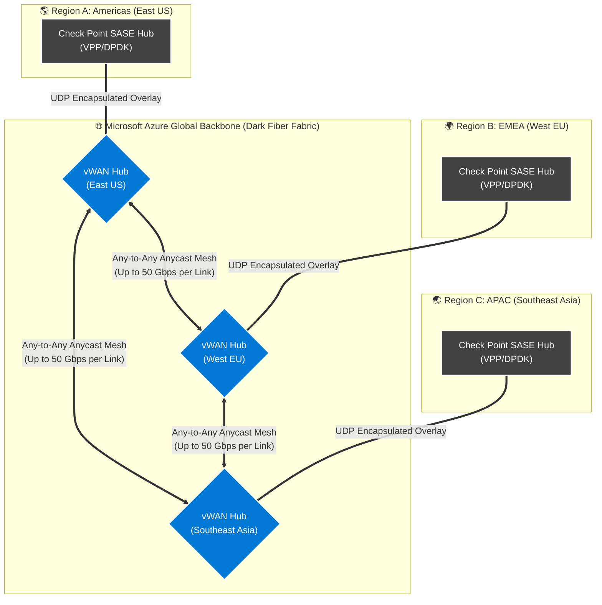

# Azure vWAN Global Scale & Performance in the SASE Architecture

When engineering a carrier-grade SASE deployment for large enterprises, understanding the underlying capabilities—and limitations—of the cloud provider's network fabric is critical. 

This document illustrates how Check Point leverages **Azure Virtual WAN (vWAN)** as an incredibly fast but "dumb" global transit mechanism spanning multiple geographic regions, while simultaneously bypassing Azure's inherent software-defined networking (SDN) scale limits.

---

## 1. Multi-Region vWAN Global Fabric Topology

The following diagram isolates the Azure global transit layer across three major geographies (Americas, EMEA, and APAC). 

Notice that **Azure vWAN does zero complex security routing**. It strictly acts as a high-speed, 50 Gbps pure-UDP bridge allowing the isolated regional Check Point SASE hubs to form a global mesh network.

---

## 2. vWAN Scale Metrics & The Overlay Advantage

When relying *solely* on native cloud provider firewalls or Gateways, customers bump into harsh cloud-managed limitations. Here is a breakdown of maximum Azure limits versus the capabilities unlocked by this Check Point overlay architecture.

### A. Raw Throughput (Bandwidth)
*   **Azure vWAN Native Limit:** A single Azure Virtual Hub scales its routing infrastructure up to a maximum of **50 Gbps**. 
*   **The Check Point Advantage (Multi-NIC Offloading):** First, we bypass Azure Firewall latency by passing raw UDP across vWAN. Second, we can inject a third NIC (`eth2` via Multus) strictly for public WWW internet traffic. Heavy web traffic (Netflix, SaaS, YouTube) is NATted directly to the internet locally within the region, bypassing vWAN completely. This ensures the precious 50 Gbps vWAN pipe is exclusively reserved for secure, inter-region enterprise data.

### B. Route Scale (BGP Limitations)
*   **Azure vWAN Native Limit:** Azure vWAN Hubs support up to a maximum of **10,000 routes**. Standard Azure VPN Gateways often cap out at 1,000–4,000 routes. For a large enterprise or telco with millions of subnets and overlapping IP spaces, this limit is a catastrophic bottleneck.
*   **The Check Point Advantage:** **Infinite Route Scale.** Because the Check Point architecture encapsulates all internal SD-WAN routes, overlapping IPs, and SRv6 telemetry inside standard UDP payloads, the Azure vWAN BGP table only sees a handful of regional Hub IP addresses. The VPP engines operating inside the Check Point pods maintain the actual millions of BGP entries completely out of Azure's sight.

### C. Packets Per Second (PPS) & Kernel Bypass
*   **Azure vWAN Native Limit:** Standard Azure Virtual Machines process traffic through the host OS virtual switch (vSwitch), which introduces CPU interrupt latency. Non-accelerated VMs top out at around `1M to 2M` Packets Per Second (PPS).
*   **The Check Point Advantage:** **Up to ~30 Million PPS.** By attaching **SR-IOV (Accelerated Networking)** directly to the AKS nodes, the physical Azure NIC bypasses the vSwitch and funnels traffic directly into the Check Point container's **DPDK (Data Plane Development Kit)** memory space. This completely negates Azure's software SDN friction, enabling Telco-level minimum-latency line rates.

### D. Connections Per Second (CPS) & Concurrent Flows
*   **Azure vWAN Native Limit:** Managed stateful Azure services (like NAT Gateways or Azure Firewalls) track session states. At extreme scale (millions of concurrent sessions or hundreds of thousands of CPS), SNAT port exhaustion or state table memory caps occur.
*   **The Check Point Advantage:** vWAN treats the UDP overlay tunnels as a handful of massive *stateless* flows (using ECMP - Equal-Cost Multi-Path routing under the hood). The connection state tracking (CPS/Concurrent Flows) is entirely shifted to the Check Point CloudGuard engines. Properly sized Check Point instances can sustain **10+ Million concurrent connections** per cluster, completely mitigating Azure native state-table wipeouts.

### E. MTU and Encapsulation Overhead (Jumbo Frames)
Because Check Point's architecture deeply encapsulates traffic—wrapping a customer's raw IPv4 payload inside an IPv6 (SRv6) Header, and then wrapping *that* inside an outer IPv4 UDP header—the final packet size grows significantly (adding ~60-100 bytes of overhead). If standard 1500-byte MTUs were strictly enforced everywhere, packets would constantly fragment, destroying CPU and network performance.

Here is how the architecture handles MTU limitations across the different network boundaries:
*   **Customer Edge to Azure (The Internet Limit - 1500 MTU):** The public internet strictly enforces a 1500-byte MTU limit. To prevent fragmentation before traffic even reaches Azure, the Check Point Quantum SD-WAN routers deployed at the customer branch enforce **TCP MSS Clamping**. By artificially lowering the Max Segment Size of the TCP packets at the source branch (e.g., to ~1350 bytes), it guarantees there is plenty of "empty room" in the 1500-byte frame to attach the IPsec, UDP, and SRv6 headers without ever fragmenting over the internet.
*   **Inside the Azure VNet (AKS Node MTU):** Once inside the Azure network, we bypass the 1500 limit. Azure's modern backend and Accelerated Networking (SR-IOV) NICs natively support **Jumbo Frames** (up to ~4000+ bytes). The DPDK/VPP ethernet interfaces inside the Check Point Pod are configured to accept these Jumbo MTUs.
*   **Multi-Region Transit (Azure vWAN Backbone):** When SASE Hub `East US` needs to send the double-encapsulated packet to SASE Hub `West EU`, it routes over the Azure vWAN backbone. Because Microsoft's dark fiber internal network natively transports Jumbo Frames, these "Super Packets" fly across continents between the Hubs without ever fragmenting.

---

### Summary
In this SASE architecture, **Azure vWAN is utilized exclusively for what Microsoft does best:** laying transatlantic dark fiber and switching dumb UDP packets at 50 Gbps speeds. 

**Check Point provides what it does best:** carrier-grade BGP scale, high-capacity SRv6 tracking, massive stateful connection retention, and Sub-second DPDK throughput.