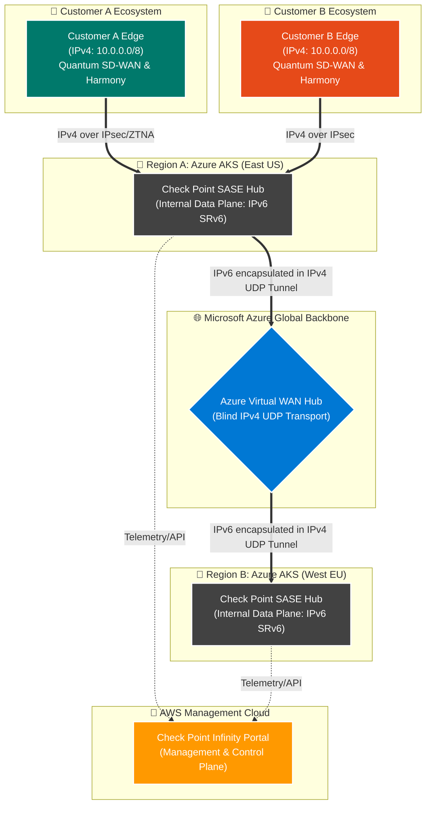
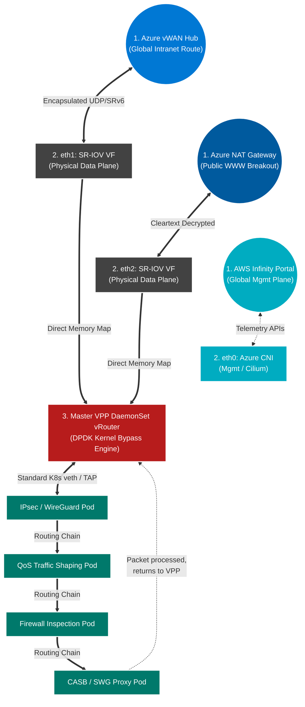

# Check Point AKS Cloud-Native SASE Architecture

As SASE providers scale, migrating from traditional virtual machines to Cloud-Native Network Functions (CNFs) hosted on Azure Kubernetes Service (AKS) becomes critical. 

This document explores how Check Point implements a high-speed, multi-tenant SASE fabric using Multi-NIC Pods integrated with Azure's physical backbone and Virtual WAN (vWAN) using Multus, DPDK, and SR-IOV.

---

## 1. High-Level Azure Multi-Region Architecture (10,000 ft View)

**IPv4 vs. IPv6 (SRv6) Clarification:** 
It is critical to distinguish where traffic shifts from IPv4 to IPv6:
*   **Customer On-Premises (Edgers):** The user's actual branch networks operate on native **IPv4** (e.g., overlapping `10.0.0.0/8`).
*   **SASE Overlay (Data Plane):** Once inside the Check Point SASE Hub, the VPP engines translate and route packets using **IPv6 (SRv6)** to completely isolate Customer A from Customer B and to define security service chains.
*   **Azure Underlay (vWAN):** Azure's physical switches cannot route custom SRv6 natively. Therefore, the IPv6/SRv6 traffic is encapsulated inside a standard **IPv4 UDP** packet before touching the Azure backbone. Azure merely routes standard IPv4 UDP over vWAN.

This topology illustrates the macroscopic routing landscape. It demonstrates how two overlapping enterprise customers (`Customer A` and `Customer B`, both using the exact same `10.0.0.0/8` IPv4 space) are securely routed across Azure vWAN using custom Check Point VPP containers. 

---

## 2. Zoom-in: VPP DaemonSet & Microservices Architecture (The Datapath)

Zooming into **Region A**, this diagram explains the complex host-level networking required to perform Telco-grade packet processing inside an AKS Worker Node. 

Because underlying public cloud fabrics (like Azure) do not natively route SRv6 packets, Check Point must handle the complex SRv6-to-UDP encapsulation themselves. Instead of putting a VPP engine inside every single customer Pod (which creates immense overhead), Check Point utilizes a **Master VPP vRouter** deployed as a **DaemonSet** on the worker node. This Master VPP acts as the high-speed traffic cop, orchestrating the entire Service Chain across specialized Cloud-Native Network Function (CNF) Pods.

### Architectural Deep Dive

#### 1. The VPP DaemonSet (Host Network)
In a pure microservices SASE environment, placing the DPDK engine inside the worker node itself (as a DaemonSet running with `hostNetwork: true`) is highly efficient. The Master VPP vRouter binds directly to Azure's physical NICs via Accelerated Networking (SR-IOV). It processes the millions of raw packets hitting the server, unwraps the IPv4 UDP transport tunnels, reads the inner SRv6 headers, and routes the traffic to the appropriate security pod.

#### 2. High-Speed Service Chaining (Standard Interfaces)
A SASE inspection pipeline requires multiple specialized engines (IPsec/WireGuard termination, QoS traffic shaping, Firewall/IPS inspection, and CASB/SWG proxies). If the underlying product architecture does not support custom shared-memory interfaces like **`memif`** (which requires heavy application rewrites to support memory-mapped datapath transfers), the VPP DaemonSet falls back to routing traffic into the specialized Pods using highly optimized **standard Linux virtual interfaces** (like `veth` pairs or `TAP` interfaces tuned for DPDK). The VPP DaemonSet acts as the central traffic switch, ensuring traffic reliably hops between the Pods. 

#### 3. Overcoming Azure vWAN & IPv6 Overlap Limitations
Azure vWAN is an incredibly powerful global transit layer, but it is deeply intolerant of overlapping BGP IPv4 spaces. In our diagram, multiple customers use `10.0.0.0/8`. 
*   **The Problem:** If Check Point injected those overlapping routes directly into the Azure vWAN Hub, the Azure BGP tables would instantly collide. Furthermore, if the VPP engine transmits a raw **SRv6** packet, Azure's physical switches would simply drop the custom headers.
*   **The "Over-The-Top" Solution:** Check Point utilizes vWAN strictly as a physical transport. The VPP DaemonSet isolates the overlapping IPv4 payloads, wraps them in SRv6 routing logic, and finally encapsulates the entire data structure inside a standard IPv4 UDP packet. Azure vWAN routes the encapsulating UDP packet seamlessly across global regions without ever touching the sensitive overlapping customer data hidden inside.
*   **The Tenant ID Routing:** When the packet reaches the destination region, the remote worker node's Master VPP DaemonSet strips off the outer IPv4 UDP shell, reads the internal SRv6 header, and extracts the **Tenant ID (VRF)**. The VPP engine uses this Tenant ID to immediately place the packet into the correct customer's isolated routing table and service chain, completely oblivious to Azure's underlying infrastructure.

#### 4. The Separation of Cloud (WWW) and Intranet (vWAN)
The VPP routing logic actively splits datapath traffic locally at the node:
*   **Intranet Payload (`eth1` bound):** Corporate data is wrapped in SRv6/UDP and pushed out to the Azure vWAN fabric.
*   **Local Web Breakout (`eth2` bound):** Standard internet browsing (e.g., Office365, YouTube) does not need to cross the expensive corporate vWAN. Instead, VPP applies NAT locally and pushes it straight to a localized Azure NAT Gateway for immediate public breakout, radically reducing vWAN transit costs. 

#### 5. The Role of Azure CNI Powered by Cilium
While DPDK handles the ultra-fast datapaths, standard Kubernetes Management (pushing configuration, talking to the Infinity Portal, metrics) is handed off to **Azure CNI Powered by Cilium**. Cilium acts independently on the `eth0` interface, using lightweight eBPF rules to enforce strict network policies over the cluster's control plane telemetry without interfering with VPP's specialized transit.