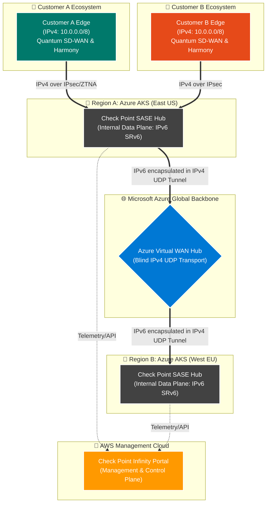
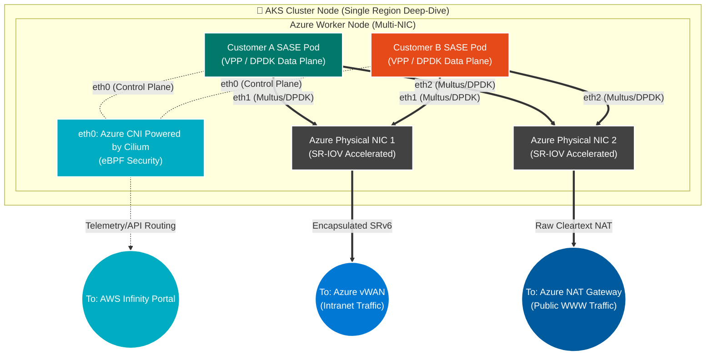

# Check Point AKS Cloud-Native SASE Architecture

As SASE providers scale, migrating from traditional virtual machines to Cloud-Native Network Functions (CNFs) hosted on Azure Kubernetes Service (AKS) becomes critical. 

This document explores how Check Point implements a high-speed, multi-tenant SASE fabric using Multi-NIC Pods integrated with Azure's physical backbone and Virtual WAN (vWAN) using Multus, DPDK, and SR-IOV.

---

## 1. High-Level Azure Multi-Region Architecture (10,000 ft View)

**IPv4 vs. IPv6 (SRv6) Clarification:** 
It is critical to distinguish where traffic shifts from IPv4 to IPv6:
*   **Customer On-Premises (Edgers):** The user's actual branch networks operate on native **IPv4** (e.g., overlapping `10.0.0.0/8`).
*   **SASE Overlay (Data Plane):** Once inside the Check Point SASE Hub, the VPP engines translate and route packets using **IPv6 (SRv6)** to completely isolate Customer A from Customer B and to define security service chains.
*   **Azure Underlay (vWAN):** Azure's physical switches cannot route custom SRv6 natively. Therefore, the IPv6/SRv6 traffic is encapsulated inside a standard **IPv4 UDP** packet before touching the Azure backbone. Azure merely routes standard IPv4 UDP over vWAN.

This topology illustrates the macroscopic routing landscape. It demonstrates how two overlapping enterprise customers (`Customer A` and `Customer B`, both using the exact same `10.0.0.0/8` IPv4 space) are securely routed across Azure vWAN using custom Check Point VPP containers. 

---

## 2. Zoom-in: AKS Cluster Node & NIC Architecture (Single Region)

Zooming into **Region A**, this diagram explains the complex host-level networking required to perform Telco-grade packet processing inside an AKS Worker Node. It outlines the separation of the Control Plane (Cilium) and the Multi-NIC Data Plane (Multus, DPDK, SR-IOV), actively separating Intranet traffic from WWW Internet traffic to save bandwidth and costs.

### Architectural Deep Dive

#### 1. Multi-NIC Pods (Management, Intranet, and WWW)
To satisfy Telco-grade throughput and separate security domains, the SASE Pods require three distinct interfaces utilizing **Multus CNI**:
*   **`eth0` (Management):** Connected via standard **Azure CNI Powered by Cilium**. This provides highly secure, eBPF-based Kubernetes network policies for Control Plane telemetry. It reports back to the Infinity Portal in AWS.
*   **`eth1` (Intranet Data Plane):** Dedicated entirely to raw Check Point customer payload destined for the internal SD-WAN. Traffic is encapsulated in UDP/SRv6 and pushed to Azure vWAN.
*   **`eth2` (WWW Data Plane):** Dedicated entirely to Public Internet browsing (SaaS, Video, Web). Traffic is natively NATted by VPP and pushed directly to an Azure NAT Gateway. **This bypasses vWAN entirely, saving massive bandwidth costs.**

#### 2. High-Speed Packet Processing (KERNEL BYPASS)
To achieve million-packet-per-second (PPS) routing within the container, the Pod's `eth1` and `eth2` interfaces utilize the **Data Plane Development Kit (DPDK)**. Azure directly supports this by attaching multiple **Accelerated Networking (SR-IOV)** Virtual Functions straight into the Pods. The host Azure OS completely ignores this traffic, handing the physical network card instructions directly to the Check Point VPP engine, which splits the WAN and WWW routing logic instantly.

#### 3. Overcoming Azure vWAN & IPv6 Overlap Limitations
Azure vWAN is an incredibly powerful global transit layer, but it is deeply intolerant of overlapping BGP IPv4 spaces. In our diagram, Customer A and Customer B both use `10.0.0.0/8`. 
*   **The Problem:** If Check Point injected those overlapping routes directly into the Azure vWAN Hub, the Azure BGP tables would instantly collide. Furthermore, if the VPP engine transmits a raw **SRv6** packet, Azure's physical switches would drop the custom headers.
*   **The "Over-The-Top" Solution:** Check Point utilizes vWAN strictly as a physical transport. The VPP pod logic isolates the overlapping IPv4 payloads, wraps them in SRv6 routing logic, and finally encapsulates the entire data structure inside a standard IPv4 UDP packet. Azure vWAN routes the encapsulating UDP packet seamlessly across global regions without ever touching the sensitive overlapping customer data hidden inside.

#### 4. The Role of Azure CNI Powered by Cilium
If an ISV prefers not to build their own CNI from scratch (BYO-CNI), **Azure CNI Powered by Cilium** is the recommended default for the `eth0` control plane. Cilium utilizes eBPF (Extended Berkeley Packet Filter) to provide extremely lightweight, highly scalable network policies and observability. It tightly locks down the management plane of the Pod ensuring it can only communicate with the authorized AWS APIs, leaving `eth1` completely unbound for raw data transit.