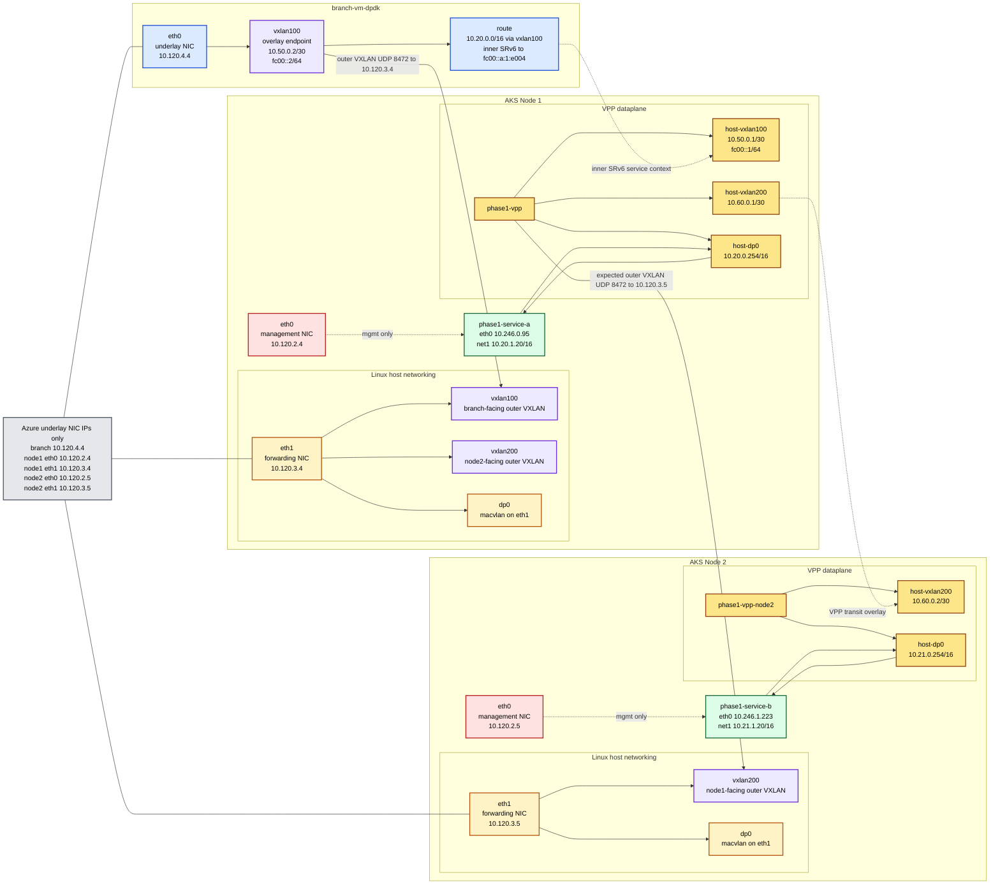

# Scenario 01: VXLAN Plus SRv6 Over Functional VPP Path

This is the first scenario to review before deployment.

It intentionally uses the already-proven functional model from the earlier AKS work:

- branch traffic is wrapped in VXLAN
- the inner payload carries SRv6 data
- VPP receives the decapsulated traffic and applies the forwarding decision
- service delivery stays on one node first

## Why This Is First

This scenario proves the forwarding idea without blocking on the unfinished native MANA VPP dataplane work.

## Current Status

This scenario is now live-validated on the existing lab resources.

Validated resources:

- AKS cluster: `sase-ubuntu2404-aks`
- branch VM: `branch-vm-dpdk`
- dataplane node: `aks-nodepool1-38799324-vmss000001`
- AKS management-side node IP: `10.120.2.4`
- forwarding NIC IP on the same node: `10.120.3.4`

The working packet path is now:

1. branch VM underlay on `10.120.4.4`
2. outer VXLAN UDP `8472` sent to node forwarding NIC `10.120.3.4`
3. inner SRv6 packet with `fc00::a:1:e004` as the LocalSID target
4. VPP decapsulation on the AKS node
5. VPP delivery to service pod dataplane `net1`

This means the functional path is no longer using the node management IP as the tunnel endpoint.

That means this scenario is about architectural proof first:

- Azure-safe outer transport
- tenant or service context inside the tunnel
- VPP as the node-local owner of the dataplane logic
- separate management and dataplane handling for service pods

## Planned Packet Path

1. The branch VM builds an SRv6 packet.
2. That packet is encapsulated inside VXLAN with an Azure-safe outer header.
3. Azure routes the outer packet to the AKS dataplane node.
4. VPP terminates the outer tunnel.
5. VPP reads the inner SRv6 context.
6. VPP forwards to the selected local service pod dataplane interface.
7. The service pod returns traffic to VPP for the next hop, egress, or drop.

## Current Three-Device Topology

This is the current troubleshooting topology for the live lab. It separates the Azure-visible underlay addresses from the overlay and VPP-local transit addresses created by the POC.

Important address separation:

- Azure only knows the underlay NIC addresses in `10.120.x.x`
- `10.50.0.x` and `10.60.0.x` are POC-created overlay or transit addresses inside Linux and VPP
- service pod dataplane addresses are `10.20.x.x` on Node 1 and `10.21.x.x` on Node 2

## What Was Actually Deployed

The live lab ended up with these active pieces:

- Multus installed in the cluster
- `phase1-dp-lan` NetworkAttachmentDefinition for service dataplane attachment
- `phase1-vpp` privileged `hostNetwork` pod on the dataplane node
- `phase1-service-a` fake service pod with:
  - `eth0` for AKS management path
  - `net1` for dataplane path

The working VPP-side behavior is:

- Linux `vxlan100` created on node `eth1`
- Linux `dp0` macvlan created on node `eth1`
- VPP `host-vxlan100` at `10.50.0.1/30` and `fc00::1/64`
- VPP `host-dp0` at `10.20.0.254/16`
- SRv6 LocalSID configured as:
  - `fc00::a:1:e004 -> end.dt4 table 0`

The branch-side behavior is:

- Linux `vxlan100` created on branch `eth0`
- `10.50.0.2/30` and `fc00::2/64` on branch `vxlan100`
- service subnet route installed with SRv6 encapsulation toward `fc00::a:1:e004`

The service pod also requires two dataplane-specific actions after startup:

1. add return route `10.50.0.0/30 via 10.20.0.254 dev net1`
2. disable GRO/GSO/TSO on `net1`

Use [scripts/tune-service-pod-net.sh](./scripts/tune-service-pod-net.sh) to apply those pod-side settings.

## What Broke During Bring-Up

The main issues found during deployment were:

1. `net1` on the service pod came up `DOWN` because host `eth1` was still link-down.
2. VPP had the tunnel and local interface, but traffic still failed because the SRv6 LocalSID was missing.
3. Moving the outer tunnel to the forwarding NIC worked for ping, but plain TCP initially collapsed because PMTU and offload handling were wrong.

The fixes that mattered were:

- bring `eth1` up on the node before building `dp0`
- add `sr localsid address fc00::a:1:e004 behavior end.dt4 0`
- move the outer VXLAN endpoint from `10.120.2.4` to `10.120.3.4`
- align the branch route MTU and MSS to the real VXLAN ceiling
- disable GRO, GSO, and TSO on the path edges

## MTU Findings

The forwarding underlay and the active service path do not have the same ceiling.

Forwarding underlay results:

- `eth1` and `enP30832s1d1` on the AKS node accepted `9000`
- branch underlay `eth0` also accepted `9000`
- direct branch-to-node forwarding NIC test passed at about `4028` total bytes
- direct branch-to-node forwarding NIC test failed at `4048` total bytes and above

Active tunnel results:

- node-side Linux `vxlan100` on AKS refused anything above `1450`
- branch-side `vxlan100` can be set larger, but that does not change the node-side ceiling
- once SRv6 encapsulation is added on the branch route, the practical branch-to-service route MTU becomes `1386`
- with ICMP payload accounting, the useful DF ping payload ceiling is about `1322`

This is the important takeaway for this phase:

- the forwarding NIC path is real and separate from AKS management
- the active service path is still constrained by the Linux VXLAN ceiling on the AKS node
- a split forwarding NIC does not automatically produce a jumbo service path in this lab

## Performance Results

### Functional Checks

- branch VM to VPP tunnel IP `10.50.0.1`: pass
- branch VM to service pod `10.20.1.20`: pass
- VPP LocalSID counters incremented on real traffic: pass

### Before PMTU and Offload Fixes

- UDP `1.5 Gbit/s`: about `1.49 Gbit/s` receiver rate with very low loss
- UDP `2.0 Gbit/s`: about `1.97 Gbit/s` receiver rate with about `0.96%` loss
- TCP: effectively unusable, from tens of Kbit/s to low Mbit/s depending on MSS forcing

### After PMTU and Offload Fixes

Validated final tuning:

- branch `vxlan100` MTU set to `1450`
- branch service route set to `mtu 1386 advmss 1346`
- `net.ipv4.tcp_mtu_probing=1` enabled on branch VM
- GRO/GSO/TSO disabled on branch and node tunnel edges
- service pod `net1` GRO/GSO disabled

Measured results after that tuning:

- TCP `iperf3`: `2.16 Gbit/s` sender, `2.15 Gbit/s` receiver
- TCP `iperf3 -M 1200`: `2.58 Gbit/s` sender, `2.57 Gbit/s` receiver
- UDP `iperf3 -u -b 1.5G`: about `1.48 Gbit/s` receiver with about `0.95%` loss in the sampled run

The Phase 1 conclusion from the current live test is:

- the forwarding-NIC tunnel path is functional
- TCP is recoverable once PMTU and offload handling are controlled
- the bottleneck is no longer basic reachability, but how much performance we can extract from the `af_packet` plus Linux VXLAN path

## Phase 1B East-West Scale Attempt

The next test goal is no longer only same-node delivery.

The active follow-up test is:

- scale the AKS worker pool to two nodes
- run one VPP pod per node
- place equal counts of fake SASE service pods on Node 1 and Node 2
- send traffic from multiple Node 1 service pods toward matching Node 2 service pods
- measure the aggregate throughput through the inter-node VPP dataplane

Azure constraint for this phase:

- any ingress, egress, or east-west packet that crosses the Azure fabric must use an Azure-safe outer transport
- in this POC, that means VXLAN over the forwarding NIC path
- SRv6 may still be used as inner service context for VPP, but native SRv6 must not be exposed directly on the Azure underlay

What was completed in the live lab:

- node pool scaled from `1` to `2`
- second worker `aks-nodepool1-38799324-vmss000002` became Ready
- second worker forwarding NIC was verified as `10.120.3.5`
- second VPP pod `phase1-vpp-node2` was deployed on Node 2
- second service pod `phase1-service-b` was deployed on Node 2
- a Node 2-specific dataplane subnet `10.21.0.0/16` was introduced to avoid `host-local` overlap with Node 1 `10.20.0.0/16`
- direct forwarding-NIC underlay between `10.120.3.4` and `10.120.3.5` was validated
- Node 2 local service pod to local VPP gateway reachability was eventually recovered

What is still blocking a valid throughput number:

- inter-node forwarding through the second VPP instance is not yet stable enough for a credible east-west throughput result
- part of the debugging path also proved that direct inter-node forwarding assumptions on `eth1` are not the right architecture of record for Azure if they expose native SRv6 to the fabric
- because of that, any current multi-pod throughput number would measure a broken path rather than the intended architecture

Detailed worker-to-worker debugging notes are tracked separately in [EAST_WEST_DEBUG_REPORT.md](./EAST_WEST_DEBUG_REPORT.md).

That means this scenario is still the validated Phase 1A baseline, while the Phase 1B worker-to-worker throughput test is now a real next-step item with partial lab bring-up already completed.

## Repro Sequence

Use the scenario files in this order:

1. deploy the manifests in `manifests/`
2. run [scripts/setup-phase1-vpp.sh](./scripts/setup-phase1-vpp.sh) inside the VPP pod
3. run [scripts/setup-branch-vxlan.sh](./scripts/setup-branch-vxlan.sh) on the branch VM with node forwarding IP `10.120.3.4`
4. run [scripts/tune-service-pod-net.sh](./scripts/tune-service-pod-net.sh) from the operator host to prepare the service pod dataplane interface

Expected tuned branch-side route after setup:

- `10.20.0.0/16 encap seg6 mode encap segs fc00::a:1:e004 dev vxlan100 mtu 1386 advmss 1346`

## What This Scenario Proved

This scenario now proves all of the following in the current lab:

1. one AKS node can act as the Phase 1 SASE worker
2. the outer tunnel can land on a dedicated forwarding NIC instead of the AKS management IP
3. VPP can terminate the outer tunnel and use SRv6 context to select local delivery
4. service pods can keep management on `eth0` and dataplane on `net1`
5. the functional bring-up path can reach multi-gigabit throughput before native MANA VPP forwarding is ready

## Limits Still Open

- native VPP plus MANA plus DPDK forwarding is still not the stable path of record
- the AKS node Linux VXLAN ceiling is still `1450`, so this scenario is not a jumbo end-to-end service datapath
- performance numbers here are for a single service pod and same-node delivery only
- cross-node chaining and aggregate east-west throughput are not yet validated

## Planned Pod Model

- VPP pod:
  - host-facing and privileged
  - tied to the dataplane node
  - owns the local forwarding logic
- fake SASE service pods:
  - `eth0` for management and Kubernetes control-plane traffic
  - `net1` for dataplane traffic through Multus

## What This Scenario Must Show

1. Branch VM to VPP reachability over VXLAN.
2. Decapsulation at VPP.
3. SRv6-driven selection of the destination local flow.
4. VPP to service pod delivery on the dataplane interface.
5. Static same-node service chaining.

## What This Scenario Does Not Need Yet

- edge role behavior
- dynamic policy engine integration
- cross-node service chaining
- cross-cluster transport
- production traffic engineering
- final native DPDK optimization