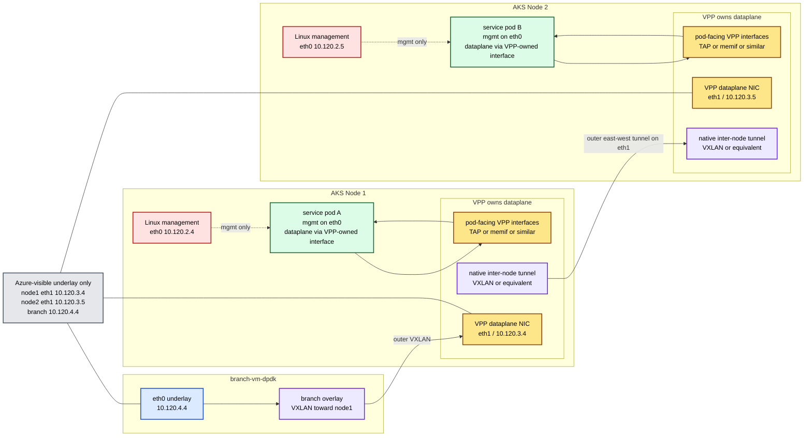

# Scenario 05: VPP-Owned `eth1`

This scenario is a separate track for the next east-west experiment.

It exists because the current `01-vxlan-srv6-afpacket` worker-to-worker path is blocked at the boundary between:

- VPP `host-vxlan200-tx`
- Linux `vxlan200`
- Linux `eth1`

That means the current east-west model is not a good base for further progress.

## Status

This is now the intended next active track for worker-to-worker east-west recovery.

Scenario `01-vxlan-srv6-afpacket` remains the validated same-node baseline, but it is no longer the right place to keep iterating on inter-node transport.

## Why This Needs A Separate Scenario

Scenario `01-vxlan-srv6-afpacket` is still the validated Phase 1A baseline for:

- same-node delivery
- branch to node VXLAN plus SRv6 service steering
- pod dataplane attachment on one worker

But the worker-to-worker path in that scenario is blocked by the current dataplane ownership model.

This new scenario is for a different assumption:

- `eth0` remains Linux-owned for AKS management
- `eth1` becomes VPP-owned for dataplane transport
- VPP owns the inter-node tunnel on `eth1`
- pod-facing connectivity moves closer to VPP instead of relying on Linux `vxlan200`

## Why This Is Different

The blocked model was:

- service pod `net1`
- VPP `host-dp0`
- VPP `host-vxlan200`
- Linux `vxlan200`
- Linux `eth1`

The key failure was proven with packet trace and Linux capture:

- VPP reached `host-vxlan200-tx`
- Linux `vxlan200` saw no packet
- Linux `eth1` saw no packet

This scenario removes that boundary from the design.

## Target Topology

## Design Rules

These rules keep this scenario focused.

1. `eth0` stays untouched for AKS control-plane and management traffic.
2. `eth1` is dataplane-only and should not remain in the forwarding path through Linux `vxlan` devices.
3. Azure-visible traffic on `eth1` must still use an Azure-safe outer transport.
4. VPP should own the inter-node transport on `eth1`.
5. Pod-facing dataplane interfaces should be closer to VPP than the current `macvlan + host-interface` model.

## Candidate Pod-Facing Models

The pod side can be approached in increasing order of platform weight.

### A. TAP-based pod attachment

Why it fits:

- VPP keeps clearer ownership of the pod-facing path
- closer to how Contiv/VPP thinks about pod wiring
- easier to reason about than Linux `macvlan + host-interface`

Tradeoff:

- more custom plumbing than the current Multus path

### B. memif-based lab attachment

Why it fits:

- useful for a smaller proof of VPP-owned dataplane behavior
- can isolate pod-facing mechanics from the underlay problem

Tradeoff:

- less natural for a Kubernetes pod model unless wrapped carefully

### C. Contiv/VPP-like node model

Why it fits:

- VPP owns data NIC and pod connectivity model end to end
- strongest architectural match to the direction we are moving toward

Tradeoff:

- much larger platform step than a custom scenario

## Candidate Underlay Models For `eth1`

### A. VPP native VXLAN on VPP-owned `eth1`

This is the first choice in principle because it matches the Azure-safe overlay requirement.

Risk already observed:

- native VPP VXLAN in the current runtime crashed with `SIGSEGV` when built on top of the current host-interface path

This scenario reduces that risk by changing the ownership model instead of layering native VXLAN on the same broken boundary.

### B. Another VPP-native inter-node transport

If native VXLAN remains unstable in the current build, a different VPP-native tunnel can still be used to prove dataplane ownership.

Constraint:

- the Azure-visible packet format must stay Azure-safe

## Implementation Order

The work should proceed in this order.

### Step 1: Freeze Scenario 01

- keep it as the validated same-node baseline
- do not spend more time trying to recover worker-to-worker transport there

### Step 2: Define `eth1` ownership boundary

- decide whether Linux keeps any dataplane role on `eth1`
- target answer should be no, except for initial bootstrap if strictly required

### Step 3: Prove VPP-to-VPP reachability first

- before any service pod traffic
- before any throughput test
- before any scale-out work

### Step 4: Add one pod-facing dataplane interface per node

- attach one service pod per node using the new VPP-oriented model
- validate local pod to local VPP gateway first

### Step 5: Validate end-to-end east-west packet flow

- pod A to VPP1
- VPP1 to VPP2 on `eth1`
- VPP2 to pod B

### Step 6: Only then run throughput

- no throughput work before a stable east-west packet path exists

## Success Criteria

This scenario is successful only if all of the following are true.

1. VPP owns the worker-to-worker dataplane transport on `eth1`.
2. A packet from Node 1 service pod to Node 2 service pod can be observed at each hop.
3. Outer transport packets are visible on the actual worker `eth1` interfaces.
4. The design no longer depends on the broken `host-vxlan200 -> Linux vxlan200 -> eth1` boundary.

## Failure Criteria

This scenario should be stopped or reframed if any of the following remain true.

1. VPP still depends on Linux `vxlan200` to reach Node 2.
2. Packets still disappear after a VPP host-interface transmit step.
3. The new design cannot produce a real packet on `eth1`.
4. Native VPP transport remains unstable even after removing the old ownership boundary.

## Decision Point After This Scenario

If this scenario still cannot produce a stable worker-to-worker packet path, the next step should likely be a stronger node model such as Contiv/VPP rather than more custom iteration on the current Phase 1 plumbing.

## Exit Criteria

This scenario is the right successor only if it can produce a real east-west packet flow on `eth1`.

Without that, there is no point running throughput tests or adding more service-pod scale.