# Phase 1 Node-Local VPP POC

## Scenario Index

| Folder | Status | What It Tests | Key Result |
|--------|--------|---------------|------------|
| [01-vxlan-srv6-afpacket](./01-vxlan-srv6-afpacket/) | Validated | Same-node: branch VXLAN + SRv6 → service pod | 2.16 Gbps TCP, 1.48 Gbps UDP |
| [02-service-pod-dual-nic](./02-service-pod-dual-nic/) | Abandoned | Dual-NIC service pod experiment | Not pursued |
| [03-mana-dpdk-validation](./03-mana-dpdk-validation/) | Failed | DPDK on MANA NIC | `ibv_create_cq` error — Azure VF restrictions |
| [05-vpp-owned-eth1](./05-vpp-owned-eth1/) | **Active** | E-W: VPP VXLAN between 2 MANA nodes | **1 Gbps UDP, 1.4 Mbps TCP** |
| [06-baseline-cilium-ebpf](./06-baseline-cilium-ebpf/) | Validated | Cilium native + VPP plugin investigation | **9-12 Gbps TCP (Cilium)** |

## Complete E-W Performance Results

### Throughput Summary

| Method | TCP 1-stream | UDP 1G | Ping RTT |
|--------|-------------|--------|----------|
| Linux kernel direct (no VPP) | 12.2 Gbps | — | — |
| Cilium eBPF (MANA D4s_v6) | 9.05 Gbps | 979 Mbps | 6.1 ms |
| Cilium eBPF (Mellanox D4s_v5) | 9.80 Gbps | 996 Mbps | 2.95 ms |
| **VPP VXLAN veth (MANA D4s_v6)** | **1.35 Mbps** | **986 Mbps** | **4.7 ms** |

### VPP VXLAN Detailed Results (Scenario 05)

| Test | Throughput | Loss/Retransmits |
|------|-----------|-----------------|
| ICMP ping (both directions) | 4.5 ms avg | 0% loss |
| TCP 1-stream | 1.35 Mbps | 346 retransmits |
| TCP 4-stream | 5 Mbps | 1,866 retransmits |
| UDP 1-flow 1G | 986 Mbps | 0.008% loss |
| UDP 1-flow 2G | 927 Mbps | 26% loss |
| UDP 1-flow 5G | 606 Mbps | 64% loss |
| UDP 2-flow 500M each | 602 Mbps total | 39% loss |
| UDP 4-flow 200M each | 727 Mbps total | 8.5% loss |
| UDP 4-flow 500M each | 609 Mbps total | 66% loss |

### VPP Interface Plugin Tests

| Plugin | MANA (D4s_v6) | Mellanox (D4s_v5) | Error |
|--------|--------------|-------------------|-------|
| af_packet v3 | TX broken | TX broken | TPACKET ring doesn't flush |
| af_packet v2 | TX broken | TX broken | sendto succeeds, 0 on wire |
| af_xdp | not tested | TX broken | XDP UMEM TX, 0 on wire |
| rdma | N/A | Failed | ibv_create_flow() not supported |
| dpdk (MANA PMD) | Failed | N/A | ibv_create_cq() failed |
| **TAP + bridge** | **TX works** | **TX works** | Frames reach eth1 |
| **veth + ip_forward** | **TX works** | not tested | Working E-W solution |
| Python AF_PACKET send() | **TX works** | **TX works** | Proves kernel path works |

### Bottleneck Analysis

```
12.5 Gbps  ── Azure VM bandwidth allocation (D4s_v6 / D4s_v5)
                │
12.2 Gbps  ── Kernel direct (Linux TCP between nodes)
                │
 9-12 Gbps ── Cilium eBPF (native AKS CNI)
                │
 ~1 Gbps   ── VPP VXLAN via veth (af_packet + Linux forwarding overhead)
                │
 ~1.4 Mbps ── VPP VXLAN TCP (inner checksum bug limits TCP severely)
```

## Key Findings

1. **VPP E-W works** — ICMP and UDP traffic flows bidirectionally between service pods on different MANA nodes through VPP VXLAN tunnels. 0% packet loss for ICMP, ~1 Gbps for UDP.

2. **4 VPP bugs fixed** to get E-W working:
   - Bug 1: VXLAN decap hash includes encap_fib_index → use encap-vrf-id 0
   - Bug 2: Cilium eBPF masquerades source IP → tc filter del + nft SNAT
   - Bug 3: uRPF fails on host-eth1 → ip4-vxlan-bypass
   - Bug 4: af_packet v2 outer IP checksum wrong → GSO feature + v2 mode

3. **af_packet TX broken on Azure** — VPP's TPACKET ring and XDP UMEM TX modes don't work on Azure's hv_netvsc driver. Plain Python AF_PACKET send() works, proving it's a VPP/TPACKET issue, not Azure.

4. **Veth workaround** — VPP sends via TAP or veth to kernel, kernel forwards normally to eth1. Caps throughput at ~1 Gbps.

5. **TCP is crippled** (~1.4 Mbps) due to inner TCP checksum not being recomputed through the VXLAN path. UDP works fine.

6. **No DPDK/RDMA path on Azure** — Both MANA and Mellanox VFs restrict ibverbs APIs needed by VPP's DPDK and RDMA plugins.

## Environment

| Resource | Value |
|----------|-------|
| AKS Cluster | sase-ubuntu2404-aks (swedencentral) |
| MANA pool | 2× Standard_D4s_v6, 12.5 Gbps each |
| Mellanox pool | 2× Standard_D4s_v5, 12.5 Gbps each |
| VPP | v26.02-release |
| CNI | Cilium (Azure CNI overlay) |
- scenario-specific configs
- test notes and checkpoints

## Scenario Split

### `01-vxlan-srv6-afpacket/`

First functional scenario.

Use the already-proven Azure-safe outer transport:

- branch VM sends VXLAN over IPv4 or UDP
- inner payload carries SRv6 data
- VPP decapsulates and forwards locally
- same-node service reachability is validated before kernel-bypass optimization

This is the fastest path to prove the forwarding model.

### `02-service-pod-dual-nic/`

Service pod attachment scenario.

Purpose:

- keep `eth0` for normal AKS management
- add a second interface for dataplane traffic using Multus
- validate the pod model needed for fake SASE functions

### `03-mana-dpdk-validation/`

Native MANA plus DPDK validation scenario.

Purpose:

- prove the second NIC and MANA environment are usable
- prove `dpdk-testpmd`
- only promote this path into the main POC after VPP forwarding is actually stable

### `04-east-west-throughput/`

Cross-node east-west throughput scenario.

Purpose:

- add a second worker node
- run one VPP instance on each worker
- place equal numbers of fake SASE pods on both workers
- measure aggregate throughput from Node 1 service pods to Node 2 service pods through the VPP dataplane

Current state:

- partially prepared in the live lab
- blocked on stabilizing inter-node forwarding through the second VPP instance

### `05-vpp-owned-eth1/`

Separate east-west recovery scenario.

Purpose:

- stop relying on the blocked `host-vxlan200 -> Linux vxlan200 -> eth1` path
- move dataplane ownership of `eth1` closer to VPP
- rebuild worker-to-worker transport on a model that can actually produce packets on the wire

Current state:

- active next-track design document added
- intended successor for worker-to-worker recovery now that the current path has been narrowed to a broken VPP-to-Linux transmit boundary

## Deployment Direction

The deployment model for this POC is:

1. AKS stays the managed Kubernetes platform.
2. A dedicated dataplane node pool is used.
3. The node has two paths:
   - `eth0` for AKS management and standard pod networking
   - `eth1` for the dataplane-side experiment
4. VPP runs per node as a privileged DaemonSet-style workload.
5. Service pods keep management on `eth0` and get a second dataplane interface through Multus.
6. Branch traffic arrives wrapped because native SRv6 in Azure fabric was not usable in the previous tests.

## Topology

```mermaid
flowchart TB
    classDef branch fill:#dbeafe,stroke:#1d4ed8,stroke-width:2px,color:#000
    classDef node fill:#f3f4f6,stroke:#4b5563,stroke-width:2px,color:#000
    classDef vpp fill:#fde68a,stroke:#92400e,stroke-width:2px,color:#000
    classDef service fill:#dcfce7,stroke:#166534,stroke-width:2px,color:#000
    classDef overlay fill:#ede9fe,stroke:#6d28d9,stroke-width:2px,color:#000
    classDef underlay fill:#e5e7eb,stroke:#4b5563,stroke-width:2px,color:#000
    classDef host fill:#fef3c7,stroke:#b45309,stroke-width:2px,color:#000
    classDef mgmt fill:#fee2e2,stroke:#b91c1c,stroke-width:2px,color:#000
    classDef note fill:#eff6ff,stroke:#2563eb,stroke-width:1px,color:#000

    subgraph branch [branch-vm-dpdk]
        BR_PLAIN["eth0\nunderlay NIC\n10.120.4.4"]:::branch
        BR_VX100["vxlan100\noverlay endpoint\n10.50.0.2/30\nfc00::2/64"]:::overlay
        BR_ROUTE["branch route\n10.20.0.0/16 via vxlan100\ninner SRv6 to fc00::a:1:e004"]:::branch
        BR_PLAIN --> BR_VX100 --> BR_ROUTE
    end

    subgraph azure [Azure VNet Underlay]
        AZ_NOTE["Azure-visible NIC IPs only\nbranch eth0 10.120.4.4\nnode1 eth0 10.120.2.4\nnode1 eth1 10.120.3.4\nnode2 eth0 10.120.2.5\nnode2 eth1 10.120.3.5"]:::underlay
    end

    subgraph node1 [AKS Node 1]
        N1_POD["phase1-service-a\neth0 10.246.0.95\nnet1 10.20.1.20/16"]:::service
        N1_MGMT["eth0\nmanagement NIC\n10.120.2.4"]:::mgmt
        subgraph N1_HOST [Linux host networking]
            N1_ETH1["eth1\nforwarding NIC\n10.120.3.4"]:::host
            N1_VX100["vxlan100\nbranch-facing outer VXLAN\nUDP 8472"]:::overlay
            N1_VX200["vxlan200\nnode2-facing outer VXLAN\nUDP 8472"]:::overlay
            N1_DP0["dp0\nmacvlan on eth1"]:::host
        end
        subgraph N1_VSW [VPP dataplane]
            N1_VPP["phase1-vpp\nVPP hostNetwork pod"]:::vpp
            N1_HVX100["host-vxlan100\n10.50.0.1/30\nfc00::1/64"]:::vpp
            N1_HVX200["host-vxlan200\n10.60.0.1/30"]:::vpp
            N1_HDP0["host-dp0\n10.20.0.254/16"]:::vpp
            N1_VPP --> N1_HVX100
            N1_VPP --> N1_HVX200
            N1_VPP --> N1_HDP0
        end

        N1_MGMT -. mgmt only .-> N1_POD
        N1_ETH1 --> N1_VX100
        N1_ETH1 --> N1_VX200
        N1_ETH1 --> N1_DP0
        N1_HDP0 --> N1_POD
        N1_POD --> N1_HDP0
    end

    subgraph node2 [AKS Node 2]
        N2_POD["phase1-service-b\neth0 10.246.1.223\nnet1 10.21.1.20/16"]:::service
        N2_MGMT["eth0\nmanagement NIC\n10.120.2.5"]:::mgmt
        subgraph N2_HOST [Linux host networking]
            N2_ETH1["eth1\nforwarding NIC\n10.120.3.5"]:::host
            N2_VX200["vxlan200\nnode1-facing outer VXLAN\nUDP 8472"]:::overlay
            N2_DP0["dp0\nmacvlan on eth1"]:::host
        end
        subgraph N2_VSW [VPP dataplane]
            N2_VPP["phase1-vpp-node2\nVPP hostNetwork pod"]:::vpp
            N2_HVX200["host-vxlan200\n10.60.0.2/30"]:::vpp
            N2_HDP0["host-dp0\n10.21.0.254/16"]:::vpp
            N2_VPP --> N2_HVX200
            N2_VPP --> N2_HDP0
        end

        N2_MGMT -. mgmt only .-> N2_POD
        N2_ETH1 --> N2_VX200
        N2_ETH1 --> N2_DP0
        N2_HDP0 --> N2_POD
        N2_POD --> N2_HDP0
    end

    BR_VX100 -.->|outer VXLAN over Azure| N1_VX100
    N1_VX200 -.->|outer VXLAN over Azure| N2_VX200
    BR_ROUTE -.->|inner SRv6 context| N1_HVX100
    N1_HVX200 -.->|inter-node transit overlay| N2_HVX200
    AZ_NOTE --- BR_ETH0
    AZ_NOTE --- N1_ETH1
    AZ_NOTE --- N2_ETH1
```



## First Success Criteria

The first reviewed scenario should prove these items in order:

1. Branch VM can send VXLAN-wrapped SRv6 payload to the AKS dataplane node.
2. VPP can terminate the outer VXLAN wrapper.
3. VPP can use the inner SRv6 context to select a local forwarding action.
4. VPP can deliver traffic to a same-node service pod dataplane interface.
5. VPP can steer traffic from one local service pod to another local service pod.
6. The datapath is observable with counters and packet capture.

## Important Constraints Carried Forward From Earlier Work

- Native SRv6 through Azure fabric is not the starting point.
- VXLAN on UDP `8472` is the known safe outer transport.
- The af-packet path is the functional bring-up path.
- Native MANA DPDK is promising, but VPP forwarding on top of it is still a gated item.

## Next Read

Start with [01-vxlan-srv6-afpacket/README.md](./01-vxlan-srv6-afpacket/README.md).