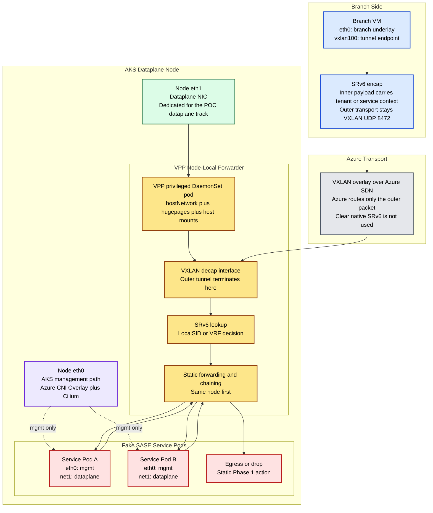

# Phase 1 Node-Local VPP POC

This folder is the working area for the new Phase 1 proof of concept.

It is separated from older material so multiple POC scenarios can live side by side without mixing assumptions, manifests, or scripts.

## Goal

Prove that one AKS worker node can behave like a SASE worker with:

- VPP as the node-local forwarding engine
- a management path separated from a dataplane path
- branch traffic entering as VXLAN with inner SRv6 payload
- static same-node service delivery first
- native MANA plus DPDK treated as a gated optimization track, not the only bring-up path

## Why This Folder Exists

The repository already contains useful implementation history under `archive/legacy-pocs/aks-dpdk-poc`, but the active Phase 1 work needs its own clean location.

This folder is intended to hold:

- current docs
- current manifests
- current scripts
- scenario-specific configs
- test notes and checkpoints

## Scenario Split

### `01-vxlan-srv6-afpacket/`

First functional scenario.

Use the already-proven Azure-safe outer transport:

- branch VM sends VXLAN over IPv4 or UDP
- inner payload carries SRv6 data
- VPP decapsulates and forwards locally
- same-node service reachability is validated before kernel-bypass optimization

This is the fastest path to prove the forwarding model.

### `02-service-pod-dual-nic/`

Service pod attachment scenario.

Purpose:

- keep `eth0` for normal AKS management
- add a second interface for dataplane traffic using Multus
- validate the pod model needed for fake SASE functions

### `03-mana-dpdk-validation/`

Native MANA plus DPDK validation scenario.

Purpose:

- prove the second NIC and MANA environment are usable
- prove `dpdk-testpmd`
- only promote this path into the main POC after VPP forwarding is actually stable

## Deployment Direction

The deployment model for this POC is:

1. AKS stays the managed Kubernetes platform.
2. A dedicated dataplane node pool is used.
3. The node has two paths:
   - `eth0` for AKS management and standard pod networking
   - `eth1` for the dataplane-side experiment
4. VPP runs per node as a privileged DaemonSet-style workload.
5. Service pods keep management on `eth0` and get a second dataplane interface through Multus.
6. Branch traffic arrives wrapped because native SRv6 in Azure fabric was not usable in the previous tests.

## Topology

## First Success Criteria

The first reviewed scenario should prove these items in order:

1. Branch VM can send VXLAN-wrapped SRv6 payload to the AKS dataplane node.
2. VPP can terminate the outer VXLAN wrapper.
3. VPP can use the inner SRv6 context to select a local forwarding action.
4. VPP can deliver traffic to a same-node service pod dataplane interface.
5. VPP can steer traffic from one local service pod to another local service pod.
6. The datapath is observable with counters and packet capture.

## Important Constraints Carried Forward From Earlier Work

- Native SRv6 through Azure fabric is not the starting point.
- VXLAN on UDP `8472` is the known safe outer transport.
- The af-packet path is the functional bring-up path.
- Native MANA DPDK is promising, but VPP forwarding on top of it is still a gated item.

## Next Read

Start with [01-vxlan-srv6-afpacket/README.md](./01-vxlan-srv6-afpacket/README.md).